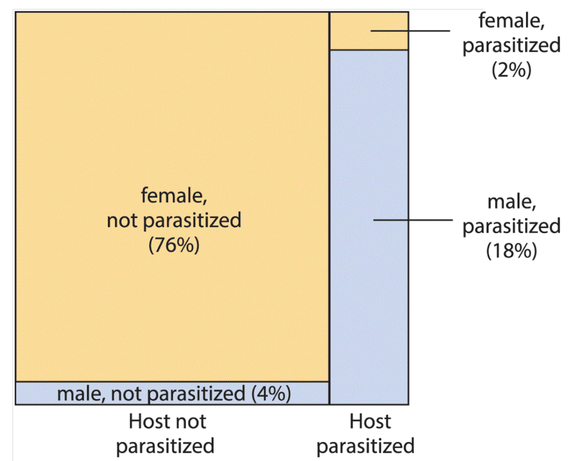
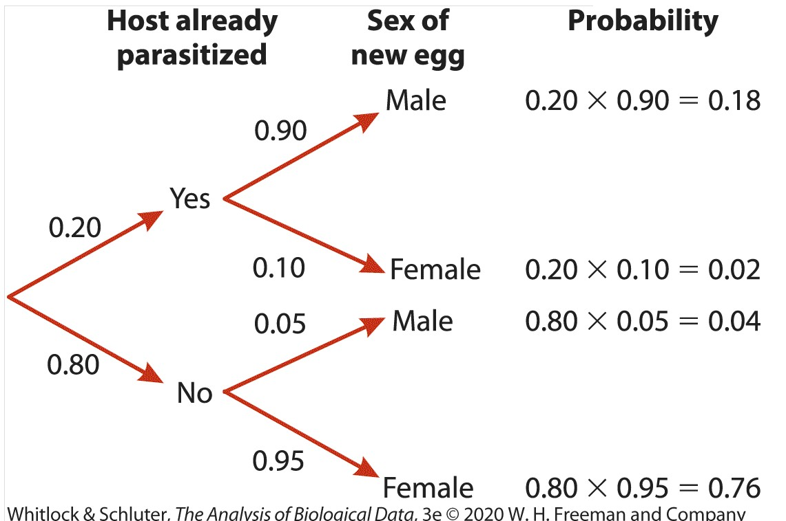
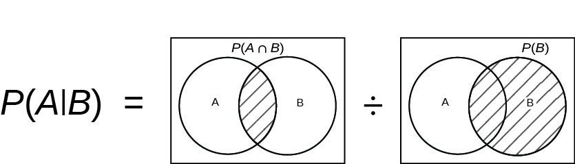
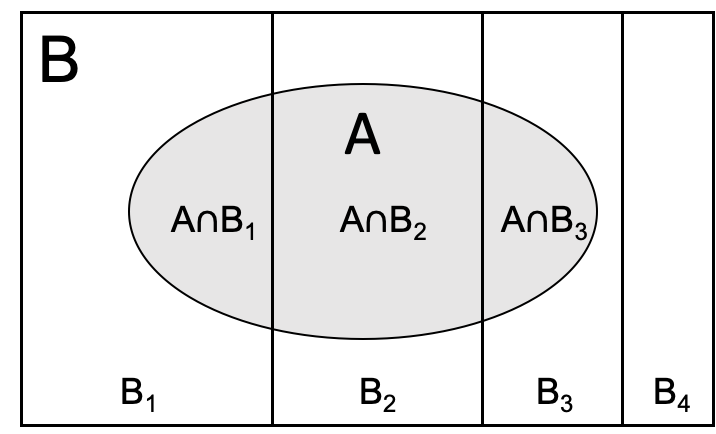

```{r setup, include=FALSE}
knitr::opts_chunk$set(echo = TRUE)
```


## Background

- Whitlock, Sections 5.8 and 5.9
- Aho, Chapter 2

## Conditional probability

When variables are associated, we need additional tools to model **dependencies** between variables.

The **conditional probability** is the probability that event A occurs, given a prior condition of event B. We can describe this situation as the probability of "A conditioned on B", "A given the prior probability of B", or simply "A given B". We write "given as" using a vertical bar, so the conditional probability is: $Pr[A|B]$.

### Whitlock, Example 5.8

In many species, the mother can alter the relative numbers of male and female offspring depending on the local environment. In this case the "sex of the offspring" and the "environment" are dependent on each other.

The *Nasonia vitripennis* is a parasite that lays eggs on the pupae of flies. If the host has not been already parasitized, than it lays more female eggs, where as if the host has already been parasitized than it lays more male eggs. Therefore the sex of the offspring depends on the status of the pupae.

We can visualize this using a Venn diagram:

{width=45%}

What is the probability that a new, randomly chosen egg, is male? We can use a **decision tree** to lay out this problem visually:

{width=45%}

So here we have:

$Pr[Host\ is\ parasitized] = 0.20$

$Pr[Host\ is\ unparasitized] = 0.80$

And:

- $Pr[male\ egg | Host\ is\ parasitized] = 0.90$ : 
  + probability that female lays a male egg, **given that** host is parasitized
- $Pr[female\ egg | Host\ is\ parasitized] = 0.10$ : 
  + same as above, but for a female egg
- $Pr[male\ egg | Host\ is\ unparasitized ] = 0.05$ : 
  + probability that female lays a male egg, **given that** the host is unparasitized.
- $Pr[female\ egg | Host\ is\ unparasitized ] = 0.95$ : 
  + ditto, for a female egg

Using the multiplication and addition rules for probabilities, and tracing out both possible paths to obtain a male egg, we can get the total probability of a male egg:

$$\begin{aligned}
Pr[male\ egg] &= Pr[Host\ is\ parasitized] * Pr[male\ egg | Host\ is\ parasitized]\ + \\
&\ \ \ \ \ Pr[Host\ is\ unparasitized] * Pr[male\ egg | Host\ is\ unparasitized] \\
&= 0.20*0.90 + 0.80*0.05 = 0.18 + 0.04 \\
&= 0.22 
\end{aligned}$$


## General multiplication rule

We can determine the probability of an event **A given B** using the conditional probability, which is simply the fraction of the time that we see A and B together, relative to the total occurrence of B:

{width=50%}

We can write this as:

$$P(A | B) = \frac{P(A \cap B)}{P(B)}$$

If we rearrange this equation, we can say that $P(A \cap B)$ is simply the probability of "A given B", times the total probability of B:

$$Pr[A \cap B] = Pr[A|B] * Pr[B]$$
Of course the reverse is true as well:

$$Pr[A \cap B] = Pr[B|A] * Pr[A]$$


## Law of total probability

When we have multiple possible conditions, or (mutually exclusive) values of B, we can say that B is a disjoint set representing multiple **states of nature**. The total probability of A will then be partitioned among all of the possible values of B. We can visualize this as follows:

{width=50%}

So the total probability of event A, $Pr[A]$, is the sum of the intersections of A and each of the partitions of B. We can write this as:

$$P(A) = P(A \cap B_1) + P(A \cap B_2) + P(A \cap B_3) + P(A \cap B_4) = \sum_{i=1}^4{P(A \cap B_i)}$$

Since each of the intersections can be written as $P(A \cap B_i) = P(A|B_i)*P(B_i)$, we can now write the **law of total probability** in terms of the conditional probabilities as follows:

$$ P(A) = \sum_{i=1}^nP(A|B_i)*P(B_i) $$
Where $n$ is the total number of mutually exclusive states of B ("conditions"). That is, the total probability of A is the conditional probability of A given B times the probability of B, for all possible values of B.

For our *Nasonia* example above, this equation gives us the same result as the one we obtained by working our way through the decision tree:

$$\begin{aligned}
Pr[male\ egg] &= Pr[male\ egg | Host\ is\ parasitized] * Pr[Host\ is\ parasitized] \ + \\
&\ \ \ \ \ Pr[male\ egg | Host\ is\ unparasitized] * Pr[Host\ is\ unparasitized]
\end{aligned}$$

## Bayes' theorem

Recall that the intersection of A and B, $Pr[A \cap B]$, can be written equivalently in terms of conditional probabilities relative to A or relative to B:

$$Pr[A \cap B] = Pr[B] * Pr[A|B] = Pr[A] * Pr[B|A]$$

We can now derive an incredibly useful formula called the **Bayes' Theorem**:

$$Pr[A|B] = \frac{Pr[B|A]*Pr[A]}{Pr[B]}$$
This turns out to be a very useful way to frame problems involving conditional probabilities, because it allows us to figure out an unknown quantities for **posterior probabilities**, given **prior probabilities** and **likelihoods**. The three elements of Bayesian statistics are thus:

+ **Priors**: known probabilities for different conditions, e.g. $Pr[A]$ and $Pr[B]$
+ **Likelihoods**: known conditional probabilities, e.g. $Pr[B|A]$
+ **Posteriors**: unknown conditional probabilities, e.g. $Pr[A|B]$ 

### Bayes' theorem with multiple priors

More generally, when there are many possible outcomes, we can figure out the conditional probability for a single outcome using the **total law of probability**:

$$P(A_i|B) = \frac{Pr(B|A_i)P(A_i)}{P(B)} = \frac{P(B|A_i)P(A_i)}{\sum_{j=1}^n P(B|A_j)P(A_j)} $$

### Bayes' theorem with binary outcomes

For a situation with binary outcomes, this simplifies to:

$$P(A|B) = \frac{Pr(B|A)*P(A)}{P(B)} = \frac{P(B|A)*P(A)}{P(B|A)*P(A) + P(B|not\ A)*P(not\ A)} $$

Going back to our *Nasonia* example above, we can use this formula to answer a new question like, ***"What is the probability that the host has already been parasitized, given that a male egg was laid?"***. For the sake of brevity, let's abbreviate "host is parasitized" as "par" and "host is not parasitized" as "!par".

$$\begin{aligned}
P(par | male) &= \frac{P(male | par)*P(par)}{P(male)} \\
&= \frac{P(male | par)*P(par)}{P(male | par)*P(par)\ +\ P(male | !\ par)*P(!\ par)} \\
&= \frac{0.90*0.20}{0.90*0.20\ +\ 0.05*0.80} = \frac{0.18}{0.18+0.04}\\
&= \frac{0.18}{0.22} = 0.82
\end{aligned}$$

Let's get a better feel for how these ideas apply by working through some more examples.


## Example 5.9 - Down's Syndrome

Down's syndrome, or trisomy 21, is a chromosomal condition that occurs in 1/1000 pregnancies. A test called the "triple test", which looks for three hormone concentrations around week 16, has been developed to circumvent the need for amniocentesis, which is a very invasive procedure (but which is also the gold standard for detection, since it provides a definitive diagnosis of the karyotype).

Let's say we want to ask: ***If the test on a random fetus gives a $Pos$ result, what is the probability that fetus actually is $DS^+$?*** In other words, what is $Pr[DS^+|Pos]$?

How can we formulate this problem in terms of Bayes' rule? 

First, we need the **priors**, or states of nature:

+ $Pr[DS^+] = 0.001$ : Rate of Down's syndrome
+ $Pr[DS^-] = 0.999$

The established rates of detection of the test, which give us our **likelihoods**, are as follows:

- $Pr[Pos|DS^+] = 0.6$
  + **True Positive** (sensitivity): The test was positive, and the fetus has DS
- $Pr[Neg|DS^+] = 0.4$
  + **False Negative** : The test was negative, however the fetus has DS 
- $Pr[Neg|DS^-] = 0.95$
  + **True Negative** : The test was negative, and the fetus does not have DS
- $Pr[Pos|DS^-] = 0.05$
  + **False Positive** : Test was positive, but the fetus does not have DS


Using the Bayes' theorem above, let's set A to be the test result, $[Pos|Neg]$, and B to be DS status, $[DS^+|DS^-]$. Now we can formulate our problem as:


$$Pr[DS^+|Pos] = \frac{Pr[Pos|DS^+] * Pr[DS^+]}{Pr[Pos]}$$

We are given the values for the numerator, but we need the values for the denominator.
For this we can use our **law of total probability**.

$$\begin{aligned}
Pr[DS^+|Pos] &= \frac{Pr[Pos|DS^+] * Pr[DS^+]}{Pr[DS^+] * Pr[Pos|DS^+] + Pr[DS^-]*Pr[Pos|DS^-]} \\
&= \frac{0.6*0.001}{0.6*0.001 + 0.999*0.05}
\end{aligned}$$

```{r}
result = 0.6*0.001 / (0.6*0.001 + 0.999*0.05)
result
```

The answer is ``r round(result*100, 2)``%. This means that almost 99% of positive results will be false positives! Even though the FP rate is only 5%, the incidence of Down's is so low that the vast majority of cases that do return a positive test will not actually have Down's syndrome.

In many cases, it's better to err on the side of caution, and any positive test results can be confirmed by further testing.


## In class exercise: Q36, 37

Some people are hypersensitive to the smell of asparagus, and can even detect a strong odor in the urine of a person who has recently eaten asparagus. This trait turns out to have a simple genetic basis. An individual with one or two copies of the $A$ allele at the gene ($AA$ or $Aa$ genotypes) can smell asparagus in urine, whereas a person with two copies of the alternative $a$ allele ($aa$ genotypes) cannot (Online Mendelian Inheritance in Man 2019). Assume that men and women in the population have the same allele frequencies at the asparagus-smelling gene and that marriage and child production are independent of the genotype at the gene. In the human population, 5% of alleles are $A$ and 95% are $a$. 

- (a) What is the probability that a randomly sampled individual from the population has two copies of the a allele (that is, that it has an aa genotype)? 

- (b) What is the probability that both members of a randomly sampled married couple (man and woman) are aa at the asparagus-smelling gene? 

- (c) What is the probability that both members of a randomly sampled married couple (man and woman) are heterozygotes at this locus (meaning that each person has one allele A and one allele a)? 

- (d) Consider the type of couple described in (c). What is the probability that the first child of such a couple also has one A allele and one a allele (is a heterozygote)? Remember that the child must receive exactly one allele from each parent. 

- (e) If a randomly sampled child has the aa genotype, what is the probability that both its parents were also aa?

---