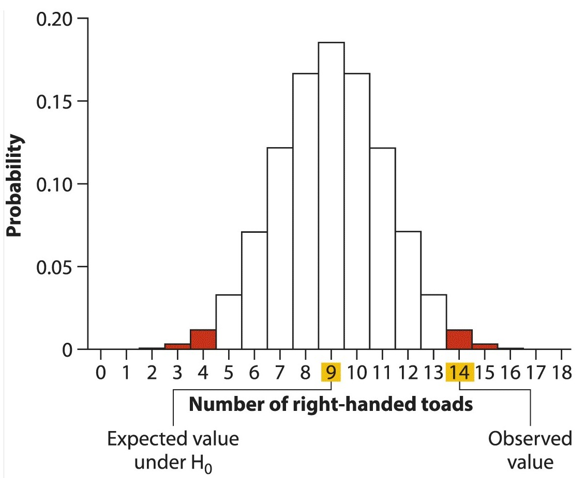

```{r setup, include=FALSE}
knitr::opts_chunk$set(echo = TRUE)
```

# Hypothesis Testing

```
In 1954, Salk’s vaccine was tested on elementary-school students across the United States and Canada. In the study, 401,974 students were divided randomly into two groups: kids in one group received the vaccine, whereas those in the other group (the control group) were injected with saline solution instead. The students were unaware of which group they were in. Of those who received the vaccine, 0.016% developed paralytic polio during the study, whereas 0.057% of the control group developed the disease (Brownlee 1955). The vaccine seemed to reduce the rate of disease by two-thirds, but the difference between groups was quite small, only about 4 cases per 10,000. Did the vaccine work, or did such a small difference arise purely by chance?

Whitlock, Michael C.; Schluter, Dolph. The Analysis of Biological Data (pp. 151-152). W. H. Freeman. Kindle Edition.
```
## Null Hypothesis

To answer this question we need to estimate the population parameters just as before. However to answer the question we need a *null* hypothesis, often denoted as $H_o$. The $H_o$ is usually related to randomness. The $H_o$ for the above question is that there is no difference between the number of cases in the vaccinated and the unvaccinated groups. If the probability of $H_o$ is very low, than we can reject the $H_o$ and accept the alternate hypothesis, $H_A$, that there is a difference in the number of cases.

## Four basic steps are involved in hypothesis testing: 
- State the hypotheses. 
- Compute the test statistic with the data. 
- Determine the $P-value$. 
- Draw the appropriate conclusions.

```
Bisazza et al. (1996) tested the possibility of handedness in European toads, Bufo bufo, by sampling and measuring 18 toads from the wild. We will assume that this was a random sample. It was found that individual toads tended to use one forelimb more than the other. At this point the question became: do right-handed and left-hand==ed toads occur with equal frequency in the toad population, or is one type more frequent than the other, as in the human population? Of the 18 toads tested, 14 were right-handed and 4 were left-handed. Are these results evidence of a predominance of one type of handedness in toads?
```

$H_o$ - Left- and right-handed toads are equally frequent in the population
$H_A$ - Left- and right-handed toads are not equally frequent in the population

A **two-sided** test is when we don't care if the Left-handed are greater or smaller than Right-handed. When looking at our $H_o$ distribution we will look at tails on both ends.

A **one-side** is more specific, when we are specifically in one direction, for example if Right-handed is more than Left-handed and not the other way around.

A **test-statistic** is a value that is compared to the null distribution to see how well it fits. In the example above, 14 is the test statistc and it is compared to the expected value 9, since there are only two options and there are 18 toads.

```
How can we empirically obtain a null distribution?
```
## P-value

$P-value$ is **NOT** the probability of $H_o$. It is the probability of a specific event under the $H_o$.



The distribution above assumes that the probability of right and left handed is 0.5 and since we have 18 toads, we would expect 9. But the researchers identified 14. Since this is a two-tailed test, we are interested in the probability of seeing 14 or more AND 4 or less left-handed toads. We can calculate this using what we know about binomial distributions

```{r}
# cdf of upto and including 4
pbinom(4, 18, 0.5) 
# cdf of not including upto 13
pbinom(13,18,0.5, lower.tail = F)

pbinom(4, 18, 0.5)+ pbinom(13,18,0.5, lower.tail = F)
```

The $P-value$ of our test statistic is 0.031. This is lower than the conventional boundary 0.05, also known as **significance level** or $\alpha$. Thus we **reject** the $H_o$ that there is no preference and accept the $H_A$ that there is a preferential handedness for toads.

## Errors in Hypothesis testing

### Type I

Rejecting a True null hypothesis is a **Type I** error. In the previous section we referred to this as **False Positives**. 

### Type II

Failing to refject a false null hypothesis is **Type II** error. In the previous section we referred to this as **False Negatives**

Note that if the null hypothesis was True, then, just by chance, we will falsely reject the null hypothesis 1/20 times.

One can try to reduce the **Type I** error by simply reducing the $\alpha$ to, for example, 0.01. However this makes the **Type II** error worse. If you are too afraid to make mistakes, you will wrongly miss out on True rejections.

Low **Type II** errors is a sign of high power test. **Power** is the probability of rejecting a false null hypothesis. We will talk more about power when we discuss experimental designs.

## Interpreting non-significant results
A high $P-value$ does not prove that the null hypothesis is true. Our test is to see if the test-statistic is more extreme than what we would expect by random sampling and so it doesn't say anything about the null hypothesis at all.

The next best thing we can do is look at the confidence intervals.

## Confidence intervals

**Confidence intervals** - when we randomly sample the data, we are sure that the real parameter is between this interval. If the test statistic falls outside of the confidence interval, than almost always it will be statistically significant. If a test statistic falls outside of 95% confidence interval, It will surely have a p-value less than 0.05. 

$P-value$ and their corresponding thresholds are qualitative. Once you pass the cutoff, than it's significant.

Confidence intervals are more quantitative. They give you range of values that are acceptable. 

Both play a different, yet complementary role in Statistics.


## In class exercise

**Can parents distinguish their own children by smell alone?**

To investigate, Porter and Moore (1981) gave new T-shirts to children of nine mothers. Each child wore his or her shirt to bed for three consecutive nights. During the day, from waking until bedtime, the shirts were kept in individually sealed plastic bags. No scented soaps or perfumes were used during the study. Each mother was then given the shirt of her child and that of another, randomly chosen child and asked to identify her own by smell. Eight of nine mothers identified their children correctly.

In the exercise we will examine the following questions:

+ What is the appropriate null hypothesis?
+ What is the alternative hypothesis? 
+ What test statistic should you use? 
+ If the null hypothesis were true, what is the probability of the observed data?
+ What is the P-value for the test? 
+ What is the appropriate conclusion?
+ We would we want to calculate a 95% confidence interval for the true proportion of correct identifications?
