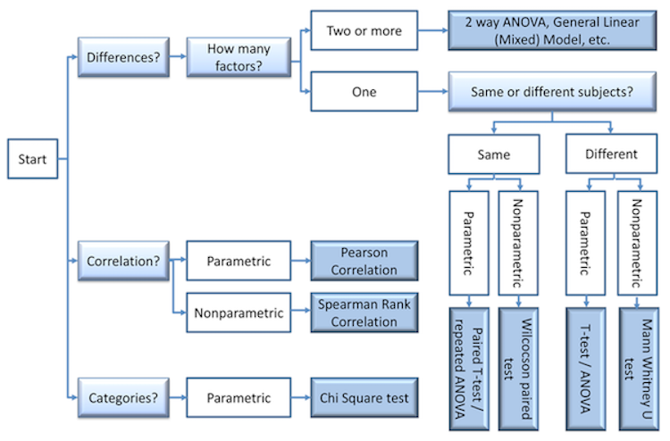
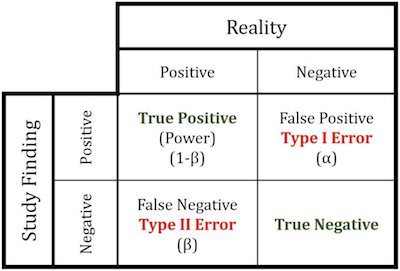
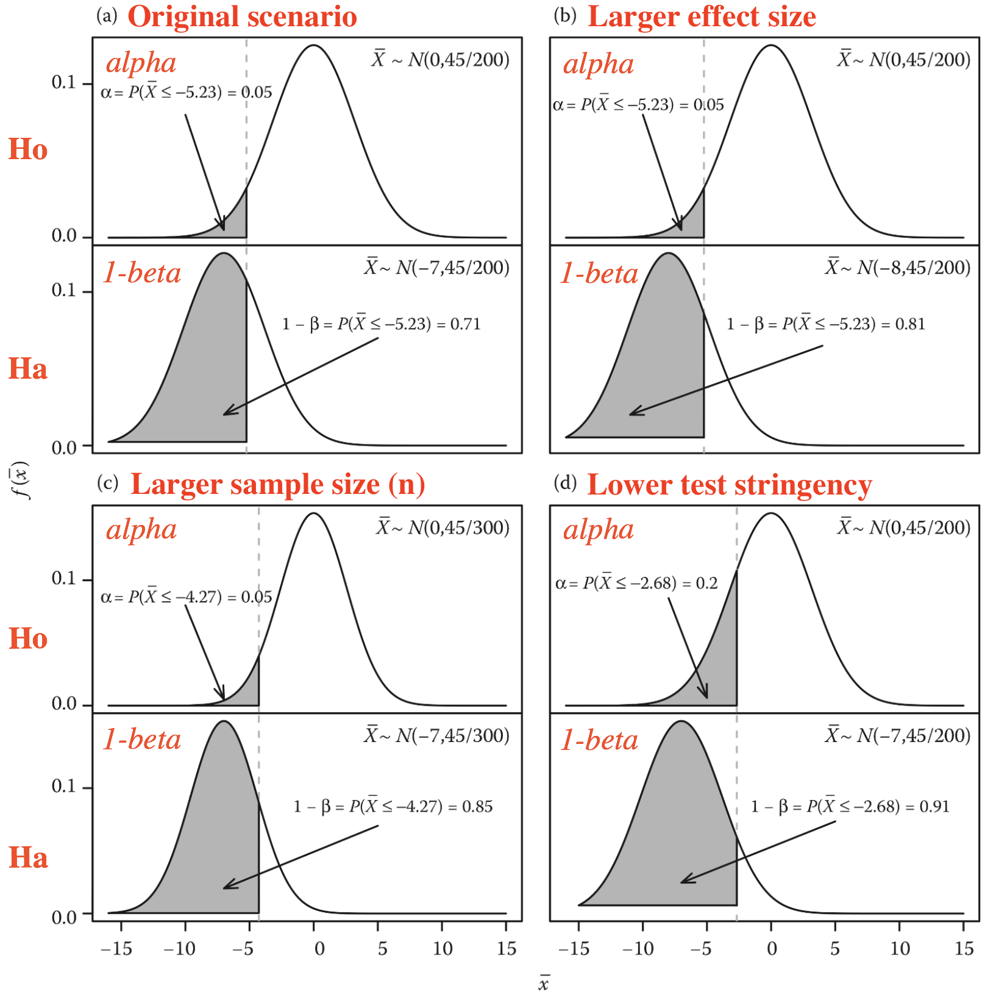

```{r setup, include=FALSE}
knitr::opts_chunk$set(echo = TRUE)
```

## Background Reading

**Power analysis:** Aho, Chapter 6.3-6.5 

## Which statistical test should I use?

In this course, we introduce you to several basic methods for **hypothesis testing** that allow us to determine whether observed differences between two or more groups are statistically different. The choice of an appropriate test will depend on what kind of question you are interested in asking.

As the course progresses, we are making our way through a variety of **parametric** tests for comparing differences between samples:  $t$-tests, ANOVA, simple linear models, and linear models with mixed effects (i.e. interaction terms). We also go over **nonparametric tests** and tests for **correlations** and **categorical** data.

The diagram below illustrates how to choose the right test depending on your question. We will revisit this framework as we progress through the semester.

{width=60%}


## Type I and II Errors

When we make statistical inferences, we are making statements about the likelihood that some hypothesis is true based on a chosen significance threshold, based on data from a finite set of experimental samples. By convention, a significance cutoff of $\alpha = 0.05$ is often chosen, meaning that _5% of the time we are likely to get a value as extreme or more extreme than the one we have observed in our test sample **just by random chance**_. That means that 5/100 times, a sample drawn from the null distribution will result in a false conclusion that the sample is NOT drawn from the null distribution. There are two types of errors we can make:

_**Type I error**_ ($\alpha$): A "false positive"

- concluding that there is an effect when none exists
- incorrectly rejecting the null hypothesis (accept the alternative $H_A$) when $H_o$ is true.
- probability of observing a value as extreme or more extreme by random chance, if the sample comes from the null distribution.

_**Type II error**_ ($\beta$): A "false negative"

- concluding that there is no effect when there is one
- incorrectly accepting $H_o$ (rejecting $H_A$) when the alternative hypothesis is true.
- probability that an extreme observation from the non-null distribution could overlap the null distribution just by chance.

{width=40%}

Depending on one's goals, either of these can be undesirable. In many applications, Type I errors are considered especially bad, for instance when reporting results for RNAi screens or differential gene expression, since they can result in a lot of extra work that does not pan out. On the other hand, casting a wide net in a primary screen at the expense of a few false positives may be ok if you want to minimize your chances of missing anything important, and you plan to double-check all of your primary data in a second round of testing (e.g. secondary RNAi screens with more replicates, or qPCR to confirm differential expression for genes of interest.)  The tradeoff between Type I and Type II errors is illustrated by a diagram showing two different populations whose distributions partially overlap.


{width=60%}


## Power Analysis

**Power analysis** tells us how confident we can be that the results we have observed are realistic. That is, how confident can we be, when we reject the null hypothesis, that our conclusion is reasonable? Power calculations must always be specified for a fixed set of parameters $\alpha$ and $\beta$, which must be chosen in advance in order to make quantitative statements. The power of an experiment depends on several variables:

- **Effect size ($E$)**: This is the expected (true) difference between the population means. A greater effect size gives a better chance of distinguishing between two populations (i.e. getting "true positives").
- **Population variance ($\sigma^2)$**: Populations with less variation make it easier to distinguish between them for a given effect size.
- **Sample size ($n$)**: Since we know from the Central Limit Theorem that increasing sample size gives us a better estimate of the population mean (standard error), it also gives greater power.
- **Significance threshold ($\alpha$)**: Relaxing our criteria for rejecting the null hypothesis will result in a larger acceptance region for a given effect size.

We will walk through **Example 6.10** from Ken Aho's book in class. 

The problem is: 

+ Alzheimer's seems to be negatively associated with moderate smoking!!! Possibly because nicotine may reduce apoptosis (programmed cell death) of neurons
+ Researchers want to know if a sample size of 200 at $\alpha = 0.05$ is sufficent to detect a decrease of 7% on Alzheimer's in subjects that smoke 10-20 cigarettes per day, given that $\sigma = 45\%$.

What is the power of the experiment? In other words, what is the probability of rejecting the null hypothesis if the effect of smoking is a 7% decrease in Alzheimer's?

An annotated version of the accompanying figure (Fig. 6.7) illustrates how the above variables affect the power to detect true differences in sample means. Panels (b-d) show that the following differences in the scenario would increase power:

   (b) Larger effect size ($E$) -- a bigger separation between population means
   (c) Larger sample size ($n$) -- this will decrease the SEM
   (d) Lower stringency of the test (increase $\alpha$) -- increase the rejection region

{width=80%}

### Calculating power

Recall that the probability of a **Type I** error is the chosen significance threshold for an experiment, $\alpha$. The probability of a **Type II** error is denoted by $\beta$. Now we can define the basic form of an equation to compute the **Power** for an experiment in terms of the significance threshold, effect size, variation, and sample size:

$$ Power = 1 - \beta \propto \frac{E\alpha\sqrt{n}}{\sigma} = \frac{E\alpha}{\sigma/\sqrt{n}} =  \frac{E\alpha}{SEM}$$

So we see that the power is the effect size, times the significance threshold, divided by the standard error. Note that **we either need to know the population variance, or have a good estimate of it** (when the sample size is large, this can be estimated using the sample variance). The power estimate will depend on the type of statistical analysis and test one is performing.

When performing experiments, **it is good practice to choose a desired significance and power for your experiment in advance** as a way to inform the proper way to set up an experiment. Typical values are $\alpha = 0.05$ and $1-\beta = 0.8$. In this case, we would like to detect outliers at a significance threshold of 5%, with a power of 80%.


### Estimating power and adequate sample size

There are **five parameters** that define the relationship between power and significance, effect size, variation, and sample size. Given any of four of these, it is possible to estimate the remaining one. This allows us to answer a variety of related questions, for example:

+ Given a chosen significance threshold and expected effect size, how big of a sample do I need to achieve a particular power?
+ Given my sample size, how much power will I have to detect an effect of a particular size?
+ Given a chosen critical value (significance threshold) and power, how big of an effect will I be able to reliably detect? 

Recall that when we learned about **confidence intervals**, we derived an estimate for the population mean as a function of the sample mean, sample size, and desired range $\gamma = 1 - \alpha$. We expect that $\gamma * 100\%$ of such intervals will contain the true population mean (e.g. the 95% CI):

$$ \mu = \bar{X} \pm z_{1-(\alpha/2)} * \frac{\sigma}{\sqrt{n}} $$
Here, $z$ is the **quantile function** for a standard normal distribution at probability $1 - \alpha/2$ and represents the $z$-score, or number of standard deviations away from the mean of a normal distribution.

The *margin of error*, $m = z_{1-(\alpha/2)} * \frac{\sigma}{\sqrt{n}}$, represents how far away the confidence bounds will be for a given CI.

Rearranging this equation allows us to estimate the required **sample size** to achieve a particular significance level and desired margin of error $m$:

$$ n = \Bigg( \frac{z_{1-(\alpha/2)}\sigma}{m} \Bigg)^2 $$

Similarly, we can estimate the sample size required to detect a particular effect, given a predetermined power $1-\beta$ and Type I error $\alpha$. 

For a one-tailed $z$-test, this gives:

$$ n \approx \frac{(z_{1-\alpha} + z_{1-\beta})^2\sigma^2}{(\mu - \mu_o)^2} $$
For a two-tailed $z$-test, this gives:

$$ n \approx \frac{(z_{1-(\alpha/2)} + z_{1-\beta})^2\sigma^2}{(\mu - \mu_o)^2} $$
These equations differ only in whether  the Type I error, $\alpha$, is found on one side or is split between both sides of the null distribution.

Fortunately, there is family of R functions, including `power.t.test()`, that will compute the value for a missing parameter given any of the other four.

### Example

Aho, Ex. 6.10 (also see Fig. 6.7)

We will set this up and go through it together in class.

```{r eval=F, include=F}
E = -7  # effect size
n = 200
sigma = 45
alpha = 0.05
type = "one.sample" # one or two sample
alt = "one.sided"  # one- or two-sided

# critical value (z*) for lower-tail test at alpha=0.05
z.crit = qnorm(alpha)  # -1.644854
pnorm(0,abs(z.crit),lower.tail=T)  # 0.05

# get SEM
sem = sigma/sqrt(n)
sem

# get value of x at z.crit
# want P( X.bar  <= z.crit * sem)
# percent difference for lower-tail significance
x.crit = z.crit*sem  # x-value at critical z-score 
x.crit

# power
# Expected X.bar (pop. mean) under H_A = E = -7
pwr = pnorm(x.crit, mean = E, sd = sem)  # power = 0.71
pwr

# check power
qnorm(pwr, E, sem)  # alpha = P(X.bar <= -5.24)

# ================================================== #
# to use the power.t.test command, need to use
# positive effect size (test only works in one direction)
 power.t.test(n, delta = -E, sd = sigma, sig.level = alpha, 
              type="one.sample", alternative="one.sided", strict=T)

# ================================================== #
# what if you want power = 0.8? => alpha goes up (less stringent)
x.bar2 = qnorm(0.8, E, sem) # effect size -4.32
x.bar2

# what significance level is this?
alpha2 = x.bar2 / sem
alpha2
pnorm(0,abs(alpha2),lower.tail=T)  # 0.087

# ================================================== #
# what if sample size = 300? => more power for same E
n2 = 300

# get x-bar and SEM
sem2 = sigma / sqrt(n2)
sem2
x.bar2 = qnorm(0.05)*sem2
x.bar2

# power
pnorm(x.bar2, effect.size, sem2)  # power = 0.85

# ================================================== #
# what if effect size were larger for n=200? say -8%?
pnorm(x.bar, effect.size - 1, sem)  # power = 0.81

```