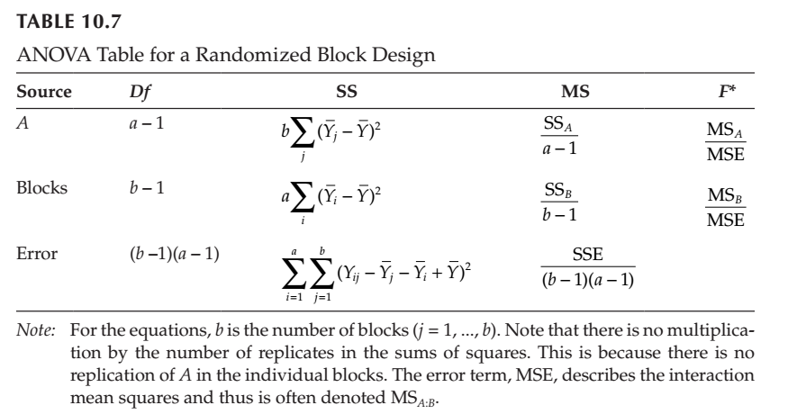
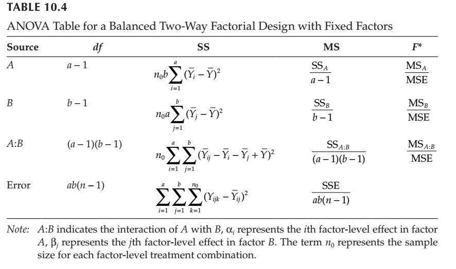

## Comparison of ANOVA with linear models

### Two samples with the same means

Let's generate two sample groups, *ctrl* and *trt*, by taking random samples from normally distributed data.

First, Select 5 random numbers from distribution where *mean*=0 and *sd*=1

```{r}
ctrl=rnorm(5)
```

Select 5 random numbers from distribution where *mean*=5 and *sd*= 1

```{r}
trt = rnorm(5, mean=5)
```

combined both samples into one vector

```{r}
data = c(ctrl,trt)
```

Defined how the data is grouped

```{r}
expgroups = factor(rep(c("ctrl", "trt"), each=5))
```

Use boxplot to show distribution

```{r}
boxplot(data ~ expgroups)
```


## Perform ANOVA

The model is written such that the dependent variable (data) is explained by the independent variable (groups). Two ways to perform an ANOVA analysis is to use either the `aov()` function or the `lm()` function.

Method 1: `aov`
```{r}
summary(aov(data~expgroups))
```

The report tells us that the SSB is ~60, and the SSW ~10
If the SSB/SSW = SumSq(expgroups)/SumSq(Residuals) is a lot different from 1, we can conclude that there is a difference between the groups. But we actually want the F-statistic = (SSB/df.exp) / (SSW/df.res) = SSB/1 / SSW/8

Method 2: `lm()`
```{r}
datalm = lm(data ~ expgroups) # linear model of the data as explained by expgroups
                              # expgroups is the independent variable
                              # data is the dependent variable
summary(datalm)
```

The results from looking at `summary.lm` and `summary.aov` are slightly different. The Null hypothesis of linear modeling is that the *slope* of the line is 0, whereas the Null hypothesis of the ANOVA is that the *variance* of all of the data is the same as the variance of the individual groups. In other words, the baseline for `lm` is the control, whereas for ANOVA there is no baseline; you simply look at all the differences between the groups.

Despite these methodological differences, **notice that the $p$-values are the same.**

Using the ``anova()`` function on the linear model gives you the same information as the summary of ``aov()``

```{r}

anova(datalm)

```


```{r}
summary(aov(data ~ expgroups))
t.test(data~expgroups, var.equal=T)


```

### Generating random normally distributed data for three groups


Let's make another group and call it `trt2`.

```{r}
trt2= rnorm(5,mean=10) # same number of samples, but mean differs
```

Let's combine it with the other groups.

```{r}
data = c(ctrl,trt,trt2)
expgroups = factor(rep(c("ctrl", "trt", "trt2"), each=5))
boxplot(data ~ expgroups)
```

```{r}
datalm = lm(data ~ expgroups)
summary(datalm)
```

For this model, "Estimate" gives the slope of the line between the control and each experimental group. This is around 5 comparing ctl-trt1 and ~10 comparing ctl-trt2. This is just the difference between the means.

We get p-values for the individual groups, and an overall p-value for the model.


Let's compare this to the ANOVA result:

```{r}
summary(aov(data ~ expgroups))
```

Notice that for `summary` we don't see which groups are giving the significant difference. We can use "Tukey's honest significant difference" test, **TukeyHSD**, which performs a pair-wise comparison to help us figure this out.

```{r}
TukeyHSD(aov(data ~ expgroups))
```

This shows the magnitude of the differences between all pairwise combinations of the groups, so you can tell which groups are responsible for any major differences between them.

Again, performing the ``anova()`` function on the linear model gives you the same results as the summary of ``aov()`` however you can not perform ``TukeyHSD()`` on the ``anova()`` results.

```{r}
anova(datalm)

```

### What if trt2 is the same as trt?

```{r}
trt2= rnorm(5,mean=5)
data = c(ctrl,trt,trt2)
expgroups = factor(rep(c("ctrl", "trt","trt2"), each=5))
datalm = lm(data ~ expgroups)
boxplot(data ~ expgroups)
```

```{r}
summary(datalm)
```

```{r}
summary(aov(data~expgroups))
```

```{r}
TukeyHSD(aov(data~expgroups))
```

Notice that for the ANOVA, the differences between the groups is the same as the slopes between the ctl and the treatment groups in the linear model.


    
## Generating a random normally distributed data for two groups from two factors


This could be like treating two different varieties with two concentrations of Nitrogen to see if there is difference 

In this scenario both varieties have the same significant response

```{r}
wtctrl = rnorm(5,mean=0)
wttrt = rnorm(5,mean=5)

mutctrl = rnorm(5,mean=0)
muttrt = rnorm(5,mean=5)

data = c(wtctrl,wttrt,mutctrl,muttrt)
```

We need to create two different factors

```{r}
expgroups = factor(rep(c("ctrl", "trt","ctrl", "trt"), each=5))
genotype = factor(rep(c("wt", "mut"), each=10))
```

### BLOCKING



```{r}
boxplot(data ~ genotype + expgroups)
```

We can still look at the responses individually
```{r}
datalm = lm(data ~ genotype + expgroups)
summary(datalm)
```


```{r}
summary(aov(data ~ genotype + expgroups))
```
```{r}
summary(aov(data ~ expgroups))


```

### We can also just look at the interaction



```{r}
datalm = lm(data ~ genotype * expgroups)
summary(datalm)
```

Here the Estimate for the interaction term `genotypewr:expgroupstrt` tells you the *change in the slopes* comparing controls vs. experimental groups in the two different genotypes. This measures the contribution of the genotype to the treatment response.

```{r}
boxplot(data~genotype * expgroups)

```

```{r}
summary(aov(data ~ genotype * expgroups))
```

```{r}
TukeyHSD(aov(data ~ genotype * expgroups))
```


## What if the gene in only one variety resonds to nitrogen

```{r}
wtctrl = rnorm(5,mean=0)
wttrt = rnorm(5,mean=0)

mutctrl = rnorm(5,mean=0)
muttrt = rnorm(5,mean=5)

data = c(wtctrl,wttrt,mutctrl,muttrt)
expgroups = factor(rep(c("ctrl", "trt","ctrl", "trt"), each=5))
genotype = factor(rep(c("wt", "mut"), each=10))

boxplot(data ~ genotype + expgroups)
```

If we just look at the response of treatment vs control, it doesn't look very significant.

```{r}
summary(aov(data ~ expgroups))
```

However when we add a factor to account for some of the variability, the treatment effect is significant.

```{r}
summary(aov(data ~ expgroups + genotype))
```

Order should not matter in this case.
```{r}
summary(aov(data ~ genotype + expgroups))
```

And Tukey helps us break down the comparisons.

```{r}
TukeyHSD(aov(data ~ genotype + expgroups))
```


Using the *+* between the factors we are not paying attention to the fact that there is an interaction between the varieties and amount of nitrogen. We can do this by using a *\** between the factors or add a term with both factors with a *:* between them.

```{r}
datalm = lm(data ~ genotype * expgroups)
summary(datalm)
```

```{r}
datalm = lm(data ~ expgroups + genotype + genotype:expgroups)
summary(datalm)
```

Let's see how the summary.aov changes the results.

```{r}
summary(aov(data ~ genotype * expgroups))
```

```{r}
TukeyHSD(aov(data ~ genotype * expgroups))
```

### Relevel
However,  in the lm() models, it is all relative to the first levels ( which are simply picked alphabetically) let's relevel the factor and make sure wt is being used as the reference.

```{r}
genotype = relevel(genotype, "wt")
datalm = lm(data ~ expgroups * genotype)
summary(datalm)
```
Notice that the treatment is no longer significant, because in **wt** it isn't. 

Where as when perform the aov function,

```{r}
summary(aov(data ~ genotype * expgroups))
```

```{r}
TukeyHSD(aov(data ~ genotype * expgroups))
```


### Model Simplification

As a general rule you want to only consider the more complex model if there is a significant difference between the models. We can also compare different models. 

```{r}
dataalm1 = lm(data ~ genotype + expgroups)

dataalm2 = lm(data ~ genotype + expgroups + genotype:expgroups)

anova(dataalm1, dataalm2)
```

Since there is a significant difference, we keep the more complex model.

