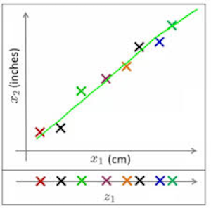
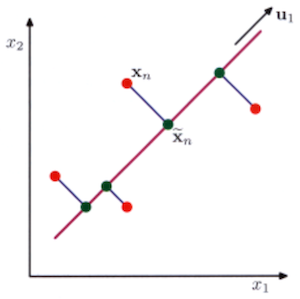
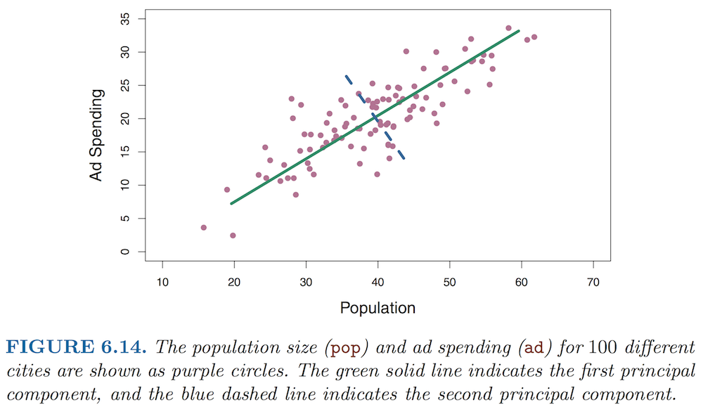
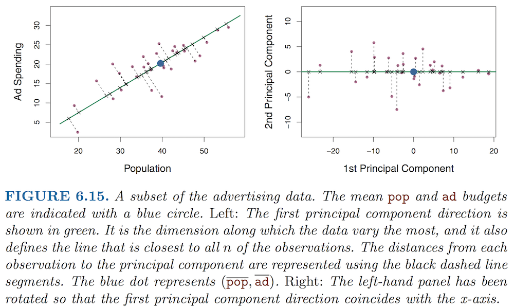
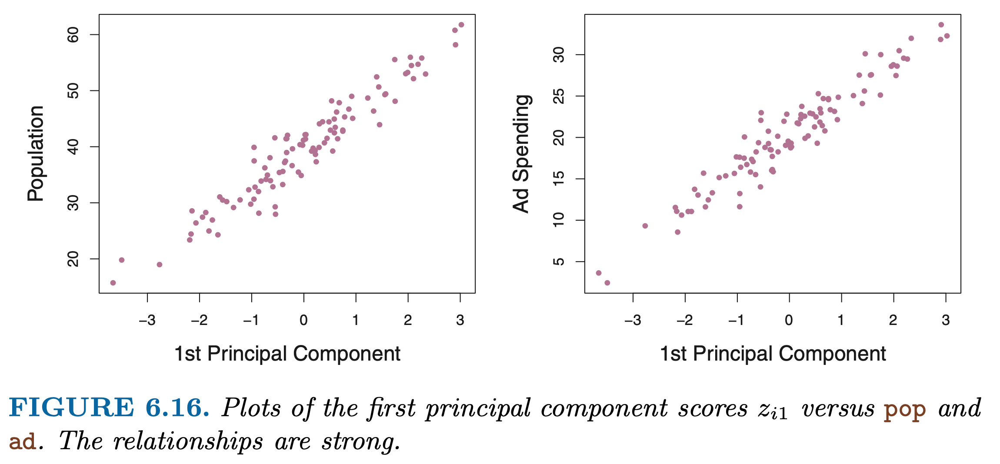
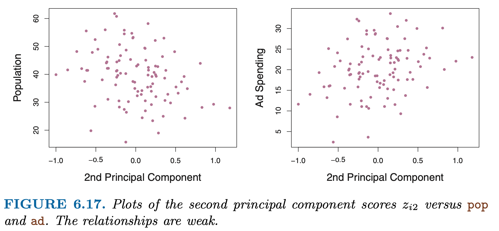
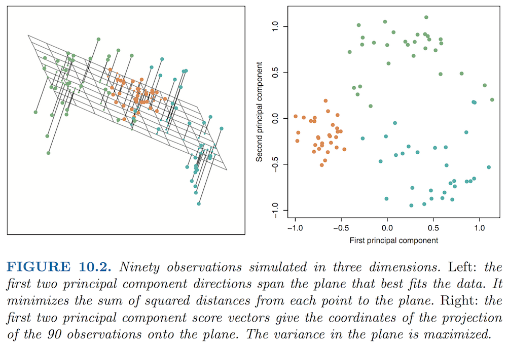
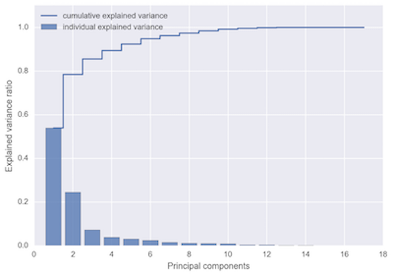

```{r setup, include=FALSE}
knitr::opts_chunk$set(echo = TRUE)
```


# Clustering or Dimensional Reduction: When and Why?

**Clustering**

+ Which genes show the most similar expression patterns?
+ Which conditions have the most similar "state" in terms of their expressed genes?
+ How many distinct "classes" are there?

**Dimensional reduction**

+ How can I summarize the entire dataset in terms of the distribution of the data?
+ How can I isolate the groups (genes or conditions) showing the greatest amount of variation?
+ Can I represent the data with a smaller number of variables / descriptors?
+ How can I visualize the relationships between different conditions?


# Motivation

Often, the amount of "information" present in a dataset -- in terms of the total variability -- is not uniformly distributed across measurements. **Why?** 

If two dimensions (experimental conditions) are highly **correlated**, then there is some **dependency** between them, and the amount of information gained by including the second dimension in your analysis is small. We saw this when we looked at the correlations between predictors in our logistic regression homework.

In such cases, instead of simplifying our data by just selecting a few features to work with ("feature selection"), we can ***project*** the data onto a smaller number of dimensions that capture the "essence" of the variation and different groupings in the data using a much smaller number of explanatory variables, without losing too much of the original information.


## A brief note on tSNE and UMAP

**PCA, tSNE, and UMAP** all seek to simplify the way data are represented while preserving distinctive patterns in the data, i.e the most informative features and groupings and the relationships among them. 

You can broadly think of these as different ways to look at relationships, based on "far"-ness vs. closeness.

+ **PCA**: 
  + Identifies a **linear combination** of features (measurements in multiple dimensions) that explain the **total variation** in the original dataset.
  + Used for a wide range of applications, including image analysis, data compression, feature extraction, and data visualization.
+ **tSNE and UMAP**:
  + Used to visualize high-dimensional data in 2 or 3 dimensions.
  + Primarily focused on preserving **local structure**.
  + UMAP is better at capturing total variation than tSNE.
  + Global structure is better preserved using UMAP than tSNE.

Especially for single-celled profiling data, **PCA and clustering are often used as a precursor to 2D visualization with UMAP** in order to limit the presentation of data to the portion of the data that actually drive variation between conditions in the dataset (e.g. most commonly, different cell types or sub-types).

We will not go through the intricacies of tSNE and UMAP here, since the algorithms are rather complex. You will see a lot of tSNE maps in older single-cell papers. However, UMAP has largely replaced tSNE in recent years due to several advantages:

The ***Towards Data Science*** website contains several useful blog posts that discuss how tSNE and UMAP work and the differences between them. These can be somewhat involved, so to get started, just read through the general parts that will be easier to digest. [**Toward Data Science blog posts on tSNE and UMAP** by _Nikolay Oskolkov_](https://towardsdatascience.com/tagged/stats-ml-life-sciences)

I have also written **my own guide to tSNE** that draws on some of these sources, which you may peruse if you like. [**PDF**](Visualization_tSNE_2018.pdf) - [**HTML**](Visualization_tSNE_2018.html)


# Principal Components Analysis

## Background Reading

+ Introductory: [**ISLR Chapter 6 - PCA Overview**](https://drive.google.com/file/d/1-fxueybcKca2N1xlK9j4K__xtLhh0tdy/view?usp=sharing)
+ Advanced: [**ISLR Chapter 10 - Unsupervised Learning**](https://drive.google.com/file/d/1eaCF4hEGGHyP8BCXWiTh1XZJ3IGxVy0-/view?usp=sharing)  _(through Section 10.2)_


## Overview

Our goal is to identify large-scale patterns across the data, while reducing complexity so that we focus on the most important information. **Principal components** enable us to summarize data using a smaller number of variables that collectively capture most of the **variability** in the original dataset. 

A simple 2D example would take all of the data points and project them onto just one of the two axes. In the figure below (**Figure 1**), most of the variation in $x_1$ and $x_2$ dimensions are present in the projection on $z_1$.The main difference is that the total variation along the diagonal 2D is somewhat squished upon reduction to 1D. 

{width=25%}

The main idea behind PCA is to find a **linear combination** of the original measurements (dimensions, or features) that capture and preserve the greatest amount of variation in the data.


## How does PCA work?

Consider the following two-dimensional dataset (**Figure 2**):

{width=25%}

The key concept behind PCA is that we want to **change coordinate systems** so that the **maximum amount of variation is distributed along orthogonal axes**. 

+ To do this, we make a ***linear projection*** of the data onto a lower-dimensional subspace, which we call the **principal subspace**.
+ In the new subspace, $\mathbf{u_1}$ is the "**first principal component**", and most of the variation in the data is distributed along this axis. In other words, it is the dimension along which the data are most "spread out". 
+ For higher-dimensional data, we project our data from $\mathbf{x_1, x_2, ...}$ onto a new set of variables $\mathbf{u_1, u_2 ... }$. The 1st PC will still contain the greatest amount of variation in the data, the second PC will contain the second greatest amount of variation in the data, and so on.

The projection is a mathematical transformation that is simply a **linear combination** of the original variables. There are two equivalent ways to think about PCA that are both illustrated in **Figure 2**:

* **Maximize the variance** of the projected data (along the $\mathbf{u_1}$ axis)
* **Minimize the average projection cost**, i.e. the **mean squared distance** between data points and their projections (the distance from $x_n$ to to $\tilde{x}$)

The two formulations give rise to the same algorithm. 


## A simple case: PCA in two dimensions

Now let's look at a real-life example, from Chapter 6.3.1 of *Introduction to Statistical Learning* (**Figure 3**).

{width=80%}

We see from the figure that most of the variation in the data falls along the green line. This is the first principal component (PC1). If we were to remove this variation, then we could describe the rest of the variation in terms of the orthogonal dimension shown by the dashed blue line. 

Now we have effectively changed our coordinate system from "Population" (x) vs. "Ad Spending" (y) to a **new coordinate system**, PC1 and PC2 (**Figure 4**). Notice that we have transformed the data by **mean centering**, so that we represent each original dimension as a deviation from its mean.


{width=80%}

## Relationship between original and PC coordinate systems

Now we want a way to quantify the **loadings** of the original variables on to our new dimensions. Let's define a set of $M$ principal components, and call them $Z_1 ... Z_m$. For the above example, we can now write, for PC1:

$$ Z_1 = 0.839 * (pop - \overline{pop})  + 0.544 * (ad - \overline{ad})  $$

Now something interesting has happened. We have transformed our original set of $p$ predictors (population, ad spending) of $n$ variables (cities) to a new set of predictors in $M$ dimensions: the **principal components**.

In this example, that doesn't seem like a big deal, but consider gene expression studies, where we measure thousands of genes (our $n$ variables) across many samples (call this $p$). We can describe this as an $n$ x $p$ matrix.

By performing PCA, we can reduce the dimensionality of our dataset from $p$ to something much smaller that explains most of the variation in the dataset. This is particularly convenient for large datasets, such as *single-cell studies*, since our $M$ principal components will be some **linear combination** of our original measurements, where $M < p$.

We can also see that much more variation is captured in PC1 than in PC2 by plotting each of the original variables against each PC:



## A 3D example

What happens when we have more than just two features to compare? Let's consider a small dataset simulated in three dimensions (**Figure 5**). Now we see that, in the same way that PC1 captures the most variation in the dataset, together the first $M$ principal components provide the best $M$-dimensional approximation of the original dataset. We can extend this approach to any number of dimensions.

As $p$ increases, it rapidly becomes unweildy to visualize how the data are distributed by plotting every pairwise combination of features (since there are $p*(p-1)/2$ pairwise combinations). Instead, PC plots provide a nice way to visualize the most significant variation across the dataset. Looking at 2D plots of the first few PCs usually provides a pretty good summary of the overall variation in the original data.

{width=80%}


## Mathematical formulation for PCA

Let's now find a mathematical way to describe what we have done that generalizes to multiple dimensions. Let's call our set of $p$ predictors $X_1, X_2 ... X_p$, and $M$ represent $M < p$ linear combinations of them. Note that for each feature (condition) $X$ we have $n$ observations (genes), so that each $X$ is a vector of length $n$. For PC1, we can now write:

$$ Z_1 = \phi_{11}X_1 + \phi_{21}X_2 + ... + \phi_{p1}X_p $$

We say that $Z_1$ is the **first principal component** of the set of features $X$. It is a **normalized linear combination** of these that has the **largest variance** across the $p$ predictors.


## Loading vectors

We call the coefficients $\phi$ the **loadings** of the predictors onto the principal components. We write the loading vector for the first principal component as:

$$ \phi_1 = (\phi_{11}, \phi_{12}, ... , \phi_{p1}) $$

In the above example, the loading of "Population" onto the first principal component was 0.839, and the loading of "Ad spending" onto PC1 was 0.544.


## Normalization: Centering and Scaling

Notice that we also said the the linear equations are **normalized**. In order to make our measurements across the different variables (e.g. samples) more comparable, we both **center** the data points in each sample by subtracting each measurement from the sample mean, and then **scale** the variation for each PC so that the standard deviation equals one: $s = 1$. (Notice that this is reflected in the units shown for PC1 and PC2 in Figure 5.)

Normalization allows us to quantify the proportion of the total variance that is distributed along each PC. When $M = p$, i.e. the number of PCs equals the number of original dimensions, we have explained 100% of the variation in the original dataset.

Therefore, the *total variance* for $Z1$ across the entire dataset will sum to 1, that is:

$$ \sum_{j=1}^p \phi_{j1}^2 = 1 $$

For the advertising example above, we can see that $\theta_{11}^2 + \theta_{21}^2 = (0.839)^2 + (0.544)^2 = 1$.

Scaling is much more important when variables are measured in different units, such as the population of cities vs. the amount of ad money spent in each state.


## PC scores

To complete our formal description, we need a way to describe the relationship between each PC and each of the original observations $x_{ij}$, where $i = 1 ... n$ and $j = 1 ... p$. For an $n$ x $p$ matrix of expression data, for example, we index each gene with $i$ and each sample with $j$. 

Each of the $M$ principal components $Z$ comprises $n$ linear combinations of $p$ terms. We call these *scores* and denote them as $z_{11},...,z_{n1}$. The scores for PC1 take the form:

$$ z_{i1} = \phi_{11}x_{i1} + \phi_{21}x_{i2} + ... + \phi_{p1}x_{ip} $$

Just as the loadings relate each PC to the original set of features $X_1 ... X_p$, so the scores for each PC relate to the individual elements $x_{ij}$.


## How to choose the right nmber of PCs?

In practice, since we are interested in simplifying our description of the data, we want $M$ to be smaller than $p$. There is no single correct answer to choosing $M$. One method that is commonly used is to "eyeball" the data using a scree plot (**Figure 6**).

{width=60%}

A common approach is to look for an "elbow" in the plot, and choose the number of PCs that is one less (because at the elbow, adding PCs adds less and less to the total explained variation). In this example, 2 principal components seem sufficient to explain most of the data. Often, you will have more than 4 PC.

Another way is to decide on the total proportion of the variance you want to be able to explain. For example, you could choose a cutoff of 80-95%, depending on your application.
