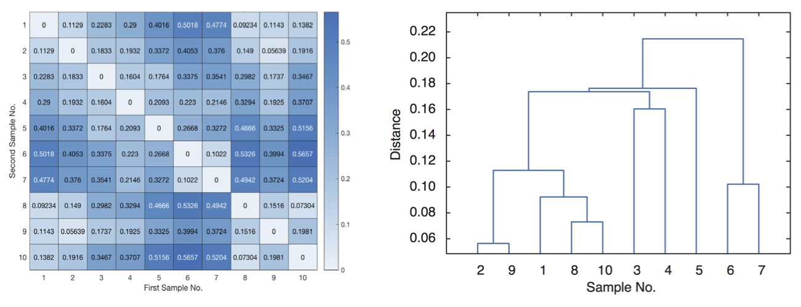
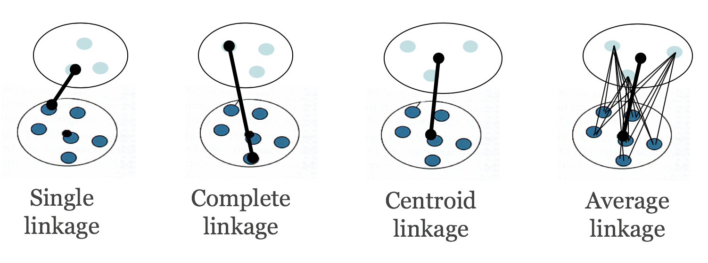
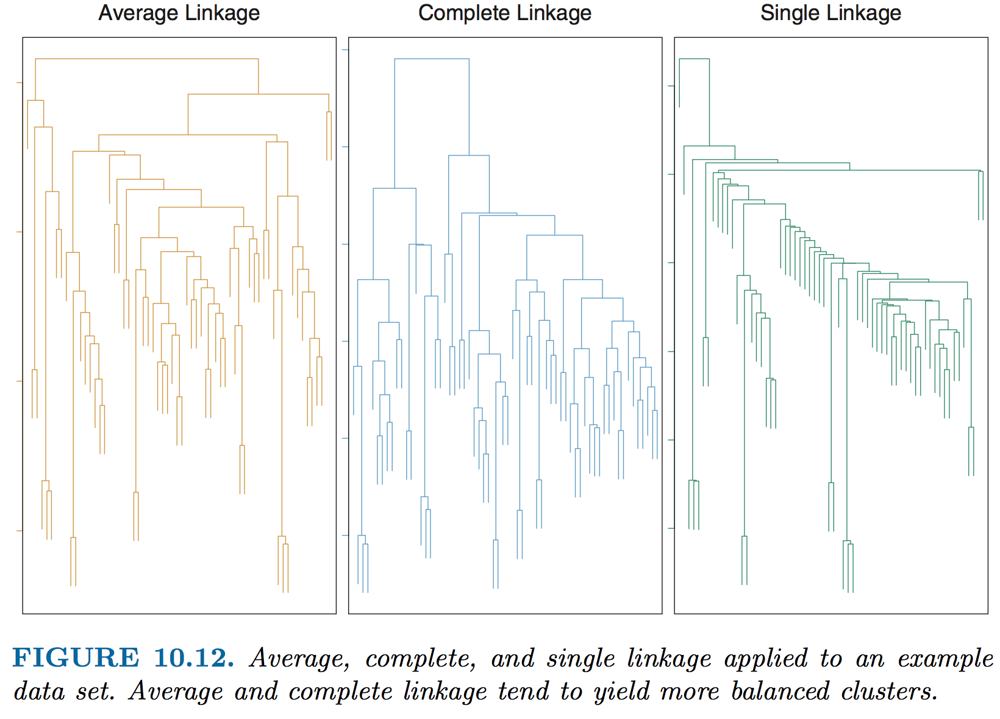
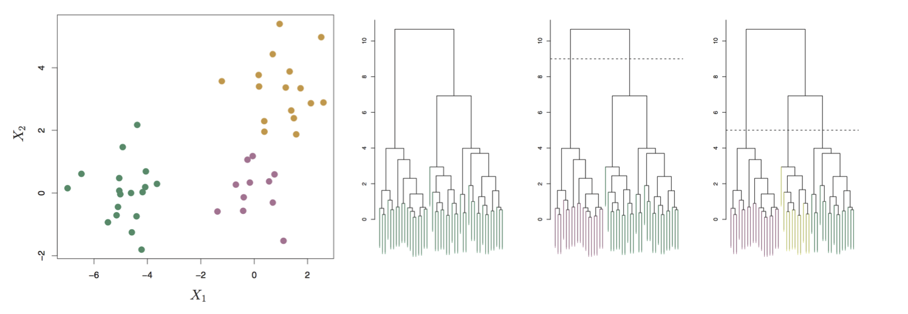
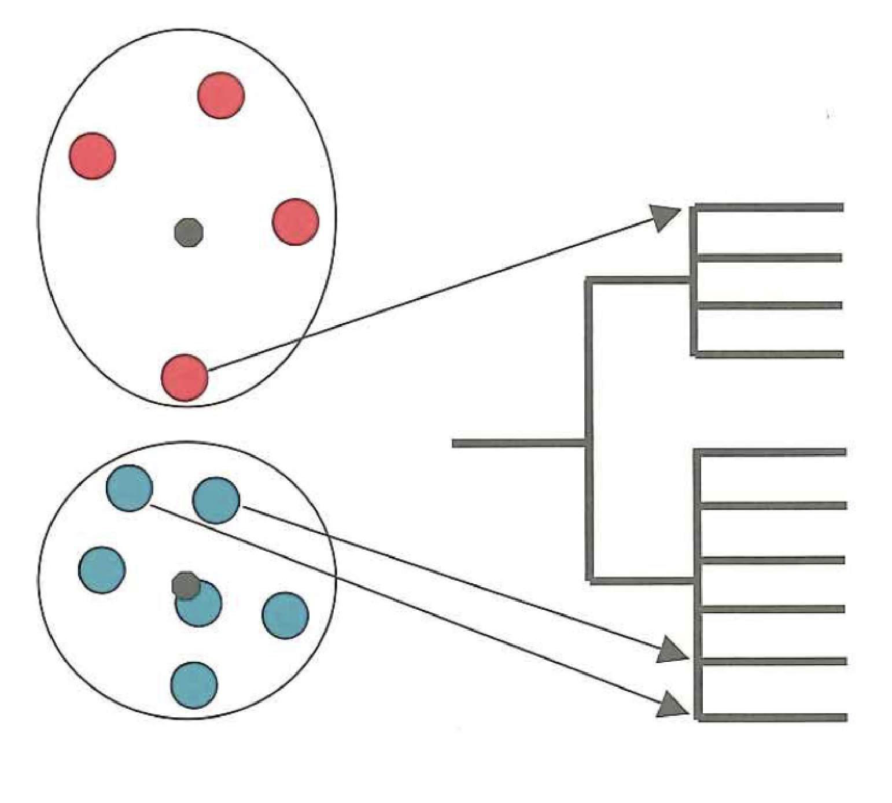
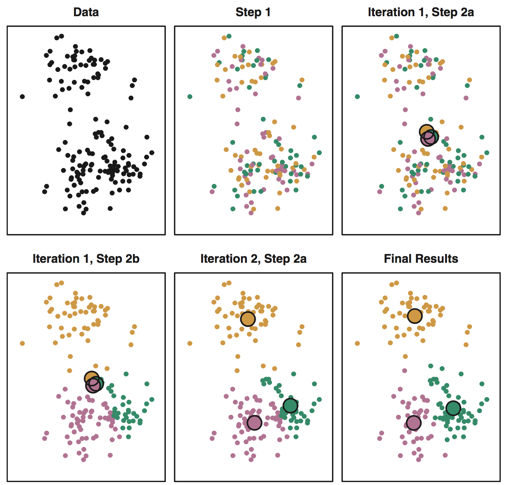
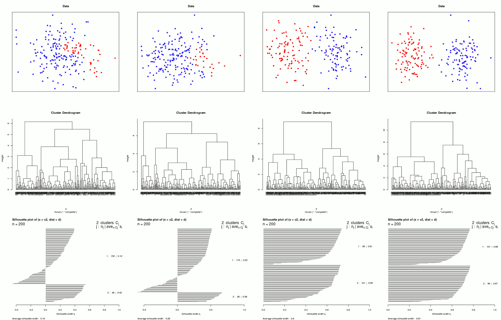
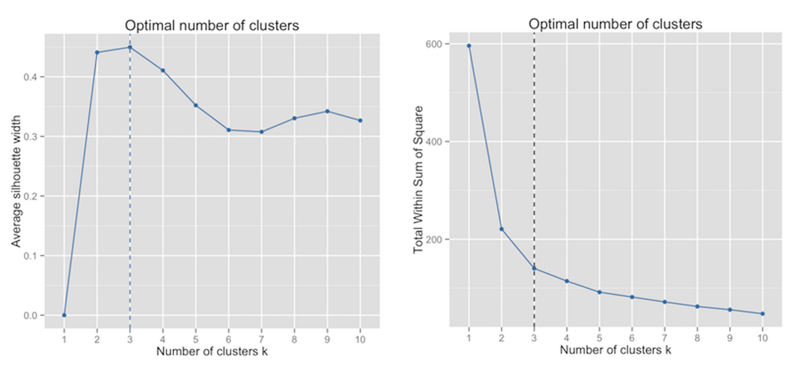

```{r setup, include=FALSE}
knitr::opts_chunk$set(echo = TRUE)
```

## Background Reading

+ Review: Distance (class notes from Week 10) - [HTML](week_10/XDAS_Distance_2019.html) - [PDF](week_10/XDAS_Distance_2019.pdf)
+ Draghici Chapter 11: Clustering (also includes distance measures) - [PDF](https://drive.google.com/file/d/0BxPAku5Rir7LNHVXWmRjaHAtOFU/view?usp=sharing)
+ Introduction to Statistical Learning, Chapter 10.3: Unsupervised Learning, Clustering Methods - [PDF](https://drive.google.com/file/d/18gOdl2yCquJW_9DtEfrg3cbQVaATtAFF/view?usp=sharing)


Most of the figures included below are from one of these chapters.

## Introduction

**Clustering** methods are **unsupervised** learning methods that are used to **classify** data based on similarity (proximity in multiple dimensions). Clustering seeks helps find patterns in your data, and can be used to find groups of genes that show similar expression across a time series, that distinguish cell types from each other, or that show strong responses to different treatments.

Clustering can be approached using either top-down (**divisive**) or bottom-up (**agglomerative**) methods. Different clustering approaches have certain advantages and disadvantages that you will become familiar with over time. 

In all cases, it is necessary to decide how to measure the **distance between data points**. Common distance measures are Euclidian, Manhattan, or correlation-based (Pearson or Spearman).

Below is a very brief overview of the two most common methods, **Hierarchical** and **K-means** clustering. The assigned reading and class exercises will give you a better understanding of how these algorithms work.

## Hierarchical clustering

An aggomerative (bottom-up) clustering method computed as follows:

* Create a distance matrix between all data points
* Find the two closest points
* Merge these (using linkage rule)
* Recalculate distance matrix
* Iteratively continue until all datapoints have been merged

Hierarchical clustering for gene expression is often performed using Pearson distance ($d$ = 1 - $r$), but it can be done with a variety of different distance measures, including Manhattan, Euclidian, or rank-based (Spearman) correlation. **Figure 1** (from Draghici Ch. 11) shows a pairwise distance matrix (left) and the resulting hierarchical clustering (right).

{width=70%}

**Linkage** refers to the criterion used to measure the distance *between* clusters (summarized in **Figure 2**):

* **Minimum linkage** - distance between two closest points in the clusters
* **Maximum linkage** - distance between the two furthest points in the clusters
* **Average linkage** - average distance between all points in cluster A vs. all points in cluster B
* **Centroid linkage** - distance between cluster "centers" (the centroid is the arithmetic mean position of all points within a cluster across all dimensions)

{width=60%}

Different linkage methods result in different clustering outcomes, as illustrated in **Figure 3** (from Introduction to Statistical Learning, Ch.10.3).

{width=80%}

### Tree cutting

The final number of clusters you will end up will will depend on where you "cut" the dendrogram -- i.e. what threshold you choose for the distance between clusters. Methods for choosing the right cutoff are described below. It is common to choose a fixed cutoff, but dynamic cutting approaches have also been devised that take into account the the shape of the branches. A blog that discusses this is referenced at the end of this document.

**Figure 4** (from Introduction to Statistical Learning, Ch.10.3) shows a data matrix and resulting dendrogram with Euclidian distance. Depending on the chosen cutoff, either two or three clusters are produced.

{width=80%}

### Caveats

* Different distance measures can give rise to different groupings of data points.
* Sometimes points that are not that distant will get into different clusters, as illustrated in **Figure 5**.
* It's hard to know what to call a "group", i.e. to choose an appropriate cutoff. Methods to choose the right number of groups are discussed below.

{width=25%}

## K-means clustering

A divisive (top-down) clustering method. The procedure is:

* Step 1: Select the number of clusters k and arbitrarily assign each point to one of the k groups
* Step 2:
  + Compute centroids for each group (average position in n-dimensional space)
  + Reassign data points to the closest centroid
* Iterate until convergence (shampoo, rinse, repeat ...)

By taking the smallest distance between each point in a cluster to the center of the cluster, k-means seeks to minimize the "within-cluster sum of squares". 

K-means clustering uses Euclidean distance (other measures may not converge). A common variant on k-means clustering is called *k-medioids* clustering, which uses Manhattan distance instead. It is somewhat less sensitive to outliers.

**Figure 6** illustrates a simple iterative example of K-means clustering with k=3. Numerous interactive illustrations of this process may be found on the web (a simple one using the iris dataset and R Shiny can be found [here](https://shiny.rstudio.com/gallery/kmeans-example.html)).


{width=65%}


### Caveats

* Difficult to know how to choose the **optimal k** (see below for two ways to help with this)
* Can end up with very different clusters depending on starting conditions (these are random)!
* Doesn't work well if true clusters have funny shapes


## Pre-processing: Normalizing, filtering, and scaling data

_**Normalization**_: Prior to applying any clustering method, you should always make sure your data are normalized (e.g. convert raw RNA-seq counts to TPM), otherwise they will not be comparable.

_**Filtering**_: For comparing fold-changes, it can also be a good idea to first **filter** the data and only cluster using the genes that show dynamic expression (i.e. show a lot of variation between experiments). Since all datapoints will be clustered, this will restrict the clustering to genes that are more "interesting" and will usually result in more distinct clusters. This cam be done using **PCA** prior to clustering.

_**Scaling**_: Hierarchical clustering using correlations will automatically put all your data on the same scale. However since K-means uses Euclidian distance, clustering with raw TPM will cluster genes mainly by their overall expression levels. This can be mitigated by scaling the data. Scaling by mean-centering and sdandardizing using the variation will turn expression measurements into $z$-scores. Computing Euclidian distance on scaled data will give the same result as computing Pearson correlation.

[comment]: # (Reference on this topic: https://arxiv.org/pdf/1601.02213.pdf)


## How can we judge the quality of clusters?

+ **Cluster Size**
  + Examine the overall size of clusters; clusters that are very large often indicate that the grouping is not very good.
+ **Cluster compactness**
  + Examine the distance between members of the same group versus members in other groups. Compact clusters with greater separation between different groups are better. We can use *slihouette widths* to evaluate this (see below).
+ **Cluster shape**
  + Examine the shape of clusters using different distance or linkage measures, or rescaling, to see if changing these will improve the groupings. Depending on the distance measure, data that are very spread out in one dimension but do not vary much in another dimension can get grouped improperly (e.g. when using Euclidian distance). If this happens, it's probably a good idea to scale the data with respect to the variation in each dimension.
+ **Independent Criteria**
  + Evaluate clusters with respect to some other biological information, such as GO-term enrichment or correspondence with other phenotypic data.


### Silhouette plots

In general, we want to *maximize the between-cluster distance* and *minimize the within-cluster distance*. To compare these two features, we can define a **silhouette width** for each datapoint as:

$$Sil_i = \frac{(b_i - a_i)}{max(a_i,b_i)}$$
where:
$a_i$ = average within-cluster distance with respect to gene $i$
$b_i$ = minimum between-cluster distance with respect to gene $i$

Ideally, we would like the distance from any point to the rest of its own cluster to be much smaller than its distance to datapoints in other clusters, i.e. to minimize $a_i$ while maximizing $b_i$. 

The silhouette width varies between -1 and 1: $-1 < Sil_i < 1$. A good clustering partition will result in more values of $Sil_i$ closer to 1 ($a_i << b_i$), whereas a poor partition will give $Sil_i$ closer to -1.

Cluster quality can be assessed by **visualization** and **summary statistics**. The average silhouette width across clusters, as well as the number of genes with negative values, will give some idea about the quality of the clustering overall.

This is illustrated here for *hierarchical clustering* of four datasets, each partitioned into two clusters (**Figure 7**; this image is taken from Wikipedia). The silhouette plots show the value of $Sil_i$ for each point in every cluster, grouped by cluster and in descending order of silhouette width.

<!-- (from https://de.wikipedia.org/wiki/Silhouettenkoeffizient) -->



Looking at the dendrograms, we can see that the quality of clustering increases going from left to right as the separation between clusters increases. The more well-separated clusters on the right-hand side show longer branch lengths _between_ clusters and shorter branch lengths _within_ clusters. 

Choosing $k$=2, silhouette plots also improve, showing more points with higher $Sil_i$ and higher _average silhouette width_ for each cluster -- indicating greater overall within- vs. between-cluster distances. Notice also that the left-hand plots also show some points with negative silhouette widths, indicating that they are not closer to points in their own cluster than they are to points in other clusters.

A really nice example of using silhouette plots to determine the right number of clusters from **k-means clustering** is given here, with very good illustrations (**please check it out!**):

http://scikit-learn.org/stable/auto_examples/cluster/plot_kmeans_silhouette_analysis.html


### Choosing *k*

#### Silhouette widths

To choose the proper number of clusters, we can plot the number of clusters, $k$, versus the average silhouette width for all clusters and pick the $k$ with the highest value (**Figure 8, left**). 

{width=70%}

It's still a good idea to examine the data visually, though, since sometimes a clustering result with a slightly lower average will still "look" more natural to you. It is also possible that a slightly sub-optimal clustering may give more meaningful groupings biologically, for example greater coherence in terms of GO-term enrichment.

#### Elbow plots

K-means clustering tries to minimize the overall **sum of squares** within each cluster:

$$\underset{S}{\arg\min} \sum_{i=1}^k \sum_{x \in S_i} || \bf{x} - \bf{\mu}_i||^2$$

where $k$ is the number of clusters, $\bf{S}=\{S_1,S_2,...,S_k\}$ are the k sets of datapoints $\bf{x}$, and $\bf{\mu}_i$ is the mean of points in each set $S_i$.

Hence another way to evaluate the right number of clusters is to plot the **total within-cluster sum of squares** versus the **number of clusters** (**Figure 8, right**). The optimal number of clusters may be taken as the "**elbow**" in the graph. At this point, the improvement in WSS begins to level off with increasing $k$, so adding more clusters won't improve the quality of clusters much and will start splitting coherent clusters into more and smaller ones. This counters the goal of reducing the data to find the most meaningful groupings.


## Additional Resources

* Methods for choosing the right cluster number (from "Statistical tools for high-throughput data analysis" website: http://www.sthda.com/english/wiki/print.php?id=239)

* Wikipedia also has pretty decent articles on various clustering methods (Figure 1 is from one of their articles).

* A blog on hierarchical clustering that mentions dynamic tree cutting: https://2-bitbio.com/2017/04/clustering-rnaseq-data-making-heatmaps.html

* Interactive visualization of k-means clustering with RShiny: https://shiny.rstudio.com/gallery/kmeans-example.html
