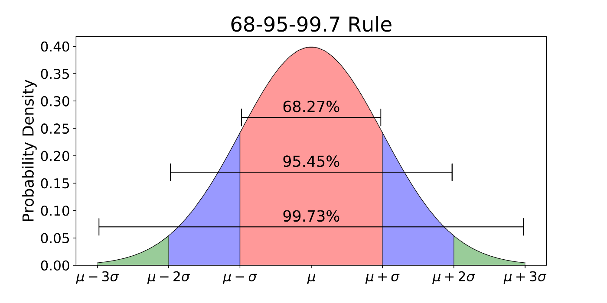

```{r setup, include=FALSE}
knitr::opts_chunk$set(echo = TRUE)
options(tinytex.verbose = TRUE)
library(tidyr)
library(dplyr)
library(ggplot2)
library(ggpubr)
library(cowplot)
library(DT)
```

```{css, echo=FALSE}
.qbox {
  padding: 1em;
  background: cornsilk;
  border: 1px solid burlywood;
  border-radius: 5px;
}

.bluebox {
  padding: 1em;
  background: #d8ecf3;
  border: 1px solid cornflowerblue;
}

h1 {color: mediumblue}
h2 {color: mediumblue}
h3 {color: mediumblue}
```

<!-- ======================================================================= -->

## I. Review: Summary statistics

### Population parameters

#### Location / central tendency: mean

Measures of location describe the most "representative" value in a population.

+ The **mean** is the ***expected value*** of all individuals in a population and is the arithmetic mean.

$$E(X) = \mu = {\frac{1}{N}}\sum{x_i} $$

#### Scale / dispersion: variance and SD

Measures of scale describe how far away from the mean most of the individuals in the population are.

+ The **variance** of the population is the squared sum of differences between the population mean and each individual, divided by the total number of individuals in the population.

$$Var(X) = \sigma^2 = \frac{1}{N}\sum({x_i - \mu)^2}$$

+ The **standard deviation (SD)**, $\sigma$, is simply the square root of the variance. 

<!-- ======================================================================= -->
<div class="qbox">
$\Rightarrow$ ***Question: Why is SD is a more intuitive measure of dispersion than variance?***

<details closed markdown="block">
  <summary>Answer</summary>
  
+ Because it is in the ***same units*** as the units of measurement.

</details>
</div>
<!-- ======================================================================= -->


### Sample mean and variance

+ The **sample mean** $\bar{X}$ and **variance** $s^2$ describe the ***sample distribution*** of an unbiased random sample of individuals taken from a population.

$$\bar{X} = \frac{\sum(x)}{n}, \ \  s^2 = \frac{\sum({x_i - \bar{X})^2}}{n-1}$$
These statistics are **estimators** of the true (usually unknown) **population parameters**.

<!-- ======================================================================= -->
<div class="qbox">
$\Rightarrow$ ***Q: Why does the sample variance have $n-1$ degrees of freedom?***

<details closed markdown="block">
  <summary>Answer</summary>

+ We have only $n-1$ independent values in the calculation, since we use up one degree of freedom in calculating the sample mean, $\bar{X}$.
+ Because of this, dividing by $n$ vs. $n-1$ would underestimate the true variation in the population.

</details>
</div>
<!-- ======================================================================= -->

### Robust estimators

The median and inter-quartile range (IQR) are alternative measures of location and scale that are **robust to outliers**.

+ The **median** is the middle value of a dataset: 50% of the datapoints are below and 50% are above this value.
+ The **IQR** represents the range of data between the 25th and the 75th percentiles.


### IQR vs. SD

<div align=center>

{width=50%}

</div>

<!-- ======================================================================= -->
<div class="qbox">
$\Rightarrow$ ***Q: What are the rules of thumb for the IQR?***

<details closed markdown="block">
  <summary>Answer</summary>

+ The central 50% of the data are within the IQR.
+ Around 99% of the data are within the IQR +/- 1.5*IQR.

</details>
</div>
<!-- ======================================================================= -->
<p>
<!-- ======================================================================= -->
<div class="qbox">
$\Rightarrow$ ***Q: What are the rules of thumb for the SD?***

<details closed markdown="block">
  <summary>Answer</summary>

- Around 2/3 of the data are within 1 SD of the mean.
- Around 95% of the data are within 2 SD.
- Around 99% of the data are within 2.5 SD.
- Around 99.7% of the data are within 3 SD.

</details>
</div>
<!-- ======================================================================= -->


## II. Random sampling

We've talked a lot about why taking **random samples** is important for obtaining representative estimates for population parameters, and things to watch out for to minimize sample **bias** (what are the possible sources of sample bias?) 

<!-- ======================================================================= -->
<div class="qbox">
$\Rightarrow$ ***Q: What effects does sampling error have on our sample estimates?***

<details closed markdown="block">
  <summary>Answer</summary>

+ Sampling error, due to bias or other sources of uncertainty, can affect both the ***accuracy*** and the ***precision*** of sample estimates.

</details>
</div>
<!-- ======================================================================= -->


### Distribution of a random sample

Once we have taken a (hopefully unbiased) sample from a population, we can look at the distribution of our measurements for each individual in the sample. 

For example, let's simulate the height distribution of everyone who was this class in each of the last four years, by taking four random samples of 17 people (assuming biologists represent an unbiased sample of the human population!).

```{r, include=F}
s1 = data.frame(height=rnorm(17, mean = 169, sd = 14))
ggplot(s1, aes(x=height)) +
  geom_histogram(fill="lightblue", color="darkgray", binwidth = 1)
```

```{r class.source="fold-hide"}
# ================================================================ #
# number of samples and sample size
sample_size = 17    # sample size
sample_num  = 4     # number of samples
sample_mean = 169
sample_sd   = 14

# ================================================================ #
# matrix of random samples
sample_data = replicate(sample_num,
                        rnorm(sample_size, mean = sample_mean, sd = sample_sd))
sample_data = matrix(sample_data, ncol=sample_num)
colnames(sample_data) = paste0("s", 1:sample_num)  # label the columns

height_long = stack(data.frame(sample_data, stringsAsFactors = TRUE))
names(height_long) = c("Height_mm","Sample")

# ================================================================ #
# make a second data frame holding height means for each sample
height_means = height_long %>% 
  group_by(Sample) %>%
  summarise(mean_height = mean(Height_mm))
# height_means

# ================================================================ #
# plots
p1 = ggplot(height_long %>% filter(Sample == "s1"), aes(x=Height_mm)) +
  geom_histogram(fill="lightblue", color="darkgray", binwidth = 2) +
  geom_vline(data = height_means %>% filter(Sample == "s1"),
             aes(xintercept=mean_height)) +
  xlab("Mean height (mm)")

p2 = ggplot(height_long %>% filter(Sample == "s2"), aes(x=Height_mm)) +
  geom_histogram(fill="lightblue", color="darkgray", binwidth = 2) +
  geom_vline(data = height_means %>% filter(Sample == "s2"),
             aes(xintercept=mean_height)) +
  xlab("Mean height (mm)")

p3 = ggplot(height_long %>% filter(Sample == "s3"), aes(x=Height_mm)) +
  geom_histogram(fill="lightblue", color="darkgray", binwidth = 2) +
  geom_vline(data = height_means %>% filter(Sample == "s3"),
             aes(xintercept=mean_height)) +
  xlab("Mean height (mm)")

p4 = ggplot(height_long %>% filter(Sample == "s4"), aes(x=Height_mm)) +
  geom_histogram(fill="lightblue", color="darkgray", binwidth = 2) +
  geom_vline(data = height_means %>% filter(Sample == "s4"),
             aes(xintercept=mean_height)) +
  xlab("Mean height (mm)")

composite_plot = ggarrange(p1,p2,p3,p4, nrow=2, ncol=2 )
annotate_figure(composite_plot, top = text_grob("Class heights, 2018-2021", 
               face = "bold", size = 14))
```


### Variation among samples

Each time we take a new sample, there will be some random variation in the sample mean, which will usually not match the population mean precisely. 

Let's take another look at how much the average height of our class varied over the last four years. We will use a density plot rather than a histogram to make the patterns come out better.

```{r class.source="fold-hide", echo=F}
# ================================================================ #
ggplot(height_long, aes(x=Height_mm, fill=Sample, color=Sample)) +
  geom_density(alpha=0.2) +
  geom_vline(data = height_means, aes(xintercept=mean_height, color=Sample)) +
  xlab("Mean height (mm)")
```


### Variability of sample means

Since the mean height of each class will always be a little different, what can we do to figure out how well our sample estimates represent the true population parameters?

Is there a way for us to know which mean estimate is closest the true population average? And how much variation might we expect to see in the population?

Let's say we know that the average height of humans around the world is 169mm. If we take many, many samples of 20 people from the same population, and record the mean value from each of these, we can plot the distribution of these sample means:

```{r, include=F}
x <- replicate(1000, {
  mm <- runif(10)
  mean(mm)
  })
hist(x)
```

```{r class.source = 'fold-hide', message=FALSE}
x = replicate(10000, {
  rsample = rnorm(sample_size, mean = sample_mean, sd = sample_sd)
  mean(rsample)
  })
mean_height = data.frame(Mean_Height = x)
ggplot(mean_height, aes(x=Mean_Height)) +
  geom_histogram(fill="lightblue", color="darkgray") +
  geom_vline(data = mean_height, aes(xintercept=mean(Mean_Height))) +
  labs(title = "Distribution of 10,000 sample means", x="Mean height (mm)")

```

Now the average value of all of these sample means looks pretty spot on! 

However, the variation in our sample means is still rather large, so we might not have that much confidence in the precision of our estimate from any singe sample.

<!-- ======================================================================= -->

## III. Sampling distributions of sample estimators

The **sampling distribution** of a sample estimator for a population parameter represents the ***distribution of all possible values for the sample statistic*** derived from a particular sample size, given an infinite number of samples drawn from the same population.

+ Sampling distributions can be computed for *all kinds of sample statistics*, and give us an idea of how closely we can expect our sample statistics to represent the true population parameters.

Fortunately, statistics for sampling distributions can be computed from a **single sample** - so you don't actually need take numerous samples of $N$ individuals (or independent measurements from a population) to get a good idea of how precise your sample estimates are! Whew. 

Below we will illustrate empirically that this is the case.


### Sampling distribution of the sample mean

One of the most important sampling distributions is the **sampling distribution of the sample mean**, $\bar{X}$. When we talk about the distribution of sample means, **the sample mean is now our random variable!** 

Let's just let that sink in: ***The sample mean is the random variable that describes the distribution of sample means.***

<!-- ======================================================================= -->
<div class="qbox">

$\Rightarrow$  ***Q: Why is the sampling distribution of $\bar{X}$ of particular interest to us?*** 

<details closed markdown="block">
  <summary>Answer</summary>

+ Because it allows us to determine how well our estimate represents the true **central tendency** of the population from which our samples are drawn, i.e. the ***precision*** of our estimate.

</details>
</div>
<!-- ======================================================================= -->
<p>
<!-- ======================================================================= -->
<div class="qbox">
$\Rightarrow$ ***Q: How do we quantify the precision of $\bar{X}$?***

<details closed markdown="block">
  <summary>Answer</summary>

+ We use the distribution to compute the **variation** in $\bar{X}$, which gives us an estimate of its ***precision***.

</details>
</div>
<!-- ======================================================================= -->
<p>
<!-- ======================================================================= -->
<div class="qbox">
$\Rightarrow$ ***Q: How does knowing the precision of $\bar{X}$ help us quantify our confidence that our sample estimate reflects the true population mean?***

<details closed markdown="block">
  <summary>Answer</summary>

+ It allows us make an educated guess about the **range of values** in which we expect the **true population mean** to be found.
+ This is called a **confidence interval**.

</details>
</div>
<!-- ======================================================================= -->


### $\bar{X}$ follows a normal distribution

With sufficiently large sample size $N$, the distribution of the sample mean $\bar{X}$ will converge on the population mean $\mu$, with variance $\sigma^2/N$. Obviously, when $N$ equals the entire population, the sample mean will exactly equal the population mean!

In the notation for distributions (which we will learn more about soon) we can describe the distribution of $\bar{X}$ as follows:

$$\bar{X} \sim \mathcal{N}(\mu,\frac{\sigma^2}{N})$$

In words, this equation says that: **"The sample mean X bar follows a normal distribution with mean mu and variance equal to sigma squared divided by the sample size N."**

+ This means that if you take a whole bunch of random samples from a population, then the distribution of the sample means will look pretty much like a bell curve. 
+ Moreover, since the variation in $\bar{X}$ is inversely proportional to $N$, the amount of uncertainty in your estimator will shrink as the sample size gets bigger.

This point is worth repeating: ***"The uncertainty in $\bar{X}$ decreases with increasing sample size."***

+ *For example, no matter how many samples of size 20 you take, your uncertainty in $\bar{X}$ will always be greater than if you took just one sample of 100 individuals.* If you are still skeptical about this, read on!

<!-- ======================================================================= -->

## IV. Standard Error of the Mean (SEM)

The **standard deviation of a sample statistic** is called its **standard error**. 

+ For the sample mean $\bar{X}$, the standard error is called the **standard error of the mean** and is abbreviated as **SEM**, or often simply as **SE**.

The SEM provides a measure of how much the variable $\bar{X}$ is expected to differ from sample to sample, i.e. the ***precision*** of  which we are able to estimate the true population mean $\mu$.

As noted above, the **variance** of $\bar{X}$ is dependent on the sample size $N$, and is equal to the population variance $\sigma^2$ divided by $N$:

$$Var(\bar{X}) = \frac{\sigma^2}{N} $$
The **SEM** is simply the square root of $Var(\bar{X})$:

$$\sigma_{\bar{X}} = \frac{\sigma}{\sqrt{N}}$$


### Estimating the SEM using sample data

When the sample includes the entire population, then we know the population mean precisely. In practice, however, we usually do not have access to the entire population. 

Instead, we can use the **sample standard deviation**, $s$, as an **estimate** for the population parameter $\sigma$. This also allows us to approximate the SEM using the SD of the sample:

$$ SE_{\bar{X}} = \frac{s}{\sqrt{N}} \approx \frac{\sigma}{\sqrt{N}} $$

<!-- ======================================================================= -->

## IV. Confidence Intervals

A **Confidence Interval (CI)** gives a ***range of values*** within which we would expect the true population parameter to fall most of the time. Confidence intervals can be calculated for all kinds of sample statistics!

+ The most common CI you will encounter is the **95% CI of the mean**, which gives us an estimate for a range of values within which the true population mean will fall 95% of the time.
+ In other words, **95 out of 100 confidence intervals based on independent random samples will contain the true population mean.**

<!-- ======================================================================= -->
<div class="qbox">
$\Rightarrow$ ***Q: What is the most common mistake people make in interpreting confidence intervals?***

<details closed markdown="block">
  <summary>Answer</summary>

+ People often assume that any particular 95% CI will have a "95% chance of containing the true sample mean". But this is not the case! 
+ For any given CI, the true population mean either **will**, or **will not**, contain the true population mean.

</details>
</div>
<!-- ======================================================================= -->
<p>
<!-- ======================================================================= -->
<div class="bluebox">
This **<a href="https://rpsychologist.com/d3/ci/" target="blank">animation</a>** contains a very intuitive visualization of what a CI of a sample is. Take a look at this and play around with changing the parameters.
</div>
<!-- ======================================================================= -->
<p>
<!-- ======================================================================= -->
<div class="qbox">
$\Rightarrow$ ***Q: How do the confidence intervals change with increasing sample size?***

<details closed markdown="block">
  <summary>Answer</summary>

+ The width of the CI decreases with increasing sample size.
+ This is because the variation in the mean for small sample sizes is a lot bigger!
+ So, a larger sample will be more representative of the larger population, and will provide a more ***accurate*** estimate of the true population parameter.

</details>
</div>
<!-- ======================================================================= -->
<p>
<!-- ======================================================================= -->
<div class="qbox">
$\Rightarrow$ ***Q: How do you think the sample mean affects the range of a confidence interval?***

<details closed markdown="block">
  <summary>Answer</summary>

+ The sample mean is **NOT** related to sample variance. 
+ So, the widths of CIs will vary a lot from sample to sample due to random variation...
+ ... meaning that ***narrow CIs are not necessarily more accurate***, as they may still be far away from the true mean.

</details>
</div>
<!-- ======================================================================= -->


### 95% CI

Since the sampling distribution of the sample mean approximates a normal distribution, this means that the **95% CI is approximately equal to the sample mean plus or minus two times the SEM**.

To be more precise, the 95% CI is within 1.96 times the standard error error of the mean:

$$ \bar{X} - 1.96 * SE_\bar{X} < \mu < \bar{X} + 1.96 * SE_\bar{X} $$


<!-- ======================================================================= -->
<div class="qbox">
$\Rightarrow$ ***Q: Why does it make sense that the 95% CI spans $\pm$ 2 times the SEM?***

<details closed markdown="block">
  <summary>Answer</summary>

+ Because the central bulk of a normal distribution is within two SD of the mean.

</details>
</div>
<!-- ======================================================================= -->
<p>
<!-- ======================================================================= -->
<div class="qbox">
$\Rightarrow$ ***Q: How many 95% CI's computed from 100 random samples of height measurements in the human population will contain the true population mean?***

<details closed markdown="block">
  <summary>Answer</summary>

+ The 95% CI for 95 of the 100 samples will contain the true population mean.

</details>
</div>
<!-- ======================================================================= -->


### The SE and CI depend on sample size

Both the SE and the CI are heavily dependent on ***sample size***. Consequently, this should be an important consideration in designing experiments, which we will get to later in the course.

***The SEM and CI for smaller samples will always be less precise than estimates based on larger samples.***


### Connection between the CI and the $p$-value

In ***hypothesis testing***, which we will discuss next week, we choose a significance threshold like $p=0.05$ to reject the null hypothesis that our sample comes from the null distribution. 

Correspondingly, if the 95% CI does not contain the mean for the null hypothesis, then the $p$-value for our sample statistic is less than 0.05. We will discuss this in a lot more detail in coming weeks.


<!-- ======================================================================= -->

## V. The Central Limit Theorem

### What is the Central Limit Theorem?

The CLT is one of the most ***fundamental concepts in statistics*** and encapsulates the issues discussed above.Briefly, it says that, ***As the sample size increases, any sample statistic will converge on the true population parameter, and its distribution will be approximately normal.***

+ Most commonly, the CLT is applied to the ***sampling distribution of the sample mean***.

The CLT highlights two important properties of **independent and identically distributed (iid)** random variables:

1. The **variation** in the distribution of a sample statistic will be ***inversely proportional*** to the **sample size** $N$. 
  + This means that our ***confidence*** in that value will increase because the variation among the sample estimates will get smaller.
2. Moreover, the distribution of the sample statistic will follow a **normal distribution** centered around the population mean.
  + In other words, repeated estimates of your sample statistic will show a normal distribution, ***even if the underlying data distribution is not normal***.

Since the SEM decreases as the square root of the sample size, ***in the limit*** our uncertainty in the sample mean $\bar{X}$ will go to zero as $N$ goes to infinity (and therefore $\bar{X}$ will exactly equal the true population mean $\mu$):

$$\lim_{N \rightarrow \infty}SEM = \lim_{N \rightarrow \infty}\frac{\sigma}{\sqrt{N}} = 0$$

+ *Side note:* It turns out that the normal distribution has ***maximum entropy***. This means that any individual sample gives no additional information about any of the other samples, i.e. they are uncorrelated, as you would expect for i.i.d. random variables.

<!-- ======================================================================= -->

## VI. Example

### A. Uniform distribution

Here we illustrate the concepts we have just discussed by sampling from a **uniform distribution**, where the probability of any outcome is the same. 

<!-- ======================================================================= -->
<div class="bluebox">
$\Rightarrow$ ***Q: Can you think of any cases where the sampling distribution is uniform?***

<details closed markdown="block">
  <summary>Some examples</summary>

+ The chance of a fair die landing on any of its faces
+ The chance of winning a lottery ticket
+ The month of the year in which anyone in the Biology Department was born
+ The time to the next cell division of a single yeast cell in log phase, from the moment you first look at it
+ The spatial distribution of territorial animals, or of plants in strong competition for water, light, or nutrients

</details>
</div>
<p>
<!-- ======================================================================= -->

Regardless of the specific uniform distribution we sample from, the lesson is the same. 

#### **Random sampling**

Below we sample from a **continuous** uniform distribution, in which all possible real values in an interval are represented with equal probability. 

<!-- ======================================================================= -->
<div class="qbox">
$\Rightarrow$ ***Q: Which of the above scenarios are examples of a continuous uniform distribution?***

<details closed markdown="block">
  <summary>Answer</summary>

+ The time to wait for log-phase cells to divide
+ The spatial distribution of territorial animals or plants in competition for resources

</details>
</div>
<p>
<!-- ======================================================================= -->

+ To get a sample, all we have to do is just pick a bunch of random numbers between 0-1.
+ We will then compare random samples of different sizes.

To help us visualize the results, we can write a function that takes a sample size and returns a ggplot object. Then, we can just call the function a bunch of times and draw the plots.

```{r class.source="fold-hide", fig.width=5, fig.asp=.8}
# a function to draw a histogram for a sample of size 'size' between zero and one
# the function takes the desired sample size and returns a ggplot object
runif.hist = function(size){
  return(
    ggplot(data.frame(trial = rep(1:size), 
                      value = runif(size, 0, 1)), 
         aes(x=value)) +
    geom_histogram(binwidth=.1, boundary=0,
                   fill="lightseagreen", color="black") +
    geom_vline(aes(xintercept = mean(value)), color="red") +
    ggtitle(paste("Sample size:", size, sep=" ")) +
    theme_classic() #+
#    theme(plot.title = element_text(size = 12))
  )
}

# test out drawing samples of several different sizes
ggarrange(runif.hist(10),runif.hist(100),
          runif.hist(1000),runif.hist(10000), 
          nrow=2, ncol=2)

```

If we repeated this exercise over and over, we would see exactly what we already expect: 

+ each sample is slightly different
+ smaller samples show greater variation in the sample mean than larger samples
+ larger samples more closely approximate the ideal distribution

We can also make an **interactive plot** (using RShiny) and experiment with changing the sample size on the fly:

```{r, echo=FALSE}
shinyApp(
  ui = fluidPage(
    sliderInput("sample_size",
                "Set the sample size:",
                min = 10,
                max = 1000,
                value = 10,
                step = 10,
                animate = TRUE),
    plotOutput("hist")
  ),
  
  server = function(input, output) {
    output$hist = renderPlot({
      runif.hist(size=input$sample_size)
    })
  },
  
  options = list(height = 600)
)
```


### B. Sampling distribution of the sample mean

So far, we've just looked at the distributions of ***individual samples*** of a particular size drawn from a uniform continuous distribution. 

Now let's look at the **mean of multiple samples**. This will give us some idea of **how precisely we can estimate the population mean**, given a particular sample size. 

+ For example, this could be the average wait time we would measure for a random cell to divide under the microscope if we looked at tens, hundreds, or thousands of cells.

Of course, the true mean of a continuous uniform distribution is the range divided by two (here, that would be 0.5).

#### **Histograms**

+ To get a better feel for how much the sample mean varies from sample to sample, we can use the `replicate()` function to get the sample mean for each of 100 samples of size 10, and then visualize the results as a histogram:

```{r class.source="fold-hide", message=FALSE, fig.width=5, fig.asp=.6}

# Sample means for each of n samples of 10 observations
n.samples = 100
sample.size = 10
sample.means = replicate( n.samples, mean( runif(sample.size, min=0, max=1) ) )
#sample.means

# make a histogram of the results
ggplot(data.frame(sample.name = (1:n.samples), 
                  sample.mean = sample.means), 
       aes(x=sample.mean)) +
  geom_histogram(binwidth=0.05, boundary=0,
                 fill="rosybrown", color="black") +
  xlim(0,1) +
  ggtitle(paste(n.samples,"sample means for random samples of size",sample.size,sep=" "))

```

We can see from this that there is quite a lot of variation in the sample means! 

Now let's turn this into a **function**, which will make it a lot easier to visualize our results for different numbers and sizes of samples. 

+ At the same time, let's also put some vertical lines on the plots to show the mean and SD of the distribution.

```{r class.source="fold-hide"}
# create a function that takes two parameters (with defaults):
#   n.samples = number of times to replicate the sampling
#   sample.size = number of observations for each sample
# return a ggplot histogram object
mean.runif.hist = function(n.samples=100, sample.size=10) {

  # generate n.samples and compute the sample mean for each sample
  x.bar = replicate(n.samples, mean(runif(sample.size, min=0, max=1)))
  sample.means = data.frame(sample.name = 1:n.samples,
                            sample.mean = x.bar )
  
  # plot the distribution of sample means
  ggplot(sample.means,aes(x=x.bar)) +
    geom_histogram(binwidth=0.02, fill="indianred1", color="black", alpha=0.5) +
    xlim(0,1) +
    
    # below is a trick to limit the number of significant digits
    # displayed for the mean and SD (2 for 100, 3 for 1000, etc.)
    ggtitle(paste("n=",n.samples,", size=",sample.size," (runif)\n",
                  "(mean=", signif(mean(x.bar), log10(n.samples)),
                  ", sd=", signif(sd(x.bar), log10(n.samples)),")",
                  sep="") ) +
    
    # draw vlines for the mean and SD of the sample means
    geom_vline(aes(xintercept=mean(x.bar)), color="turquoise1", size=1) +
    geom_vline(aes(xintercept=mean(x.bar) + sd(x.bar)), 
               color="blue", linetype="dotted", size=0.5) +
    geom_vline(aes(xintercept=mean(x.bar) - sd(x.bar)), 
               color="blue", linetype="dotted", size=0.5)
}

```


We can use this function to make an interactive histogram of the **sampling distribution of sample means** and experiment with how the plot changes when we vary the $n$ and $size$ parameters across several orders of magnitude.

```{r, echo=FALSE}
shinyApp(
  ui = fluidPage(
    sliderInput("n_samples",
                "Set the number of samples:",
                min = 10,
                max = 1000,
                value = 10,
                step = 10,
                animate = TRUE),
    sliderInput("sample_size",
                "Set the sample size:",
                min = 10,
                max = 1000,
                value = 10,
                step = 10,
                animate = TRUE),
    plotOutput("hist")
  ),
  
  server = function(input, output) {
    output$hist = renderPlot({
      mean.runif.hist(n.samples=input$n_samples,
                      sample.size=input$sample_size)
    })
  },
  
  options = list(height = 700)
)
```

<!-- ======================================================================= -->
<p>
<div class="qbox">
$\Rightarrow$ ***Q: What happened when you increased the number of sample sets, but kept the sample size the same?***

<details closed markdown="block">
  <summary>Answer</summary>
  
+ Increasing the number of samples sets doesn't make that much difference.
+ The distribution of $\bar{X}$ does not change very much, and the SEM stays about the same.

</details>
</div>
<!-- ======================================================================= -->
<p>
<!-- ======================================================================= -->
<div class="qbox">
$\Rightarrow\ $ ***Q: How did the sample distribution change with sample size?***

<details closed markdown="block">
  <summary>Answer</summary>

+ Increasing the sample size narrows the distribution of $\bar{X}$ considerably - the SEM becomes smaller and smaller.
+ So, the bigger the sample, the more precise the estimate of the population mean. Eventually it will converge on the true population mean.

</details>
</div>
<!-- ======================================================================= -->

#### **Box plots**

We can also use **box plots** to summarize these distributions, which make it a little easier to compare them visually. 

```{r fig.width=5, fig.asp=.8, include=FALSE}
# a function that returns a list of means for "n" samples of size "size" 
sample.means.runif = function (n.samples, sample.size) {
  replicate( n.samples, mean( runif(sample.size, min=0, max=1) ) )
}
```

Experiment with the interactive boxplot below to visualize how varying the sample sizes for 100 samples changes the distribution of the sample means.

```{r, echo=FALSE}
shinyApp(
  ui = fluidPage(
    sliderInput("sample_size",
                "Set the sample size:",
                min = 10,
                max = 1000,
                value = 10,
                step = 10,
                animate = TRUE),
    column(7,
            plotOutput("box")),
    column(5,
            dataTableOutput("table"))
  ),
  
  server = function(input, output) {
    a <- reactive({sample.means.runif(100,input$sample_size)})

    output$box = renderPlot({
      boxplot(a(),
              horizontal=TRUE,
              ylim=c(0.2,0.8),
              range=1,
              notch=T,
              xlab = "Distribution of sample means",
              ylab = "",
              main="Distribution of sample means for \n 100 samples of a given sample size"
      )
    })
    
    output$table = DT::renderDataTable({
      a_summary_stats <- c(input$sample_size,
                           paste(round(min(a()),2),round(max(a()),2),sep="-"),
                           round(mean(a()),2),
#                           round(sd(a())/sqrt(length(a())),3))

                           # SEM = sd of sampling distro of sample means
                           round(sd(a()),3))
       a_summary_stats <- data.frame(a_summary_stats)
      rownames(a_summary_stats) <- c("Sample Size",
                                     "Mean Range",
                                     "Mean of Sample Means",
                                     "SEM")
      colnames(a_summary_stats) <- "Stats"
      a_summary_stats
    },
      rownames = TRUE,
      options = list(dom = 't')
    )
  },
  
  options = list(height = 600)
)
```

The following table summarizes these results.

```{r echo=FALSE, eval=TRUE }
data <- data.frame(
  10^(0:4),
  c("0-1","0.2-0.8","0.4-0.6","0.47-0.53","0.49-0.51"), 
  c("NA","~0.5","~0.5","0.50","0.50"), 
  c("~0.3","~0.1","~0.03","~0.01","~0.003")
)
knitr::kable(data, row.names = NA,
             col.names = c("Sample Size",
                           "Mean Range","Mean of Sample Means","SEM"),
             align=c('r','c','c','r')
             )
```

These tests show empirically that we need a **100-fold increase in the sample size** in order to get a **10-fold decrease in the SEM**. 

***So, the SEM indeed decreases as the square root of the sample size.***

+ Also note that the SEM computed with the sample SD approximates the SEM computed using the true population SD for the larger sample sizes (n = 100, 1000, 10000).


### C. Confidence Intervals

It is very rare that we know the true population parameters. We can report our uncertainty about how well a random variable estimates a population parameter using a **confidence interval (CI)**. 

We expect that a **95% CI of the mean** will contain the true population mean 95% of the time. It is typical to see 90%, 95%, and 99% confidence intervals.

#### How do we calculate the CI? 

Recall that:

+ The **sampling distribution of the sample mean** is **normally distributed**, and 
+ 95% of the probability density of any normal distribution falls within 2 SD of the mean.

Therefore, our estimator of the population mean, $\bar{X}$, should be contained within two standard deviations of the true mean around 95% of the time (even though every once in a while it will be rather far off because we are taking random samples). 

+ Technically, the 95% CI specifies that 95% of random intervals $\overline{X} \pm 1.96 * SEM$ will contain the true population mean. 

+ Since $SEM = s_x/\sqrt{N}$, combining these gives us: $95\%\ CI = \overline{X} \pm 1.96s_x/\sqrt{N}$.

*Note that since our sample estimate is a random variable, the edges of the interval are also random. Any particular CI either does or does not contain the true population mean, and around 5% of randomly sampled intervals will not contain the mean.*


#### dqpr functions in R

All we need to know to find the range of the 95% CI for the population mean is the sample mean, SD, sample size, and the correct $z$-score to plug into the formula.

To compute the CI, we need to use R functions for working with probability distributions. 

The **cumulative probability density function** `pnorm()` function finds the total **area** under the normal curve from $-\infty$ up to some number of SD's away from the mean.

<div align=center>

{width=50%}

</div>

So, if we subtract the area bounded by $-\infty$ and $-2\sigma$ from the area bounded by $-\infty$ and $+2\sigma$, we will find that 95% of the data actually does fall within this range.

For a **standard normal** distribution, the SD = 1, and the *z-score* gives the number of SD's away from the mean.

```{r}
pnorm(2) - pnorm(-2)       # z-score=2 is approximately 95%
pnorm(1.96) - pnorm(-1.96) # this is closer to 95%
```

Conversely, we use the **quantile function** `qnorm()` to find the correct z-score for the limits of the 95% interval.

Since we want to split the remaining 5% between the two tails (2.5% at the bottom and 2.5% at the top), what we want is the value of `qnorm()` at the 97.5th percentile, which will be something very close to 1.96: 

```{r}
qnorm(0.975)
```

Now we can plug this back into our equation for the 95% CI to get the ranges of the CI's for different sample sizes.

<!-- ======================================================================= -->
<div class="bluebox">
#### Exercise

$\Rightarrow\ $ _**Calculate the 95% CI for 4 samples ranging in size from 10-10,000.**_

<details closed markdown="block">
  <summary>Answer</summary>

```{r}
# We will use z=1.96 for the 95% CI.
# Since normal is symmetric, we can add and subtract this to get the CI.
Q <- qnorm(0.975)

# mean, SEM, and CI of our samples
for ( i in c(10, 100,1000,10000) ) {
  
  sample <- (runif(i, min=0, max=1)) # random sample from uniform dist
  mean_sample <- mean(sample)        # sample mean
  sem <- sd(sample)/sqrt(i)          # standard error of the mean
  interval <- c(mean_sample - Q*sem, mean_sample + Q*sem)  # 95% CI
  
  # print the results
  cat("Sample size:",i,"\nMean:",mean_sample,
      "\n  SEM:",sem,"\n  CI:",interval,"\n\n",fill=FALSE)
}
```

</details>
</div>
<!-- ======================================================================= -->
<p>
<!-- ======================================================================= -->
<div class="qbox">

$\Rightarrow\ $ _**What do we observe from these comparisons?**_

<details closed markdown="block">
  <summary>Answer</summary>

+ We observe that the 95% CI decreases as the sample size increases. If we repeat each of these 100 times, then 95 out of the 100 intervals will contain the true population mean.

</details>
</div>

***

## Summary

**Key concepts:**

+ The **sampling distribution of the sample mean** approximates a **normal distribution** and hence has predictable statistical properties.

+ The **sample mean** converges toward the **population mean** as the **sample size increases**. 

+ Correspondingly, the **variation** in the mean is **inversely proportional to the sample size**.

+ The **standard error of the mean**, representing the expected variation in the mean from sample to sample, can be computed from a **single sample of independent observations** due to its direct dependency on **sample size**.


***

## References

**Whitlock & Schluter:** Chapter 4

**Aho:** 

+ Section 3.2.2.2 (Normal distribution)
+ Section 5.2 (Sampling Distributions)
  + 5.2.2 (Sampling Distribution of $\bar{X}$)
  + 5.2.2.1 (Central Limit Theorem)
+ Section 5.3 (Confidence Intervals)
