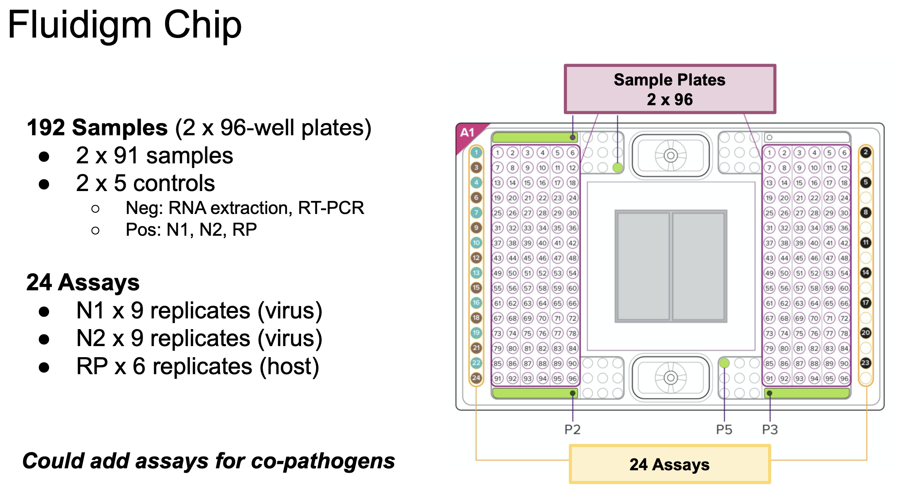

```{r setup, include=FALSE}
#install.packages("tidyverse")
#install.packages("ggpubr")
library(tidyverse)
library(ggplot2)
library(ggpubr)

# remove all legacy variables in the project environment
rm(list = ls())
```

---

# Q1: SARS-CoV-2 Diagnostics

## Background

This question is about the detection and quantification of viral loads in actual
COVID-19 tests. 

The data you will work with is from the very first experiment we performed as
part of a pilot study in the spring of 2020 to test the sensitivity of an assay
system that we developed at NYUAD using the Fluidigm microfluidic platform. We
showed that our assay is quantitative and that we could detect very low titers
of virus that were previously classified as negative samples in the diagnostic
lab. The results of this study have been published:

[**Xie et al., _Processes_ 2020** (PDF)](data/processes-08-01425.pdf) - 
[Supplement (PDF)](data/processes-08-01425-s001.pdf)


<!-- ======================================================================= -->
### The assays

This dataset contains results of qRT-PCR assays for SARS-CoV-2 nasopharyngeal
swabs from a clinical laboratory in Abu Dhabi.

The samples were previously classified as "**Negative**" or "**Positive**" for
presence of SARS-CoV-2 viral particles using a standard CDC-approved diagnostic
protocol in a clinical laboratory ("PHD Diagnostics"). These protocols typically
involve and RNA extraction step followed by reverse transcription and qPCR
amplification. Samples were called "Positive" by PHD if one or more of the viral
genes could be detected with PCR amplification within 32 PCR cycles.

The samples were then tested using the NYUAD assay system, which includes an RNA
extraction step followed pre-amplification by standard RT-PCR, and then
additional cycles of qPCR using the Fluidigm microfluidic assay system. The
two-step amplification contributes to the sensitivity of our assay. In addition,
very small volumes of reagents are used in the microfluidic system, which both
enables numerous replicate assays and lowers the cost of reagents.

<!-- ======================================================================= -->
### The dataset

+ **Samples**: The Fluidigm system is able to assay two 96-well plates of
samples at once.
  + We assayed extracted RNA from 182 clinical samples: 91 "Positives" and 91
  "Negatives", based on the PHD assay. For each class, 45 were run on one plate
  and 46 on the other plate.
+ **Controls**: We reserved 5 wells on each plate for controls:
    + `RX`: 1 negative control for the RNA extraction (extraction performed using buffer only)
    + `NT`: 1 negative control for RT-PCR (reactions run using amplification mix only)
    + `CoV`: a dilution series of 3 positive controls containing plasmid DNA
    encoding the N gene, at 3 different concentrations, for quantification of
    viral load:
      + 50 copies/ul
      + 500 copies/ul
      + 5000 copies/ul
+ **Assays**: For each sample / control, we performed 24 different assays at the
same time. These were:
  + 9 replicate assays for amplification of the viral N gene using the N1 probe set
  + 9 replicate assays for amplification of the viral N gene using the N2 probe set
  + 6 replicate assays for amplification of the human RP gene

Note that in order to detect viral RNA, we used **two different probe sets for the SARS-CoV-2 N gene, N1 and N2. We expect the N1 and N2 assays to be positive for the dilution series controls and for clinical samples that contain viral particles, and negative for the other controls.**

The **human RP gene** is a control for the quality of the clinical samples and should be present in all clinical samples if the swab was ok. **We expect the RP assays to be positive for all samples and negative for all controls.**

The layout for the Fluidigm chip is illustrated below:



<!-- ======================================================================= -->
### The data files

**1) Fluidigm output**

The raw data file from the Fluidigm system has a lot of extra metadata and some
of the column data are not that well labeled. To provide an easier starting
point for this analysis, the file has been massaged slightly and supplemented with
additional labels. Otherwise the file is pretty much the way it comes off the machine. 

The columns are as follows:

+ **ID**: Sample well + Assay well combination on Fluidigm chip (e.g. `S138-A01`)
+ **Sample**: Sample well
+ **Assay**: Assay well
+ **SampleName**: A sample barcode or control name
  + **Negative Controls**: These should all be negative!
    + `RX QC`: Quality control for RNA extraction
    + `NT QC`: Quality control for reverse transcription and preamplification
  + **Standard Controls**: Plasmid DNA with SARS-CoV-2 N gene at known concentrations
    + `CoV 50`: 50 copies / ul
    + `CoV 500`: 500 copies / ul
    + `CoV 5000`: 5000 copies / ul
  + **Samples**: A barcoded clinical sample (e.g. `9900039147` or `04MI200640957A`)
+ **Type**: `Unknown` (**you can ignore this**)
+ **rConc**: Known concentration of viral RNA (copies / ul)
  + ***NOTE: This column contains valid numerical data for standards only! For
  any row with a value of "1", the concentration has not yet been
  determined!!! (This is the way the data are emitted from the system; I'm not sure if this was a dummy value set by the lab staff, or if the machine defaults to this if no other value is entered.)***
+ **AssayName**: the tests that were performed (for each control or sample well,
there are a total of 24 assays)
    + `N1`: SARS-CoV-2 N gene, probe set 1 (9 replicates)
    + `N2`: SARS-CoV-2 N gene, probe set 2 (9 replicates)
    + `RP`: Human RP gene (6 replicates)
+ **Value**: Number of PCR cycles at which a signal was detected (numerical)
  + ***NOTE: This is the $C_t$ value, or "Cycles to threshold". A value of 999
  means that NOTHING WAS DETECTED***
+ **Quality**: Quality score for assay (**you can ignore this**)
+ **Call**: `Pass` (good assay) or `Flag` (bad assay or Value = 999)
+ **Threshold**: Quality cutoff for `Pass` (**you can ignore this**)
+ **Plate**: `Plate1` or `Plate2`


**2) PHD diagnostic results**

The diagnostic results contains two columns for each sample tested:

+ **Sample_barcode**: a barcode ID, matches **SampleName** in the Fluidigm file
+ **Class**: `Negative` or `Positive`
  + ***This is the status of each clinical sample according to PHD diagnostic lab***

<!-- ======================================================================= -->
### The overall goal

We would like to answer two basic questions:

**1. Is our assay more sensitive than the one used by the clinical diagnostic lab?**
**2. Can we correlate the viral load we measure in our lab with the status of samples according to the clinical diagnosis?**

To do this, we will use ***linear regression*** and compare the status of each
sample based on our own assay vs. the status based on the clinical lab.

We will need to do some quality control on the data before we start, however, to
get rid of data that are not reliable (e.g. due to pipetting errors,
contamination, etc.)

<br>

<!-- *********************************************************************** -->
## Q0: Prepare the data

Below you will organize the data to make it easier for you to work with it.
Feel free to delete any columns you don't need to use, or to add columns that
you think will help you keep track of everything.

<!-- ======================================================================= -->
### A. Load the dataset

Read in the Fluidigm data file and take a look at it.

```{r}
# Import massaged Fluidigm data file
fluid.all = read.csv("data/Fluidigm_1691207281.csv", stringsAsFactors = TRUE)
head(fluid.all)
```


<!-- ======================================================================= -->
### B. Subset the negative and standard controls

+ Make separate data frames for the negative controls and standard controls
(refer to the above key for details).
  + Remember that there are two sets of negative controls: "RX QC" and "NT QC"
  + The standard controls are: "CoV 50", "CoV 500", "CoV 5000"
  
**Note**: To simplify your life, you may wish to remove columns that you
are not interested in anymore. You should keep the sample ID and/or SampleName,
AssayName, Value, Call, and Plate columns. You will also need to keep rConc
for the Standards.

```{r}
# ============================================================================ #
# negative controls ("RX QC" and "NT QC")
neg.ctls = fluid.all %>% filter(SampleName %in% c("RX QC", "NT QC")) %>% 
  select(ID,SampleName,AssayName,Value,Call,Plate) %>% 
  arrange(Plate,ID)

# ============================================================================ #
# standards ("CoV 50", "CoV 500", "CoV 5000")
std.ctls = fluid.all %>% filter(!rConc == 1) %>%  # shortcut
  select(ID,SampleName,rConc,AssayName,Value,Call,Plate) %>% 
  arrange(Plate,ID)

```


<!-- ======================================================================= -->
### C. Sanity check Controls

It's always a good idea to check whether your controls look ok. Use whatever
method you like to inspect the data and answer the following questions. Looking
at plots and using those to make a decision about whether they look ok would be
fine here.

Please note:

+ The negative controls should not amplify anything, so the PCR Value for those
should be 999. This automatically raises a value of "Flag" in the "Call" column.
+ The positive controls should amplify the viral N gene using both sets of primers (N1 and N2), but not the human RP gene.

#### Negative controls

First, use `ggplot` to take a look at the negative controls. 

+ Make a boxplot or violin plot using `SampleName` and `Value`.
+ Use `facet_grid(Plate ~ AssayName)` to show the data for each assay separated by plate.

Once you get the syntax working, you can use the same template to plot the standard controls below.

```{r}
# take a look at the data ...
# View(neg.ctls)

# the Value for all of the negative controls should be 999
ggplot(neg.ctls, aes(x=SampleName, y=Value, fill=SampleName)) + 
  geom_violin() +
  geom_boxplot(width=0.05, fill="white") +
  facet_grid(Plate ~ AssayName)
```


Do all of the **negative** controls all look ok? Why or why not? 
If not, what could explain the results?

```{r eval=FALSE}
# Your answer here

No -- there should be no N1, N2, or RP detected for the QC wells, so 
we would expect to see Value = 999 and Call = "Flag".

However, some of them amplify something on Plate 2.
This is probably due to cross-contamination or errors during plate loading.

RX controls (RNA extraction):
all three probes show some signal, so it's possible that one of the
positive clinical samples got loaded in the wrong place (prior to RNA extraction).

NT controls (RT and pre-amplifcation):
N1 and N2 are negative, but RP amplified -- possible contamination
from a negative lab sample, or one of the lab people?

```

Do you think you proceed with the analysis using the data on one of the two plates? Explain.

```{r eval=FALSE}
# your answer here

Yes, Plate 1 looks ok
```


#### Standard controls

Now take a look at the standards (you can probably repeat what you just did above using the standard controls instead of the negative controls, but you might want to do a second pass where you just look at N1 and N2 after you look at all 3 assays). Note that the standards should amplify at PCR cycles below 20, and the number of cycles to amplify should decrease with increasing concentration of the control plasmid.

```{r}
# take a look at the data ...
# View(std.ctls)

# the Value for all of the positive controls for the N gene should be some number below 100 and for RP should be 999
ggplot(std.ctls, aes(x=SampleName, y=Value, fill=SampleName)) + 
  geom_violin() +
  geom_boxplot(width=0.05, fill="white") +
  facet_grid(Plate ~ AssayName) +
  theme(axis.text.x = element_text(angle = 90, vjust = 0.5, hjust=1))

# look more closely at just the N1 and N2 results
n1n2.std.ctls = std.ctls[std.ctls$AssayName != "RP",]

ggplot(n1n2.std.ctls, aes(x=SampleName, y=Value, fill=SampleName)) + 
  geom_violin() +
  geom_boxplot(width=0.05, fill="white") +
  facet_grid(Plate ~ AssayName) +
  theme(axis.text.x = element_text(angle = 90, vjust = 0.5, hjust=1))
```

Do the **standard** controls all look ok? Why or why not?

```{r eval=FALSE}
# Your answer here

No -- there should be no RP detected, but some of the RP also amplify on Plate 2.
Again, this reflects some kind of contamination somewhere along the line.

```

Based on the standard controls, do you think you can proceed with the analysis for at least one of the plates? Explain.

```{r eval=FALSE}
# your answer here

Yes, Plate 1 looks ok
```


<!-- ======================================================================= -->
### D. Prepare Sample data

#### Subset Fluidigm data and add Clinical results

+ Extract the sample data from the Fluidigm file.
+ Load the PHD result data and merge the two files using the sample barcode IDs.
  + To join the tables, you can use the `inner_join()` command.

```{r}
# ============================================================================ #
# samples

# subset fluid.all
samples = fluid.all %>% 
  filter(! SampleName %in% c("RX QC", "NT QC", "Cov 50", "CoV 500", "CoV 500"))  %>% 
  select(ID,SampleName,rConc,AssayName,Value,Call,Plate) %>% 
  arrange(Plate,ID)

# Import PHD results
phd.calls = read.csv("data/PHD_results.csv", stringsAsFactors = FALSE)

# Add a column to the Fluidigm file containing the PHD results
# use the inner_join() function to do this
samples = inner_join(samples, phd.calls, by.x = c("SampleName"), by.y = c("Sample_barcode"), row.names = FALSE)

# clean up
rm(phd.calls)
```


#### Make a placeholder for NYUAD results

As we go along we will classify the samples as "Inconclusive", "Negative", or
"Positive", according to the NYUAD results. So let's add a placeholder column
that we will fill up as we go along. 

+ Add a new column to `samples` called "NYUAD_Class" and fill it with NA.
+ Rename "Class" to "PHD_Class" to distinguish our results from the clinical results.

```{r}
# Add a column to sample for NYUAD classes and rename Class to PHD_Class
samples = samples %>%  rename(PHD_Class = Class) %>% mutate(NYUAD_Class = NA)

```

<br>

<!-- *********************************************************************** -->
## Q1: Quality Control for Standard Dilution Series

<!-- ======================================================================= -->
### A. Standard curves

In order to quantify viral load, we want to make sure that the dilution series for our standards look good, since we will depend on these to quantify our samples later.

First, use `ggplot` to plot the data with a simple linear regression line of Ct
against the concentration.

***Hints***: 

+ If you have not already done so, you may find it convenient to make a new data frame that contains only the N1 and N2 assays for the Standards (remove the RP data from the dataset).
+ Map `color` to **AssayName** and facet the plot by **Plate** to visualize the
results for N1 and for N2 separately on each plate.
+ Since the units are in PCR cycles, you will need to do the regression using a transformation of the data. Since you have a 10-fold dilution series (50, 500, 5000 copies/ul), you can use a log transformation with base 10 (`log10()`).
+ Plot the individual data points, and then add a simple regression line using `geom_smooth(method="lm")`.

```{r}
# subset N1 and N2 assays from standard control set
std.ctls.n1.n2 = std.ctls %>% filter(AssayName %in% c("N1","N2"))

# side-by-side graphs for N1 and N2 on Plate 1 and Plate 2
ggplot(std.ctls.n1.n2, aes(x=log10(rConc), y=Value, color=AssayName)) +
  geom_point() +
  geom_smooth(method="lm") +
  ggtitle("SARS-CoV-2 dilution series by plate (N1 & N2 probe sets)") +
  xlab("log10(viral copies/ul)") + ylab("Ct") +
  facet_wrap(~Plate)

## NOTE: If you want to show the original concentrations instead of the
  # log10 concentrations on the graph, you can use this function inside
  # the ggplot command
#  scale_x_continuous(label = function(x){return(round(10^x,1))})

# with original concentrations
ggplot(std.ctls.n1.n2, aes(x=log10(rConc), y=Value, color=AssayName)) +
  geom_point() +
  geom_smooth(method="lm") +
  ggtitle("SARS-CoV-2 dilution series by plate (N1 & N2 probe sets)") +
  scale_x_continuous(label = function(x){return(round(10^x,1))}) +
  xlab("Viral copies/ul") + ylab("Ct") +
  facet_wrap(~Plate)
```


+ How do the standard regression lines look? Does everything look consistent
between the N1 and N2 assays? How about between Plates?

```
# Your answer here

No -- the N1 and N2 assays look similar, but the lines from the two plates are really different.
```


<!-- ======================================================================= -->
### B. Test for interaction between rConc and Plate

Something looks fishy here. It seems that when this experiment was performed,
something was not quite right.

+ Make a linear model for the standards that includes an interaction term
between the (log-transformed) concentration and the plate and examine the
results using `summary()`

```{r}
# lm for standards with Plate interaction term
# you may do this for N1, N2, or both combined
summary(lm(Value ~ log10(rConc) * Plate, data = filter(std.ctls, AssayName == "N1")))
summary(lm(Value ~ log10(rConc) * Plate, data = filter(std.ctls, AssayName == "N2")))
summary(lm(Value ~ log10(rConc) * Plate, data = std.ctls.n1.n2))
```

+ What is the difference in slopes between the slopes for the standards on Plate
1 vs. Plate 2? Is the interaction term significant?

```
# Your answer here

Yes, the difference in slopes is -2.7 or -2.8 (depending on whether one uses N1,
N2, or both in the model).

The P-values for the interaction terms are very small.
```


<!-- ======================================================================= -->
### C. R-squared and Efficiency

If our standard dilutions are ok, we would like the amount of variation explained
by the model to be high. We will use a cutoff of $R^2 > 0.975$ as a QC measure.

Also, for a good PCR amplification, the amount of material should double in each
cycle. We can check to see if our standards follow this pattern by computing the
**efficiency of amplification**, which is given by this equation:

$$Conc = (1 + Eff)^{C_t}$$

In practice, it is computed this way:

$$Eff = 10^{-1/slope} - 1$$

where the slope is derived from a linear regression of Cycles to Threshold (Ct) values 
plotted against the $log_{10}$ values of the template amounts. A slope of -3.32 indicates 
an amplification efficiency of 100%.

**Efficiency between 90% and 110% is generally considered to be acceptable.** 
This corresponds to a slope between approximately -3.1 and -3.6.

Below, you will try to figure out which dilution series looks ok and which one does not.

+ Subset the dilution series by AssayName (N1 or N2) and Plate.
+ Generate linear models for each combination separately (e.g. N1 on Plate 1, N2
on Plate 1, etc.)
  + Note: the above can be done in one step instead if you like.
  
+ Extract the R-squared value from each lm summary (accessible as
`summary(your.model)$r.squared`).
+ Examine the slope and efficiency from each model (slope is available as one of
the model coefficients).

**Note**: you may choose to put these into a tabular format to make them easier
to compare (but this is not needed to answer the question).

```{r}
# make 4 separate linear models for N1 and N2 on Plate 1 or Plate 2
lm.n1.p1 = lm(Value ~ log10(rConc), data = filter(std.ctls, Plate == "Plate1" & AssayName == "N1"))
lm.n2.p1 = lm(Value ~ log10(rConc), data = filter(std.ctls, Plate == "Plate1" & AssayName == "N2"))
lm.n1.p2 = lm(Value ~ log10(rConc), data = filter(std.ctls, Plate == "Plate2" & AssayName == "N1"))
lm.n2.p2 = lm(Value ~ log10(rConc), data = filter(std.ctls, Plate == "Plate2" & AssayName == "N2"))

# look at the summaries of the models
summary(lm.n1.p1)
summary(lm.n2.p1)
summary(lm.n1.p2)
summary(lm.n2.p2)

# Look at the slope/efficiency and R^2
# Here is an outline for a data frame containing these data, if you want to use it
# (but you don't have to)
std.ctl.qc = data.frame(Model = c("N1-P1","N2-P1","N1-P2","N2-P2"),
                        Rsquared = c(summary(lm.n1.p1)$r.squared,
                                     summary(lm.n2.p1)$r.squared,
                                     summary(lm.n1.p2)$r.squared,
                                     summary(lm.n2.p2)$r.squared),
                        Slope = c(summary(lm.n1.p1)$coef[2], 
                                  summary(lm.n2.p1)$coef[2],
                                  summary(lm.n1.p2)$coef[2],
                                  summary(lm.n2.p2)$coef[2]),
                        Eff = c(10^{-1/summary(lm.n1.p1)$coef[2]} - 1,
                                10^{-1/summary(lm.n2.p1)$coef[2]} - 1,
                                10^{-1/summary(lm.n1.p2)$coef[2]} - 1,
                                10^{-1/summary(lm.n2.p2)$coef[2]} - 1))
std.ctl.qc
```

These fits don't look perfect, but one plate looks a lot better than the other.
So, you will need to choose one of these to use for quantifying your viral
samples.

+ Which plate's dilution series should you choose to quantify viral titers in
the clinical samples, and why?

```
# Your answer here

We will use the standards from Plate 1:
- R-squared is above 0.975
- The slope/efficiency is not in the ideal range, but it's better than for Plate 2.
```

***NOTE: We indeed verified later that there were some problems with a bunch of
wells in one quadrant on one of the plates that were probably due to loading
errors / contamination.***

<br>

<!-- *********************************************************************** -->
## Step 3 - QC and clean data for clinical samples

Now we need to check on the N1/N2/RP Assays for the clinical samples.

<!-- ======================================================================= -->
### A. Host RP gene

#### Distribution of Ct values

+ Make a violin plot of the clinical sample data for **just the host RP gene**.
+ Separate the data by PHD diagnosis ("PHD_Class"), and facet by Plate.

```{r}
# distribution of Ct values for RP genes in clinical samples
ggplot(filter(samples, AssayName == "RP"), 
       aes(x=PHD_Class, y=Value, fill=PHD_Class)) + 
  geom_violin() +
  geom_boxplot(width=0.05, fill="white") +
  facet_wrap(~as.factor(Plate), nrow=1) +
  scale_fill_manual(values=c("#00BFC4","#F8766D")) +
  labs(title="Clincal samples: Amplification of host RP gene",
       x="Sample Group", 
       y = "Ct for human RP gene")
```


+ What should we expect to see for the RP assays in the clinical samples? Does
everything look ok here?

```
# Your answer here

If a sample is good, then the human control gene should be detectable at least.
If not, then we will have to take another sample because a negative result will
be uninformative.

Some of the samples on Plate 2 look invalid (Ct = 999).

```

#### Filter samples for RP quality

Since some of the samples don't look great, we will filter them before
proceeding to the quantification.

+ Filter the data and keep only those samples for which at least 4 RP assays:
  + were called as "Pass" (QC on quality), and
  + have a Ct "Value"< 16 (meaning a decent amount of RP gene was detected).
+ Also flag the assays that were removed by labeling them as "Inconclusive" in
the `samples` dataframe (set `NYUAD_Class` to "Inconclusive").

**Note**: Since this is tedious, we have filled in this part for you.

```{r, collapse=TRUE}
# ============================================================================ #
# subset valid samples
valid.sample.ids = samples %>%  
  group_by(SampleName) %>% 
  filter(AssayName == "RP" & Call == "Pass") %>% 
  summarize( TotalPass = sum(Value < 16) ) %>% 
  filter(TotalPass > 3)

valid.samples = merge(samples, valid.sample.ids, by = "SampleName") %>% 
  arrange(ID) %>% select(-TotalPass)

# ============================================================================ #
# number of valid samples
nrow(valid.sample.ids)

# ============================================================================ #
# Flag inconclusive samples
samples$NYUAD_Class[ ! samples$SampleName %in% valid.samples$SampleName ] = "Inconclusive"
```

You should now have a filtered list with a full set of assays (N1, N2, and RP)
for samples that you deem to be of "good quality".

+ How many samples are left?

```
# Your answer here

171 samples are left.
```

+ Make a new plot of the Ct values for the RP gene from the filtered data.

```{r}
# get just the RP gene assays
samples.rp = filter(valid.samples, AssayName == "RP")

# violin plot of RP Ct values in filtered data

# all samples
ggplot(filter(valid.samples, AssayName == "RP"), 
       aes(x=AssayName, y=Value, fill=AssayName)) + 
  geom_violin() +
  geom_boxplot(width=0.05, fill="white") +
  facet_wrap(~as.factor(Plate), nrow=1) +
  scale_fill_manual(values=c("#00BFC4","#F8766D")) +
  labs(title="Clincal samples: Amplification of host RP gene",
       x="Probe set", 
       y = "Ct for human RP gene")

# by PHD diagnosis
ggplot(samples.rp, aes(x=PHD_Class, y=Value, fill=PHD_Class)) + 
  geom_violin() +
  geom_boxplot(width=0.05, fill="white") +
  facet_wrap(~as.factor(Plate), nrow=1) +
  scale_fill_manual(values=c("#00BFC4","#F8766D")) +
  labs(title="Clincal samples: Amplification of host RP gene",
       x="Sample Group", 
       y = "Ct for human RP gene")

```


#### Compare RP distributions

If we want to use standards from only one of the plates for quantification, we
should probably make sure that the samples amplified similarly on both plates,
even though it looks like something went wrong with the standards on one of the
plates.

+ First, make a QQ plot for the CT values on both plates to see if the data look
sort of normal.
+ Next, perform a test for normality to see if the distributions on both plates
look approximately normal.
+ Finally, identify and use an appropriate test to see whether these samples
likely came from the same distribution.

```{r}
## QQ plots

# Plate 1
rp.p1 = samples.rp %>% filter(Plate == "Plate1") %>% select(Value)
qqnorm(rp.p1$Value)
qqline(rp.p1$Value)

# Plate 2
rp.p2 = samples.rp %>% filter(Plate == "Plate2") %>% select(Value)
qqnorm(rp.p2$Value)
qqline(rp.p2$Value)

## Test for normality
shapiro.test(rp.p1$Value)
shapiro.test(rp.p2$Value)

## Test for difference in sample distributions
#t.test(rp.p1$Value,rp.p2$Value) # not valid since data don't look normal

# tests for non-normal distributions
ks.test(rp.p1$Value,rp.p2$Value)
wilcox.test(rp.p1$Value,rp.p2$Value)

```

+ Based on these results, and using a p-value cutoff of 0.05, does it seem ok to
use the standards from only one of the plates to quantify the viral load in all
the samples?

```
# Your answer here

Both KS and Wilcoxon rank sum test give P-values close to 0.05, but they are a
little above it, so we will go ahead and use the standards from Plate 1 (we
don't really have a good alternative choice anyway...)
```


<!-- ======================================================================= -->
### B. Viral N gene

#### Filter samples for viral quantification

We won't be able to quantify viral load in any samples that did not amplify N1
or N2, so we will want to filter those out.

+ Starting with the "valid" samples from above, filter the data so that you only
keep results for the samples that passed QC ("Pass) and showed a valid Ct value
(Value < 999) at NYUAD.
+ Keep any samples that amplified **either** N1 or N2 (sometimes, for unknown
reasons, only one or the other amplified), AND that had at least 4 good
replicates in total.
  
**NOTE**: Data cleaning is tedious. We have done this for you below.

```{r, collapse=TRUE}
# ============================================================================ #
# "positive" samples at NYUAD
nyuad.pos.sample.ids = valid.samples %>%  
  group_by(SampleName) %>% 
  filter(Call == "Pass" & Value < 999 &
           AssayName %in% c("N1","N2")) %>% 
  summarize( TotalPass = sum(Value < 999) ) %>% 
  filter(TotalPass > 3)

nyuad.pos.samples = merge(valid.samples, nyuad.pos.sample.ids, by = "SampleName") %>% 
  filter(Call == "Pass" & Value < 999 & AssayName %in% c("N1","N2")) %>%
  select(ID,SampleName,PHD_Class,AssayName,Value,Plate) %>% 
  arrange(Plate, ID, AssayName)

# ============================================================================ #
nrow(nyuad.pos.sample.ids)

# ============================================================================ #
# Add NYUAD_Class labels to sample table
samples$NYUAD_Class[ samples$SampleName %in% nyuad.pos.samples$SampleName ] = "Positive"
samples$NYUAD_Class[which(is.na(samples$NYUAD_Class))] = "Negative"
```

+ How many samples are left?

```
# Your answer here

102 samples are left.
```

+ Make a new violin plot with the cleaned data, showing the Ct values for the N1
and N2 genes by plate.

```{r}
# violin plot of N1 and N2 Ct distributions in cleaned data

# by assay
ggplot(nyuad.pos.samples, aes(x=AssayName, y=Value, fill=AssayName)) + 
  geom_violin() +
  geom_boxplot(width=0.05, fill="white") +
  facet_wrap(~as.factor(Plate), nrow=1) +
  scale_fill_manual(values=c("#00BFC4","#F8766D")) +
  labs(title="Clincal samples: Amplification of N1 and N2 genes",
       x="Assay (Probe Set)", 
       y = "Ct")

# by negative and positive classes
p.violin.plate.by.assay = function (df, p.title, x.label, y.label) {
  ggplot(df, aes(x=PHD_Class, y=Value, fill=PHD_Class)) + 
    geom_violin() +
    geom_boxplot(width=0.05, fill="white") +
    facet_grid(Plate ~ AssayName) +
    labs(title = p.title,
         x = x.label, 
         y = y.label)
}

p.violin.plate.by.assay(nyuad.pos.samples,
                        p.title="Valid clinical samples (virus detected at NYUAD)",
                        x.label = "Sample Group",
                        y.label = "Ct" )

```


#### Check for consistency among assay replicates

We also want to discard samples that showed high variability between replicates,
since these wouldn't give us much confidence in our estimate of viral load;
those samples would need to be re-analyzed again later.

Below you will compare the variation in the original N1/N2 data vs. the
variation in your cleaned up data.

**Note**: To help out with this, we have completed the initial steps below for
you already.

+ Filter the original `samples` data frame for N1 and/or N2 assays with Ct Value
< 999. 
+ Compute the **mean** and **standard deviation** across the replicates for each
assay (N1 and N2), and save this summary data in a new data frame (there will
now be one row per sample.)
+ Do the same for the filtered "Positives" dataset (`nyuad.pos.samples`).

```{r, collapse=TRUE}
# sample variation (all clinical samples with Ct < 999)
sample.var = samples %>% filter(AssayName %in% c("N1","N2") & Value < 999) %>% 
  group_by(SampleName,AssayName,PHD_Class,Plate) %>%
  summarise(Ct.mean = mean(Value), Ct.sd = sd(Value), n = length(Value)) 

# sample variation (all "NYUAD Positive" samples)
nyuad.var = nyuad.pos.samples %>%
  group_by(SampleName,AssayName,PHD_Class,Plate) %>%
  summarise(Ct.mean = mean(Value), Ct.sd = sd(Value), n = length(Value))
```

Your task is to draw some graphs to visually compare the variation in Ct values
in these two datasets.

+ For each of the two datasets we just made, add a column containing the SEM for
the Ct values.
+ Then, for each dataset, make a plot of the SEM(Ct) on the y-axis vs. the
samples on the x-axis.
  + Include a horizontal line at SEM(Ct) = 0.5 on each of the graphs.
  + Hint: you can use the expression `seq(some_column_name)` for the x-axis
  aesthetic mapping in order to plot the samples along the x-axis.

```{r}
## Add SEM(Ct) column to each dataset
sample.var = sample.var %>% mutate(Ct.se = Ct.sd/sqrt(n))
nyuad.var = nyuad.var %>% mutate(Ct.se = Ct.sd/sqrt(n))

## Plot variation as SEM(Ct) vs. sample index

# All samples with N1/N2 detected
p1 = ggplot(data=sample.var, aes(x=seq(SampleName), y=Ct.se)) +
  geom_point() +
  geom_hline(yintercept=0.5, linetype="dashed", color = "red") +
  xlab("Sample") + ylab("SEM(Ct)") +
  ggtitle("Variation among replicates (all samples)")

# Cleaned data
p2 = ggplot(data=nyuad.var, aes(x=seq(Ct.se), y=Ct.se)) +
  geom_point() +
  geom_hline(yintercept=0.5, linetype="dashed", color = "red") +
  xlab("Sample") + ylab("SEM(Ct)") +
  ggtitle("Variation among replicates (cleaned samples)")

ggarrange(p1,p2,nrow=2)
```

If everything went ok with your filtering, you should find that some of the
samples in the original dataset had high variation (s.e. > 0.5), and that the QC
steps you performed above also removed those samples from your final "Positives"
dataset. 

So luckily, you don't need to do any more filtering for this step!!!

<br>

<!-- *********************************************************************** -->
## Step 4 - Compare Results and Estimate Viral Load

<!-- ======================================================================= -->
### A. Compare sample classification from PHD and NYUAD

Now that you have a clean set of samples with reliable data, let's see how we
did compared to PHD.

+ Make a summary table containing the sample names, PHD class, and NYUAD class
for the samples in the original `sample` dataset.
+ Make a contingency table comparing the Positive / Negative / Inconclusive
calls according to NYUAD vs. PHD.

**Hint**: you need to collapse all the replicates first in order to answer this
question properly. You can use `group_by()` and `summarize()` to make a data
frame with just one row per sample that you can then use to make your table.

```{r}
# get summary table of classifications for each sample (one row per sample)
sample.classes = samples %>% group_by(SampleName, PHD_Class, NYUAD_Class) %>% summarise

# make a contingency table
with(sample.classes, table(PHD_Class, NYUAD_Class, dnn = c("PHD","NYUAD")))
```

+ How many samples that were called "Positive" by PHD did NYUAD fail to detect?

```
# Your answer here

Two were negative and 4 were inconclusive.
```

+ How many samples that were called "Negative" by PHD did NYUAD detect as positive?

```
# Your answer here

NYUAD detected virus in 17 samples that PHD called as Negative. NYUAD also had
inconclusive results for 7 of the negative samples from PHD.
```

_**NOTE**: In our analysis we actually included an additional class for
"Inconsistent" samples, which were the ones where we only detected virus using
one of the two probesets (N1 or N2). We had 9 samples in this class, so we
officially reported 8 fewer Positives that were reported as Negative by PHD, and
only one Negative that was reported as Positive by PHD._


<!-- ======================================================================= -->
### B. Linear model for prediction

+ Use the "good" standard dilution series you identified above, create a linear
model for viral load based on the Ct values for the standards. 

**Note**: Even though the N1 and N2 didn't amplify **exactly** the same, they
were pretty close, so just combine them for the purpose of making the model.

```{r}
# linear model for rConc based on combined N1 and N2 Ct from "good" plate
std.ctls.n1n2.p1 = std.ctls.n1.n2 %>% filter(Plate == "Plate1")
lm.std.rConc = lm(log10(rConc) ~ Value, std.ctls.n1n2.p1)
```

+ Plot the linear model with a 95% CI.

```{r}
## ggplot of linear model for Ct vs. conc, with regression line and CI bands

# ============================================================================ #
## KCG METHOD 1 -- just plot the data for Plate 1 with geom_smooth

# simple plot
ggplot(std.ctls.n1n2.p1, aes(x=log10(rConc), y=Value)) +
  geom_point(aes(color=AssayName)) +
  geom_smooth(method="lm", color="black", size=0.5) +
  ggtitle("SARS-CoV-2 dilution series (Plate 1, N1 & N2 probe sets)") +
  xlab("log10(viral copies/ul)") + ylab("Ct")

# with original concentrations
ggplot(std.ctls.n1n2.p1, aes(x=log10(rConc), y=Value)) +
  geom_point(aes(color=AssayName)) +
  geom_smooth(method="lm", color="black", size=0.5) +
  ggtitle("SARS-CoV-2 dilution series (Plate 1, N1 & N2 probe sets)") +
  scale_x_continuous(label = function(x){return(round(10^x,1))}) +
  xlab("Viral copies/ul") + ylab("Ct")

# ============================================================================ #
## KCG METHOD 2 -- use the model to make predictions on the control data, using
#  "confidence", then predict the CI for the individual points and plot them

# use lm for prediction on controls to get CIs for them
pred.std.rConc = predict(lm.std.rConc, std.ctls.n1n2.p1, interval = "confidence")
df.pred.std.rConc = data.frame(pred.std.rConc)

# add to a df
fit.pred.std.rConc = std.ctls.n1n2.p1 %>% 
  mutate(fit1 = df.pred.std.rConc[,"fit"],
         lwr1 = df.pred.std.rConc[,"lwr"],
         upr1 = df.pred.std.rConc[,"upr"])

# base plot
p0 = std.ctls.n1n2.p1 %>% 
  ggplot(aes(x=log10(rConc), y=Value, color=AssayName)) + 
  geom_point() 
  
# plot regression lines
p.fit = p0 + geom_line(data = fit.pred.std.rConc, 
                  mapping = aes(x = fit1, y = Value), 
                  col = "darkgray", size = .5)

# add CI's
p.fit = p.fit + geom_ribbon(data = fit.pred.std.rConc, 
                    mapping = aes(y = Value, xmin = lwr1, xmax = upr1),
                    fill = "gray", alpha = 0.5, inherit.aes = FALSE)

p.fit + ggtitle("SARS-CoV-2 dilution series (Plate 1, N1 & N2 probe sets)")
```


<!-- ======================================================================= -->
### C. Predict viral loads for samples

+ Use the model you just made to make predictions of the viral load for each of
the samples in your "NYUAD Positives" dataset.
  + Make sure to use "**prediction**" intervals instead of "confidence" intervals
  for the prediction (recall that CI is computed from the data we have, whereas
  PI is for unknown data, so the PI should be wider than the CI).

**NOTE**: You will need to decide whether to take the mean and then predict on that,
  or predict on individual measurements and take the mean afterward. **You must do
  one of these things for your final data report.** 
  *For simplicity, we have made a placeholder in the code for taking the means first, but you can do it either way.*

+ Make a new data frame that combines the prediction results with your sample
data, appended as three new columns: the fit, the lower prediction interval
bound, and the upper prediction interval bound.

```{r}
# combine sample measurements for N1 and N2 for each sample to a grand mean
# - you want to end up with one row per sample
# - you can use `goup_by()` and `summarise()` to do this
nyuad.pos.sample.means = nyuad.pos.samples %>% 
  group_by(SampleName, PHD_Class, Plate) %>% 
  summarize(Value = mean(Value))

# use lm for prediction on controls to get CIs for them
pred.sample.rConc = data.frame(predict.lm(lm.std.rConc, 
                                          newdata = nyuad.pos.sample.means, 
                                          interval = "predict"))

# take a look at the result
head(pred.sample.rConc)

# make a data frame adding 3 columns to the sample means with fit, lwr, and upr
df.pred.sample.rConc = cbind(nyuad.pos.sample.means,
                             conc.fit = pred.sample.rConc$fit,
                             conc.lwr = pred.sample.rConc$lwr, 
                             conc.upr = pred.sample.rConc$upr)

```

Finally, to see how your predictions look, plot them along with the control data.

+ Create a ggplot object showing:
  + The regression line from your controls with the control data points,
  + Points for your predictions, mapping `color` to the PHD diagnosis,
  + Prediction Intervals (PI's) for the new predictions (use the new columns you just added)

```{r}
# ============================================================================ #
# base plot: data points for N1/N2 standards from Plate 1
p0 = ggplot(std.ctls.n1n2.p1, aes(x=log10(rConc), y=Value, 
                                  color=AssayName)) +  # map color to assay names
  geom_point() +
  scale_color_manual(values=c("gray70","gray50",       # for N1/N2 controls
                              "#F8766D","#00BFC4")) +  # for Neg/Pos classes
  facet_wrap(~Plate)  # wrap by Plate
  
# add standard controls regression line
# p.fit = p0 + geom_line(data = fit.pred.std.rConc, 
#                        mapping = aes(x = fit1, y = Value), 
#                        col = "black", size = .5)
p.fit = p0 +
  geom_smooth(method="lm", color="black", size=0.4, se = FALSE)

# add data points for sample predictions
# (points are the fitted values, map color to PHD classification)
p.fit = p.fit +
    geom_point(data = df.pred.sample.rConc, # the data frame containing predicted values
             mapping = aes(x = conc.fit, y = Value, color = PHD_Class), size=0.5)

# add PI for predictions
# (min and max are the lower and upper PI bounds)
p.fit = p.fit +
  geom_ribbon(data = df.pred.sample.rConc, # the data frame containing predicted values
              mapping = aes(y = Value, xmin = conc.lwr, xmax = conc.upr),
              fill = "gray", alpha = 0.5, inherit.aes = FALSE)

# convert back to copies / ul and add some labels
p.fit = p.fit +
  scale_x_continuous(label = function(x){return(round(10^x,1))}) +
  xlab("Viral copies/ul") + ylab("Ct") +
  ggtitle("Viral load in clinical samples (with prediction intervals)")

p.fit

```

If you wanted to show specific confidence intervals for individual samples,
you'd need to do the prediction on each point individually and then calculate
the statistics for the range afterward. 

+ What do you conclude about the sensitivity of the NYUAD Fluidigm system?

```
# Your answer here

The assay is very sensitive and can detect viral particles down to less than one
copy per microliter.
```

+ How does the viral load estimated by NYUAD relate to the original diagnoses of
the PHD clinical samples as "Negative" or "Positive"? Do you see a trend?

```
# Your answer here

Most of the samples detected by NYU that had a "Negative" clinical diagnosis
also carried very low viral titers, whereas "Positive" samples carried a much
wider range that approached close to 1M particles / ul. This makes sense that if
our assays is more sensitive, we would be likely to detect virus in samples with
low titers that could be missed by the standard diagnostic test.
```


<!-- ======================================================================= -->
### D. Export data file with predicted viral loads for clinicas samples

Finally, you are ready to prepare a report to send back to the clinic!

+ First, back-transform the predicted viral loads into proper units of "copies/ul" for
reporting, and add this as a new column to `df.pred.sample.rConc`. 
  + Call the new column `Copies_per_ul`. 
  + Since these numbers span a huge range and will be ugly, use `signif()` to 
  trim the output to two significant digits.
+ Next, prepare a data table containing just the "SampleName", "PHD_Class",
"NYUAD_Class", and "Copies_per_ul". 
  + You can use `left_join()` to combine `sample.classes` with **selected columns**
  from `df.pred.sample.rConc`. This command will join the data frames based on
  common columns.
  + Make sure to specify `sample.classes` as the first argument.
+ Finally, write your viral load estimates to a file (please remember to 
substitute your own name for the placeholder `YOURNAMEHERE`). 
  + When you submit your work, upload this output file along with your .Rmd file.

```{r}
# back-calculate actual viral loads and add as a new column
df.pred.sample.rConc = df.pred.sample.rConc %>% 
  mutate(Copies_per_ul = signif(10^conc.fit,2))

# make a file for the final data report
data.report = left_join(sample.classes, 
                        select(df.pred.sample.rConc,SampleName,Copies_per_ul))

# export data file -- set `row.names = FALSE`
#write.csv(data.report, "data/PHD_samples.viral_load.YOURNAMEHERE.csv",
#          row.names = FALSE)
```

<br>
<br>

---
