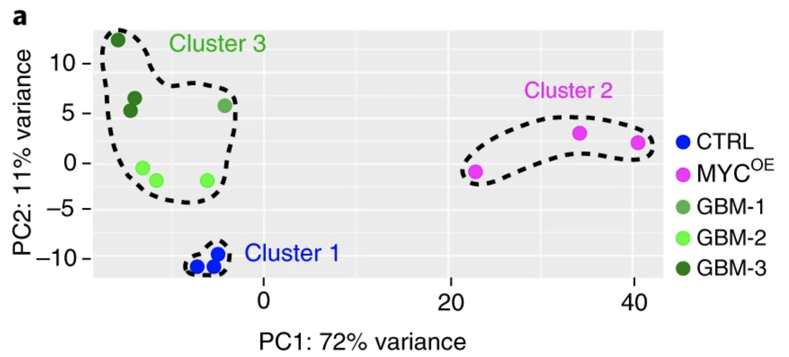
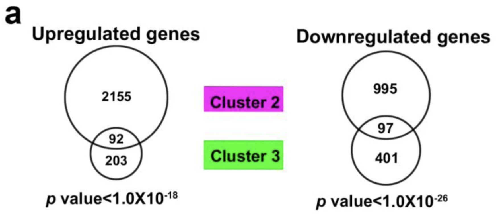
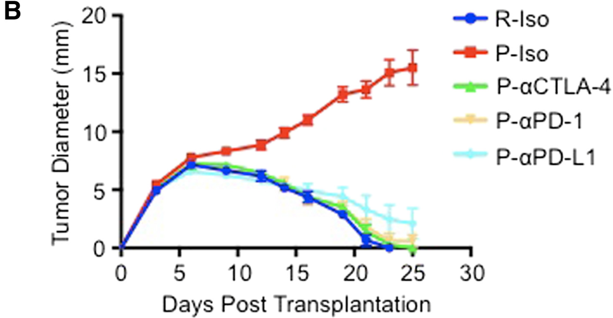
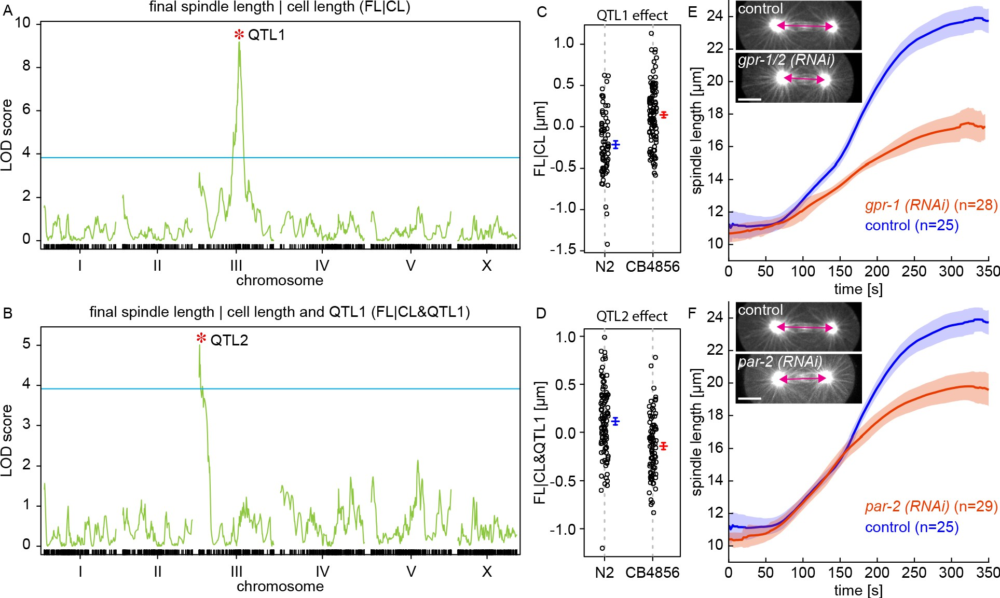

```{r setup, include=FALSE}
knitr::opts_chunk$set(echo = TRUE)
```


## 1) Gene set overlap

A recent study, [***Genetically engineered cerebral organoids model brain tumor formation*** (Bian et al., *Nat Meth* 2018)](https://www.nature.com/articles/s41592-018-0070-7),
created organoid models of two brain tumor types (primitive neuroectodermal
tumors and glioblastoma) using CRISPR to generate mutations in known oncogenes. 
The two conditions were generated by MYC oncogene overexpression, *MYC^OE^* (CNS-NET), and knockouts of several genes including *PTEN* and *P53* (GBM).

Differences in gene expression between two tumor models were compared with controls
and were found to differ in the sets of genes that were mis-regulated. 
The researchers first showed that the two organoid tumor models seem to show quite different
gene expression patterns using **PCA** (principal components analysis) of the top 500
genes with the highest variability compared with controls (see [**Figure 3a,b**](https://www.nature.com/articles/s41592-018-0070-7/figures/3)). 
We will go over PCA later in the course.

Next, they performed **hypergeometric tests** to ask whether all of the genes that 
were significantly **up- or down-regulated** in the two models (in comparison with 
controls) showed less overlap that expected by random chance (see [Supplementary Figure 3](https://www.nature.com/articles/s41592-018-0070-7/figures/9)).

If so, this would support the idea that divergent gene programs are misregulated 
in the two models.

Based on the PCA analysis (**Figure 3a**), differentially expressed genes could be separated into two different groups corresponding to in the two organoid tumor models: Cluster 2 (*MYC^OE^*) and Cluster 3 (GBM).

{width=50%}

**Fig. S3** shows Venn diagrams of the gene set overlaps between Clusters 2 and 3:

{width=50%}

Your question is whether the differentially expressed genes in these two clusters overlap by **less** than expected by chance. Here we will focus on just the **up-regulated genes**. How will you set up the problem?


### a) Expected gene set overlap based on independence

In total, 4034 genes were up-regulated in at least one of the organoid tumor models (vs. controls). The rest of the numbers you will need are shown in the Venn diagrams in Fig. S3. A framework for organizing the data has been set up below to help get you started.

```{r, collapse=T}
## Up-regulated genes ======================================================== #
## 4035 genes up-regulated in either experiment (vs control)
## 2450 total genes up-regulated in Clusters 2 & Clusters 3
# C2 = 2155 + 92 = 2247
# C3 = 203 + 92 = 295
# Overlap = 92

ol.obs = 92        # overlap
A = 2155 + ol.obs  # 2247: total size of Cluster 2 (Set A = bigger set)
B = 203 + ol.obs   # 295: total size of Cluster 3 (Set B = smaller set)
N = 4034           # total genes up-regulated in both experiments

# What is the expected overlap based on the null hypothesis of independence?
ol.exp = A*B / N
ol.exp
```


### b) Hypergeometric test

Find a p-value for the observed overlap with a hypergeometric test using `dhyper` and `pyhper`. Remember, you are looking for less overlap than expected between the two sets (is this the lower tail or the upper tail?).

First, look up the documentation on these functions.
```{r}
help(phyper)

# parameterization for phyper(q, m, n, k, lower.tail = T/F)
#   x = number of "white balls" drawn
#   m = number of "white balls" in urn
#   n = number of "black balls" in urn
#   k = number of balls drawn from the urn

```

Here are some additional tips to help you figure out how to parameterize the functions:

+ $x$: this is the observed overlap
+ $m$: pick one gene set, call this Set A
+ $n$: this is the total number of genes NOT in Set A (out of all the up-regulated genes)
+ $k$: the other set (Set B)
  +  Note that the maximum possible size of the overlap would be the total size of the smaller gene set (which cluster is that here?)
  + It does not really matter which set you choose to use for $m$ or $k$; the p-value will be the same either way.

```{r, collapse=T}
## p-value using hypergeometric test ========================================= #

# CDF: P(x <= ol.obs)

# parameterization for phyper(q, m, n, k, lower.tail = T/F)
#   x = number of "white balls" drawn (ol.obs)
#   m = number of "white balls" in urn (let's use A=C2)
#   n = number of "black balls" in urn (everything that is NOT in A)
#   k = number of balls drawn from the urn (let's use B=C3)

# CDF: total probability P(x <= ol.obs) of getting an overlap of size ol.obs or LESS
phyper(ol.obs, A, N-A, B, lower.tail=T) 
phyper(ol.obs, B, N-B, A, lower.tail=T) # same

# PDF: P(x <= ol.obs) = sum(P(x = 0:ol.obs))
sum(dhyper(0:ol.obs, A, N-A, B)) # (same as using CDF)
```


### c) Fisher's Exact Test

The hypergeometric test is equivalent to a one-tailed Fisher's test (but it is 
actually more efficient in R). Use a Fisher's test to make the same comparison as above. Here are some helpful hints:

+ You want to perform a one-sided test for more extreme values than the ones observed, given all possible combinations of values "conditioned on fixed margins" (which tail are you looking for here?).
+ Make a contingency table: orientation is arbitrary, but by convention put the categories "of interest" first.
  + Put the overlap in the top left cell (*a*, a.k.a. $x_{11}$).
  + Put the remainder of the A and B sets (minus the overlap) in the right (*b*, $x_{12}$) and bottom left (*c*, $x_{21}$) cells.
  + Put the remainder of the up-regulated genes in (*d*, $x_{22}$).

```{r, collapse=T}
## with Fisher's exact test ================================================== #

# set up a matrix of values in this order:
# test.data = matrix(c(intersect(A,B), setdiff(B,A),
#                      setdiff(A,B),   N-union(A,B) ), nrow=2, byrow = T)

test.data = matrix(c( ol.obs,    B-ol.obs,
                      A-ol.obs,  N-(A+B-ol.obs) ), nrow=2, byrow = T)
rownames(test.data) = c("C3","not.C3")
colnames(test.data) = c("C2","not.C2")
test.data

# now do the test

#fisher.test(test.data, alternative="greater") # test for enrichment
fisher.test(test.data, alternative="less")     # test for depletion
fisher.test(test.data, alternative="less")$p.value

```
### d) How do the p-values compare?

```{r}
# your answer here
```


## 2) Line plots: Mean, SD, SEM

Please read the short article *Error bars (Nat Meth 2013)* provided with this assignment.

### a) What is the difference between the standard error (SEM) of the mean and standard deviation?  
```{r eval=FALSE}
# your answer here
```

### b) What are some common misconceptions about interpreting error bars?
```{r eval=FALSE}
# your answer here
```

## 3) Cancer metabolism

In the paper [***Metabolic competition in the tumor microenvironment is a driver of cancer progression*** (Chang et al., *Cell* 2015)](https://www.ncbi.nlm.nih.gov/pmc/articles/PMC4864363/), the authors use mouse models to demonstrate that in cancers, T cells are metabolically restricted by tumor glucose consumption, ultimately allowing tumor progression. The authors use line graphs in **Figure 4B**:

{width=60%}

### a) What question were the researchers trying to answer in this Figure?
```{r eval=FALSE}
# your answer here (one sentence)
```

### b) How many replicates were performed, and what do the error bars represent?
```{r eval=FALSE}
# your answer here (1-2 sentences)
```

### c) Do you think this an appropriate way to represent the data? Why or why not, and how would you try to represent them?
```{r eval=FALSE}
# your answer here
```
    

## 4) Spindle dynamics in evolution

The paper [***Stoichiometric interactions explain spindle dynamics and scaling across 100 million years of nematode evolution*** (Farhadifar et al., *eLife* 2020)](https://elifesciences.org/articles/55877) explores spindle dynamics in *C. elegans* using a combination of imaging methods and QTL mapping of intercross lines. Below is reproduced Figure 3 from this article:

{width=80%}

### a) What question were the researchers trying to answer in this figure?
```{r eval=FALSE}
# your answer here (1-2 sentences)
```

### b) Panels C and D

About how many data points are there for each line? What do the error bars represent? Would you change anything about the way the data are represented?
```{r eval=FALSE}
# your answer here (2-3 sentences)
```

_The RIAIL panel contains **208** recombinant inbred advanced intercross lines. These were generated from a cross between the laboratory strain, N2, and a wild isolate from Hawaii, CB4856. The reference is: Rockman et al., Selection at Linked Sites Shapes Heritable Phenotypic Variation in C. elegans. Science (2010) | DOI: 10.1126/science.1194208_

_The error bars represent SEMs for the final spindle length given the cell length associated with QTL1 and QTL2, grouped by the ancestral allele at each locus (N2 or CB4856). The SNPs have opposite effects on the final spindle length._

_The graphs are designed to help the reader distinguish the differences between the two alleles, even though there is a lot of variation. Since these are individual lines, you wouldn't want to show SD, but you could show 95% CIs (however they wouldn't look as pretty!)_


### c) Panels E and F

What is being plotted? What do the shaded areas represent, and why do you think the researchers chose to display the variation in their measurements in this way? Would you have done anything differently?
```{r eval=FALSE}
# your answer here (~2-3 sentences)
```

_Here the authors are trying to show how much variation they see both within and between WT and RNAi-treated embryos. They use ribbons because the measurements are relatively continuous (they probably image every second but I didn't look for this information in the Methods). I presume that they show SD here since they are trying to illustrate that the spindle movements are highly stereotypic in the two conditions (so their RNAi is good; presumably they did this on more than one day, but I don't know.) Since SEM is a lot smaller than SD, SEM ribbons would be even thinner._

## 5) Line plots with SD or SEM

How would you plot similar graphs in R showing SD or SEM? The dataset "HW7_data.csv" contains eight replicate measurements across 20 timepoints (0-190 seconds) for a control and a treatment condition. The data are the raw (non-normalized) values used to generate the plots in Figure 6A from 
[Cipriani et al., eLife 2021](https://elifesciences.org/articles/60833).

### a) Calculate the mean, SD, SEM

Load the dataset and use the `dplyr` package to reformat it as follows:

+ Group the data by treatment and time (hint: use `group_by()`).
+ Add 3 new columns to the data frame containing group summaries for the mean, SEM, and SD (hint: use `summarise()`).
+ Add 4 new columns containing the upper and lower limits for the SEM and the SD.
  
```{r}
library(dplyr)

mean_sd_data <- as.data.frame(read.csv("HW7_data/HW7_data.csv"))

mean_sd_data<-mean_sd_data %>%
  group_by(TREATMENT, time) %>%
  summarise(mean= mean(Values), se=sd(Values)/sqrt(length(Values)), sd=sd(Values))

mean_sd_data$se_upper<- mean_sd_data$mean + mean_sd_data$se
mean_sd_data$se_lower<- mean_sd_data$mean - mean_sd_data$se
mean_sd_data$sd_upper<- mean_sd_data$mean + mean_sd_data$sd
mean_sd_data$sd_lower<- mean_sd_data$mean - mean_sd_data$sd
```
    

### b) Line plot with discrete error bars showing SD

Use `ggplot2` to create a line graph to plot the mean, with discrete error bars representing the standard deviation.

+ Map the data to time (x-axis) and mean (y-axis), and use color to indicate the treatment.
+ Use a line for the geom layer.
+ Add the error bars using `geom_errorbar()` (look this up to see how to add the upper and lower boundaries). Don't forget to map the color to the treatment.
+ Add axis labels for the time (in seconds) and the values (as "Relative fluorescence").

```{r}
library(ggplot2)

mean_sd_plot_sd<- ggplot(mean_sd_data, aes(x =time, y = mean, color = TREATMENT))+
  geom_line() +
  xlab("Time [s]")+
  ylab("Relative fluorescence")+
  theme(panel.background=element_blank(), 
        strip.background = element_blank(),
        strip.placement = "outside",
        panel.border=element_rect(colour="black",fill=NA),
        legend.title = element_blank(),
        legend.position="bottom", 
        legend.direction="horizontal")  +
  geom_errorbar(aes(ymin=sd_lower,ymax=sd_upper, color= TREATMENT), width=5) 

mean_sd_plot_sd
```


### c) Line plot with shaded regions showing SEM

Use `ggplot2` to create a line graph to plot the mean, with a shaded area representing the standard error of the mean. This plot will use almost the exact same code as the last graph, except you will use `geom_ribbon()` to display the upper and lower bounds of the SEM.
      
```{r}
mean_sd_plot_se<- ggplot(mean_sd_data, aes(x =time, y = mean, color = TREATMENT))+
  geom_line() +
  xlab("Time [s]")+
  ylab("Relative fluorescence")+
  theme(panel.background=element_blank(), 
        strip.background = element_blank(),
        strip.placement = "outside",
        panel.border=element_rect(colour="black",fill=NA),
        legend.title = element_blank(),
        legend.position="bottom", 
        legend.direction="horizontal")  +
  geom_ribbon(aes(ymin=se_lower,ymax=se_upper, fill= TREATMENT),alpha=0.3, linetype = 0) 

mean_sd_plot_se
```


### d) Which representation do you think is most effective for these data? What would you choose to do?
```{r}
# your answer here (1-2 sentences)
```

