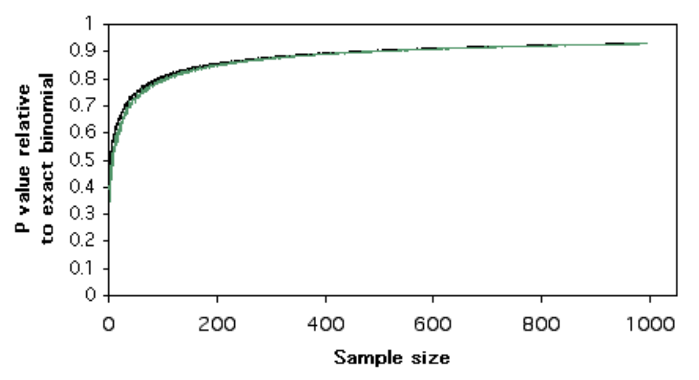
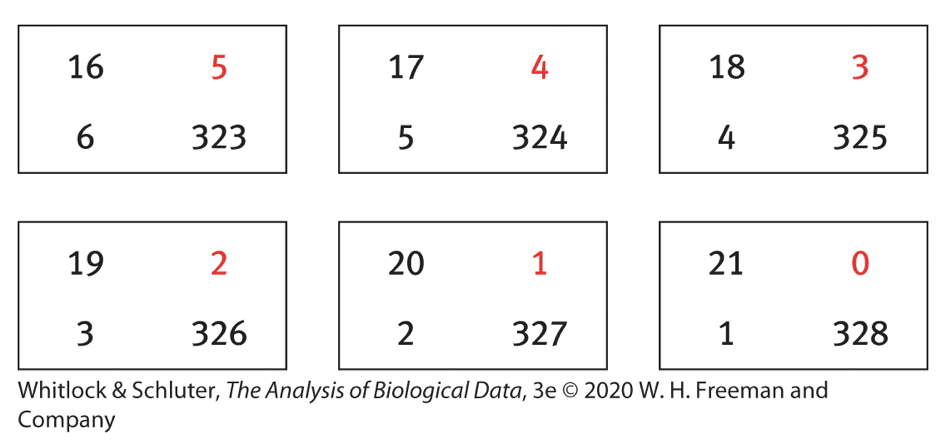

```{r setup, include=FALSE}
knitr::opts_chunk$set(echo = TRUE)
library(knitr)
```

## Overview

A common question that arises in biology is whether and **how much** a response variable differs between groups. If so, we would also like to evaluate whether the probability distribution of one categorical variable is likely to be **dependent** on that of a second variable. In other words, are any observed differences are likely to occur by chance alone, due to variation among random samples? For example:

+ *Do smokers have a higher incidence of lung cancer?*
+ *Does aspirin lower the incidence of heart attacks?*
+ *Do parasites alter the behavior of their hosts?*
+ *Did something go wrong with my CRISPR experiment? (I.e. Was the efficiency of getting an edit in one set of experiments significantly different from usual? This could indicate that something went wrong with my reagents.)*

Two kinds of analysis can be done to address such questions:

+ **Estimation**: how different is a response variable between two groups of interest?
  + **Relative risk**: relative proportions between two groups
  + **Odds ratio**: relative ***odds*** between two groups
+ Tests for **independence**: do the data show a significant difference from what would be expected if two variables were unrelated?
  + **Exact tests**: compute an exact $p$-value based on all possible discrete outcomes
  + **Approximate tests**: estimate $p$-values based on a continuous approximation of a discrete distribution

## Measures of association

### Relative risk

Relative risk is useful for **observational** studies and **experimental** studies in which random samples of the population are subjected to two different treatments.

***W&S Example 9.2:*** *Around of half of 39,876 women are randomly assigned to receive 100mg of aspirin every other day for 10 years, while the other half received a placebo. Did long-term aspirin treatment significantly reduce the incidence of invasive cancer?*

We can estimate the magnitude of any potential effect of aspirin treatment by looking at the proportions of women in each group who developed cancer. This is the relative risk (RR):

$$\widehat{RR} = \frac{\hat{p_1}}{\hat{p_2}}$$

Note that since this is an **estimate** of proportions in the population at large, we cover the proportions and the RR with "hats". 

In the aspirin example, the RR was 1.007. Since the proportions are almost the same, it is unlikely that aspirin has any effect on cancer incidence.


#### Confidence intervals

Since RR is a ratio of two random variables, it is not normally distributed, and so we cannot use the regular proceduring involving $Z$-scores to compute a 95% CI. 

However, if we take the **natural log** of RR, the distribution is **approximately normal**. This transformation turns a ratio into an equation involving simple addition/subtraction. 

Since our proportions are random variables that are randomly sampled from the population, and since random variables resulting from addition or subtraction of two normal distributions are also normally distributed, we can use a normal approximation for the resulting distribution.

This allows us to compute a standard error for $ln(\widehat{RR})$, and we can then use this to compute a 95%CI for this using a $Z$-score of 1.96:

$$ln(RR) - 1.96*SE_{ln(RR)} < ln(RR) < ln(RR) + 1.96*SE_{ln(RR)}$$

To get the 95% CI for the RR, we just need to reverse the procedure by exponentiation:

$$e^{ln(RR) - 1.96*SE_{ln(RR)}} < RR < e^{ln(RR) + 1.96*SE_{ln(RR)}}$$

For this example, we obtain $0.94 < \widehat{RR} < 1.08$. This is a very narrow distribution around RR=1, confirming that there is likely no effect.


#### Reduction in risk

We can make statements about how much snaller the risk is in one group vs. the other by restating the RR as follows:

+ **Relative** reduction in risk = $1 - RR = 1 - \frac{p_1}{p_2} = \frac{p_2 - p_1}{p_2}$
  + *How much smaller risk is in one (treatment) group as a proportion of the risk in the other (control) group.*
+ **Absolute** reduction in risk = $p_1 - p_2$
  + *Absolute difference in risk between groups.*
  + This may be very small if the overall risk is low in both groups, even though the reduction in relative risk could be large. -- indicating that even though there is a measurable difference in risk, the incidence in both groups is so small as to not have an important effect overall.


### Odds ratios

The **odds** of a particular outcome is just the probability of a "focal" outcome, vs. the probability that this outcome did not occur. Why would we want to use this instead of just the probability?

Because the ratio of the odds in two different groups, or the **odds ratio**, gives us some idea of the frequency of an outcome in one group relative to that in another group, while **controlling** for the possibility that the number of items sampled from each group is **not representative** of the population at large.

This is particularly useful when we are interested in studying risk factors in a group that is under-represented in the population at large, e.g. people with a rare disease. If we can't get a large enough sample of these people by random sampling, then it is difficult to make conclusions about how different factors affect them relative to those who don't have the disease.

The OR is often written as $\Theta$ (though not in W&S). It is defined as:

$$ \hat{\Theta}_{1,2} = \frac{p_1/(1-p_1)}{p_2/(1-p_2)} $$
where $p_1$ is the probability of the focal outcome in group 1 and $p_2$ is its probability in group 2.

For a 2x2 contingency table, we can write:

$$ \hat{\Theta}_{1,2} = \frac{\hat{p}_{11}/\hat{p}_{12}}{\hat{p}_{21}/\hat{p}_{22}} =
\frac{\hat{p}_{11}\hat{p}_{22}}{\hat{p}_{12}\hat{p}_{21}} = \frac{x_{11}x_{22}}{x_{12}x_{21}} $$

... since the denominators cancel out.
 
#### Confidence intervals

The 95% CI for odds ratios is computed in the same manner as for RR, using log-transformed values, since both involve division of two random variables:

$$e^{ln(OR) - 1.96*SE_{ln(OR)}} < OR < e^{ln(OR) + 1.96*SE_{ln(OR)}}$$


### Relative Risk or Odds Ratio?

+ When samples are ***chosen at random*** in the population, divided into groups based on a ***potential causal factor***, and then the frequency of a particular ***focal outcome*** is examined in each group, the RR and OR will produce very similar results.
+ However, RR cannot be used for **case-control** studies in which individuals are ***pre-selected*** based on known focal outcomes, and potential underlying causal factors are then examined for association with each known outcome.
  + This is because the samples were not chosen at random from the population, and therefore the proportions of individuals with each focal outcome do not reflect the proportions in the population at large.

#### Exercise: is high blood pressure a risk factor for stroke?

Consider two different experimental designs for determining whether high blood pressure is a risk factor for strokes:

+ **Design 1** 
  + 2000 men between the ages of 70-80 are chosen at random from the population.
  + These are divided into groups with and without a history of high blood pressure.
  + The number of men in each group who experienced a stroke sometime within the following 5 years is recorded.
 
+ **Design 2**
  + 2000 men between the ages of 70-80 are recruited for a study, of which 1000 have never had a stroke and 1000 have had a stroke in the last 5 years.
  + The proportion of each group who have a history of high blood pressure is recorded.

The data might look something like this:

**Design 1**
```{r, echo=F}
## Design 1 ========================= #
Stroke    = c(100,50)   # total =  200
NoStroke = c(600,1250)  # total = 1800
data_matrix1 = rbind(Stroke, NoStroke)
colnames(data_matrix1) = c("HiBP","LoBP")

# kable is a table generator from the knitr package
kable(data_matrix1)
```

**Design 2**
```{r, echo=F}
## Design 2 ========================= #
Stroke   = c(200,800)  # total =  1000
NoStroke = c(50,950)   # total = 1000
data_matrix2 = rbind(Stroke, NoStroke)
colnames(data_matrix2) = c("HiBP","LoBP")
kable(data_matrix2)
```

Let's compute RR and OR and compare the results. First, we will do this by hand, and then using R.

---

## Overview: Tests for frequency distributions

|                   | One variable                	| Two variables          |
|-------------------|-------------------------------|------------------------|
| ***Exact***	      | Binomial proportions          |	Fisher’s exact test    |
| ***Approximate***	| $\chi^2$ goodness-of-fit      |	$\chi^2$ test of independence |


### Types of questions

1. ***Goodness-of-fit***: Does one categorical variable fit an expected frequency distribution?
2. ***Independence***: Are two categorical variables associated in some way? Do response variables differ between groups?


### Types of frequency tests

+ ***Exact tests***: Enumerate **all possible discrete outcomes** that are at least as extreme as the observed data (i.e. as or more different from expectation) and compute the total probability of these.
+ ***Approximate tests***: Compare **observed vs. expected** values to estimate the probability of obtaining a result at least as extreme as the observed data. This approach uses a **continuous distribution** to **approximate** the probability.


#### *Limitations of exact tests*

The **exact tests** should be used whenever possible, since they compute exact probabilities given all possible outcomes. However,

+ The **binomial proportions test** only works for binary outcomes (two categories).
+ **Fisher's test** only works for 2x2 contingency tables (two groups with binary outcomes). 


#### *Limitations of approximate tests*

**Approximate** frequency tests do not provide accurate P-values when the frequency of one or more groups is low. Before using a $\chi^2$ test, you should check that the following **assumptions** are met:

+ Samples are unbiased random samples
+ At least 20% of the cells have an expected frequency = 5
+ The *expected frequency* for all cells is at least 1

When the above conditions are **not** met, several **alternative options** are available:

+ Combine some groups so that assumptions can be met (e.g. two groups can become "Other")
+ Use an exact test, if applicable
+ Use permutation tests to compute a P-value (Chapter 13, W&S)

#### *Continuity correction for approximate tests*

The following diagram[^1] illustrates the P-value computed by an approximate test relative to the P-value from a binomial exact test as a function of sample size. This shows that even for sample sizes that meet the criteria for an approximate test, $\chi^2$ (black) and a similar test called the "G-test" (green) provide estimates for P-values that are too small relative to an exact binomial P-value, thus inflating the apparent significance of the test.

{width=50%}

```{r out.width="50%", include=F}
# library(knitr)
# 
```


To correct for this, the default behavior in R for $\chi^2$ tests is to perform ***Yates' continuity correction***, which modifies the $(O-E)^2$ term as $(|O-E| - 1/2)^2$ to reduce the overall magnitude of the $\chi^2$ test statistic. The term "continuity" correction is applied here because a *continuous* function (Chi-square) is being applied to approximate a *discrete* function (e.g. binomial).

Nevertheless, it is still preferable to use an exact test whenever possible in order to get the most accurate measure of significance.


### $\chi^2$ test for independence

The $\chi^2$ is the most common **approximate test** for independence and is widely used for contingency analysis. It can be used to test multiple categories and so is appropriate for a range of simple comparisons. Please refer to the lecture notes from the last class for a discussion of $\chi^2$ tests.

Other approximate tests exist for experimental designs that are paired or that control for multiple measurements. We will not cover these here, but they are mentioned at the bottom of this document.


### Fisher's Exact Test

Fisher's exact test provides an **exact $p$-value** for contingency tables by computing the cumulative probability of **all possible scenarios** that differ as much or more from a neutral expectation than the observed values. 

+ It is preferred to the $\chi^2$ test for all 2x2 contingency tables.
+ It should be used instead of the $\chi^2$ test for independence for cases where some of the **frequencies** in the contingency table are **too low to satisfy the assumptions** of the $\chi^2$ test. 
+ R can also compute Fisher's exact $p$-value using larger tables. When computationally feasible, use Fisher's over $\chi^2$.


#### Assumptions

Fisher's test assumes **fixed row margins** (row totals), which are needed to compute the the probability of values at least as extreme as the observed frequencies relative to expectation under the rule of independence, i.e. $P(A \cap B) = P(A) * P(B)$ for each cell in the contingency table.


#### Formula

With fixed marginal counts, the count in one cell, $x_{ij}$, will determine the counts in the other three cells (see Aho, Section 11.6.3 for details).

The probability of the observed data is simply the product of factorials of all the marginals, divided by the product of factorials of each cell and factorial of total number.

$$ P(a,b,c,d) = \frac{ \left(a + b\right)! \left(a + c\right)! \left(b + d\right)! \left(c + d\right)!}{a!b!c!d!N!}$$
where $N=a+b+c+d$. 

The $p$-value will be the proportion of all possible ways to get a value **equal to or more extreme** than the observed count in one of the cells (typically $x_{11}$).

#### W&S Example 9.5

The method Fisher's uses to enumerate these possibilities is illustrated in this example from W&S, which asks if vampire bats prefer to bite cows in estrus (!)

What are the null and alternative hypotheses?

```{r, echo=F}
# obs
vampire <- read.csv(
  url("https://whitlockschluter3e.zoology.ubc.ca/Data/chapter09/chap09e5VampireBites.csv"),
  stringsAsFactors = FALSE)
vampireTable <- table(vampire$bitten, vampire$estrous)
kable(vampireTable)

# exp
expTable = rbind("Bitten"=c(1.3,19.7,21),
                 "Not_bitten"=c(20.7,308.3,329),
                 "Totals"=c(22,328,350))
colnames(expTable) = c("Estrus", "Not_estrus", "Total")

kable(expTable)
```

The total probability is computed by summing up the probabilities of the observed data, plus the data from all the tables with more "extreme" values (i.e. fewer than 6 cows in estrus).

{width=60%}


#### Example

We can perform a Fisher's exact test using the `fisher.test()` function. Let's go back to the example of cancer incidence among women who first gave birth under or over the age of 30. We will choose a one-tailed test, since we expect the Case group (women with cancer) to have a higher proportion of women who first gave birth over 30. 

```{r}
Case    = c(683,2537)   # total =  3220
Control = c(1498,8747)  # total = 10245
data_matrix = rbind(Case, Control)
colnames(data_matrix) = c("Above30","Below30")

# kable is a table generator from the knitr package
kable(data_matrix)

# full result from Fisher's Exact Test
fisher_test = fisher.test(data_matrix, alternative='greater')
fisher_test

# p-value from Fisher's Exact Test
ftest_pval = fisher_test$p.value
ftest_pval

# table orientation is arbitrary; both orientations give the same result
fisher.test(t(data_matrix), alternative='greater')$p.value
```

The $p$-value computed in this way is not exactly the same as we get from the other two methods we used, but they are all extremely significant. 

***Note that the orientation of the table does not matter -- the test gives the same result either way.***

#### Odds Ratios and 95% CI

The output for Fisher's exact test include a reference to the **odds ratio** and a 95% confidence interval. Under independence, the odds ratio should equal 1, so if one row has higher or lower counts than expected then the OR will be greater than or less than 1. 

You can accees these values directly from the result of Fisher's test:

```{r}
# OR
fisher_test$estimate

# CI (level)
fisher_test$conf.int
```


In this example, the null hypothesis is that there is no difference between groups: $H_0: \Theta = 1$. The alternative hypothesis is $H_A: \Theta > 1$. Since OR = 1.57, and the 95% CI is $1.44 < \Theta < \infty$, we can conclude that the incidence of cancer is not the same between these two groups.


## Fisher's Test and the Hypergeometric Distribution

Fisher's exact test turns out to be a special case of the **hypergeometric distribution**, which gives the probability of $x$ successes when sampling **without** replacement. Fisher's test follows this model because, with ***fixed row margins***, changing the value of one cell in a contingency table necessarily changes the values in the others. 

The effects are are particularly pronounced for small total numbers.

The hypergeometric distribution is commonly used to test for over- or under-representation of functional annotations in two sets of genes. We will cover this distribution in more detail in a future class.

### Example

Since Fisher's Exact Test follows a kind of hypergeometric distribution, we should get the same result if we compute a $p$-value empirically using the `hyper()` function family. 

Let's use the `phyper()` function to get a $p$-value for the observed data from the breast cancer example above. We will use the upper tail of a one-tailed test, since we are asking if the incidence of cancer is higher in the >30 group. 

Recall that since this is a discrete distribution, we will need to subtract 1 from the observed value in order to get $p(x) \ge obs$.

```{r}
# phyper(q, m, n, k, lower.tail = FALSE)
# phyper(a, a+b, c+d, a+c, lower.tail = FALSE)
#  q = observation (a   = cancer and above 30)
#  m = white balls (a+b = cancer, a.k.a. "success")
#  n = black balls (c+d = normal, a.k.a. "failure")
#  k = total draws (a+c = above 30)
phyper(683 - 1, 3220, 10245, 2181, lower.tail = FALSE)
```


Below I have rewritten the same computations for the Fisher's Exact and hypergeometric tests using R's terminology for the `hyper` family of functions:

```{r}
# data (variable names chosen to match dhyper() argument names)
x = 683    # Case_Above30 = a
m = 3220   # Case         = row 1 margin = a+b
n = 10245  # Control      = row 2 margin = c+d
k = 2181   # Above30      = col 1 margin = a+c

# same as 'data_matrix' used above
# (although table orientation doesn't matter for the Fisher exact test)
matrix(c(x,   m-x,      # a, b
         k-x, n-(k-x)), # c, d
       2,2,
       byrow = TRUE) # matrices fill by columns by default

# Fisher test, alternative = 'greater'
fisher.test(matrix(c(x, m-x, k-x, n-(k-x)),2,2), alternative='greater')$p.value 

q = x-1  # upper tail for discrete distribution
phyper(q, m, n, k, lower.tail = FALSE)
```

This is exactly the same result we obtained using Fisher's test!

---

## Other frequency tests

Other flavors of tests exist that apply to different kinds of situations where frequency data need to be analyzed. We will not cover these here, but merely mention them in case you may want to use them in the future.


### G-test for goodness-of-fit

The $G$–test of goodness-of-fit (a.k.a. likelihood ratio test, log-likelihood ratio test, or $G^2$ test) tests whether one nominal variable with two or more categories fits a theoretical expectation. Like the Chi-square test, it should be used with large sample sizes, since it will give inaccurate $P$-values for small sample sizes.


### Barnard's Exact Test for equality of proportions

It turns out that experimental study design governs whether the true distribution of the data is hypergeometric or multinomial, and therefore whether Fisher's is necessarily the right choice.

Barnard's test is a **non-parametric alternative** to Fisher's exact test. Because it ***does not assume (is not conditioned on) fixed margins***, Barnard's exact test is reported to have greater ***power*** than Fisher's exact test for 2x2 contingency tables. You can read about it on Wikipedia:
 [Barnard's test](https://en.wikipedia.org/wiki/Barnard%27s_test)

An implementation of Barnard's test is available in R:
[Blog on Barnard's exact test](https://www.r-statistics.com/2010/02/barnards-exact-test-a-powerful-alternative-for-fishers-exact-test-implemented-in-r/)


### McNemar and Cochran-Mantel-Haenszel

For more complicated scenarios, additional tests are available that we will not cover here. These include:

+ ***McNemar's test***
  + Used for "paired data", in which two measurements that come from the same individuals are compared. For example, a response variable can be compared between "pre-" and "post-" treatment, such as incidence of heart attacks before and after bypass surgery.
+ ***Cochran-Mantel-Haenszel test***
  + Used for testing the independence of two nominal variables with *repeated measurements*. For example[^2], to test for independence between an *Allele* and *Habitat* measured in four different *Locations*, the test could be applied to a 2x2x4 table to test for a relationship between the first two variables while controlling for the third.
  + The R implementation can also handle larger sets of categorical data.

---

## R commands for different kinds of frequency tests

To summarize, R contains commands for computing statistics for comparing categorical variables to expected discrete distributions, as well as for testing for and measuring associations between categorical variables:

+ Goodness-of-fit
  + `binom.test()`
  + `chisq.test()`

+ Independence
  + `riskratio()`
  + `oddsratio()`
  + `fisher.test()`
  + `chisq.test()`

---

## Converting between lists and tables

Often our data will not be pre-formatted as a contingency table, so we will need to transform it in order to use these functions. The most common functions are `table()` and `xtable()`, which allow you to create 2x2 or larger tables. You can also cross-tabulate on one or more variables.

Some short tutorials for making tables and converting between data frames and tables are available here:

+ [R Cookbook](http://www.cookbook-r.com/Manipulating_data/Converting_between_data_frames_and_contingency_tables/)
+ [Quick R](https://www.statmethods.net/stats/frequencies.html)


---

## Additional Resources

+ **Whitlock & Schluter, Chapters 8 and 9**
+ **Whitlock & Schluter Online Tutorials**
  + [Frequency Data](https://whitlockschluter3e.zoology.ubc.ca/RLabs/R_tutorial_Frequency_data.html)
  + [Contingency Analysis](https://whitlockschluter3e.zoology.ubc.ca/RLabs/R_tutorial_Contingency_analysis.html)
+ [**Handbook of Biological Statistics**](http://www.biostathandbook.com/)
  + Goodness-of-fit tests
    + [Binomial](http://www.biostathandbook.com/exactgof.html)
    + [Chi-square](http://www.biostathandbook.com/chigof.html)
    + [G-test](http://www.biostathandbook.com/gtestgof.html)
  + Tests for independence
    + [Fisher's Exact Test](http://www.biostathandbook.com/fishers.html)
    + [Chi-square](http://www.biostathandbook.com/chiind.html)
      + [*The problem with small numbers in Chi-square test*](http://www.biostathandbook.com/small.html)
  + [Chochran-Mantel-Haenzl](http://www.biostathandbook.com/cmh.html)
+ [R Cookbook](http://www.cookbook-r.com/)
+ Aho, Chapter 11

[^1]: [Handbook of Biological Statistics](http://www.biostathandbook.com/), by John H. McDonald
[^2]: [Handbook of Biological Statistics](http://www.biostathandbook.com/), by John H. McDonald
