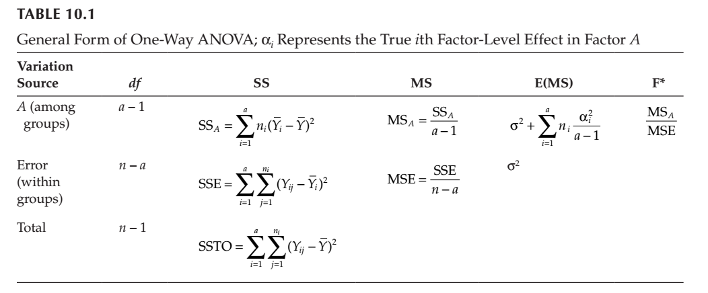

## Comparison of ANOVA with linear models

Recall that **planned** experiments are when you have control or a reference level in a factor that you want to always compare to. An **unplanned** experiment is when there is no base or control, and you simply want to know if there is a difference in the means of the different groups.

Here we will investigate the R commands that will allow us to test these two different types of experiments.

### Two samples with the same variance

Let's generate two sample groups, *ctrl* and *trt*, by taking random samples from normally distributed data.

Select 5 random numbers from distribution where *mean*=0 and *sd*=1

```{r}
ctrl=rnorm(5)
```

Select 5 random numbers from distribution where *mean*=5 and *sd*= 1

```{r}
trt = rnorm(5, mean=5)
```

Combine both samples into one vector

```{r}
data = c(ctrl,trt)
```

Define how the data is grouped

```{r}
expgroups = factor(rep(c("ctrl", "trt"), each=5))
```

Use a boxplot to show the distributions

```{r}
boxplot(data ~ expgroups)
```


## Perform ANOVA

The model formula is written such that the dependent variable (data) is explained by the independent variable (groups). Best way to setup the data is to put them in a different columns of a dataframe. 

```{r}
mydata = data.frame(data=data, expgroups=expgroups)

```

Two ways to perform an ANOVA analysis. The `lm()` function is for planned experiment and the `aov()` is for unplanned experiments. We will try both for all different scenarios. 

Method 1: `aov`
```{r}
#aov(data~expgroups, data=mydata)
summary(aov(data~expgroups, data=mydata))  # same as `summary.aov()`
                              # both expect a class 'aov' as the argument
```

The report tells us that the SSB is ~60, and the SSW ~10
If the SSB/SSW = SumSq(expgroups)/SumSq(Residuals) is a lot different from 1, we can conclude that there is a difference between the groups. But we actually want the F-statistic = (SSB/df.exp) / (SSW/df.res) = SSB/1 / SSW/8

Method 2: `lm()`
```{r}
datalm = lm(data ~ expgroups, data=mydata) # linear model of the data as explained by expgroups
                              # expgroups is the independent variable
                              # data is the dependent variable

summary(datalm)               # same as `summary.lm()`
                              # expects a class 'lm' as the argument
```

The results from looking at `summary.lm` and `summary.aov` are slightly different. The Null hypothesis of linear modeling is that the *slope* of the line is 0 ( or the difference of means is 0), whereas the Null hypothesis of the ANOVA is that the *variance* of all of the data is the same as the variance of the individual groups. In other words, the baseline for `lm` is the control, whereas for ANOVA there is no baseline; you simply look at all the differences between the groups.

Despite these methodological differences, **notice that the $p$-values are the same.**

Using the ``anova()`` function on the linear model gives you the same information as the summary of ``aov()``:

```{r}
anova(datalm) # same as summary(aov(data ~ expgroups))
```

### Generating random normally distributed data for three groups



Let's make another group and call it `trt2`.

```{r}
trt2= rnorm(5,mean=10) # same number of samples, but mean differs
```

Let's combine it with the other groups.

```{r}
data = c(ctrl,trt,trt2)
expgroups = factor(rep(c("ctrl", "trt", "trt2"), each=5))
mydata = data.frame(data=data, expgroups=expgroups)
boxplot(data ~ expgroups, data=mydata)
```

```{r}
datalm = lm(data ~ expgroups, data=mydata)
summary(datalm)
```

For this model, "Estimate" gives the slope of the line between the control and each experimental group. This is around 5 comparing ctl-trt1 and ~10 comparing ctl-trt2. This is just the difference between the means.

We get $p$-values for the individual groups, and an overall $p$-value for the model.


Let's compare this to the ANOVA result:

```{r}
summary(aov(data ~ expgroups, data=mydata))
```

### Tukey's honest significant difference test

Notice that for `summary` we don't see which groups are giving the significant difference. We can use "Tukey's honest significant difference" test, **TukeyHSD**, which performs a pair-wise comparison to help us figure this out.

```{r}
TukeyHSD(aov(data ~ expgroups, data=mydata))
```

This shows the magnitude of the differences between all pairwise combinations of the groups, so you can tell which groups are responsible for any major differences between them.

Again, performing the ``anova()`` function on the linear model gives you the same results as the summary of ``aov()`` however you can not perform ``TukeyHSD()`` on the ``anova()`` results.

```{r}
anova(datalm)
```

### What if trt2 is the same as trt?

```{r}
trt2= rnorm(5,mean=5)
data = c(ctrl,trt,trt2)
expgroups = factor(rep(c("ctrl", "trt","trt2"), each=5))
mydata = data.frame(data=data, expgroups=expgroups)

datalm = lm(data ~ expgroups, data=mydata)
boxplot(data ~ expgroups, data=mydata)
```

```{r}
summary(datalm)
```

```{r}
summary(aov(data~expgroups, data=mydata))
```

```{r}
TukeyHSD(aov(data~expgroups, data=mydata))
```

Notice that for the ANOVA, the differences between the groups is the same as the slopes between the ctl and the treatment groups in the linear model.

### What if trt2 is same as ctrl?

```{r}
trt2= rnorm(5,mean=0)
data = c(ctrl,trt,trt2)
expgroups = factor(rep(c("ctrl", "trt","trt2"), each=5))
mydata = data.frame(data=data, expgroups=expgroups)

datalm = lm(data ~ expgroups, data=mydata)
boxplot(data~expgroups, data=mydata)
```

```{r}
summary(datalm)
```

```{r}
summary(aov(data~expgroups, data=mydata))
```

```{r}
TukeyHSD(aov(data~expgroups, data=mydata))
```

    
