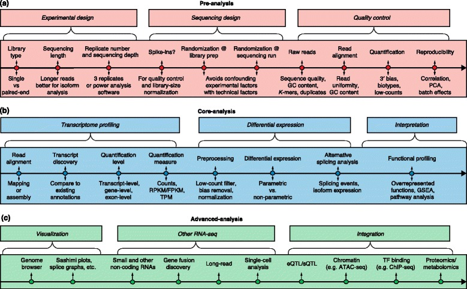

```{r setup, include=FALSE}
knitr::opts_chunk$set(echo = TRUE)
```

# Background Reading

#### [**Review** of RNA-seq analysis, including normalization](https://www.ncbi.nlm.nih.gov/pmc/articles/PMC4728800/)

```
A survey of best practices for RNA-seq data analysis
Conesa et al, Genome Biology 17:13 (2016)
```

#### [**Video: RPKM/FPKM vs TPM**](http://www.rna-seqblog.com/rpkm-fpkm-and-tpm-clearly-explained/)


# RNA-seq analysis

## Generating the data

RNA-seq has become the standard method for measure gene expression. **Figure 1** gives an overview of  measuring mRNA abundance using short-read RNA-seq (standard Illumina sequencing).

{width=60%}

## Processing and analysis steps

RNA-seq analysis involves lots of details, as summarized in the chart below. Here we will just go over the basics of **transcript quantification**.

{width=80%}


## Characteristics of RNA-seq data

Certain considerations are important in choosing how to quantify mRNA expression within and between samples.

### The curse of dimensionality

Most of the time we are trying to measure expression on many individual transcripts, but due to experimental and monetary constraints, we have few experimental replicates (both technical and biological):

* Experiment = (gene_1, gene_2, …, gene_N)
* Gene = (experiment_1, experiment_2, …, experiment_M)
* N is often on the order of 10^4
* M is often on the order of 10^1

This is a problem for determining **statistical significance**, because we have a very large number of individual items that we are sampling, but a very small sample size for each item. So the chance that we will see some differences just by chance is very high. 

For this reason we will also need to consider correcting our data for **multiple hypothesis testing**, which we will cover separately.


### Noisy or missing data

* Very lowly expressed genes are detected less reproducibly
* Especially relevant to limited sample sizes, e.g. single cell analysis
* Sometimes have "dropouts" (missing data for very rare transcripts)

The figure below illustrates that stochastic sampling of transcripts in ***technical replicates*** results in greater uncertainty in the quantification of genes with very low expression levels.

{width=40%}

On the other hand, ***biological replicates** almost always show greater variation than technical replicates. The amount variation in sampling of transcripts tends to increase with the mean expression level. This is called "overdispersion" and is illustrated in the figure below.

{width=40%}

***It is generally agreed that increasing the number of biological replicates in your experimental design will improve your results more than increasing sequencing depth.***


# Measuring gene expression

To measure the expression of each gene, we need to take into account several factors, such as:

+ **Length of each mRNA**
  + longer cDNAs will have more reads for the same level of expression as shorter cDNAs
+ **Sequencing depth**
  + libraries that differ in the total number of reads will show a different number of reads for the same gene, even if the gene is expressed at the same level
+ **Total RNA per cell**
  + Many early methods of quantification assumed that the total amount of RNA expressed per cell does not vary significantly, but this turns out not always to be the case! Total mRNA per cell can vary depending on cell type, cell size, and cycle stage.

The importance of these factors depends on the application, and whether we are comparing differences **within** or **between** replicates and samples.


## What's the best way to quantify expression data?

We can account for these considerations by **normalizing** the data. Different methods of normalization are introduced below.

You will find several measures used to quantify gene expression based on RNA-seq read counts. These are:

* **CPM** -- (raw) read counts per million
* **RPKM** -- reads per kilobase million (Mortazavi, for single-end reads)
* **FPKM** -- fragments per kilobase million (for paired-end reads)
* **TPM** -- transcripts per million (gives more consistent proportional values)
* **TMM** -- Trimmed Mean of M values (used in `edgeR` package)

These are all calculated in a similar way, but with some important differences. Most of these do the following:

* normalize for **total read depth** in each sample (in millions of reads)
* normalize for the **length of each gene** (in kilobases)

The main difference between TPM and RPKM/FPKM is the **order** in which normalization occurs. These days, you will often see expression measured as **TPM**, but many older studies used RPKM or FPKM. 


## Calculating TPM

**TPM** is calculated very simply as follows:

* Count the total reads per gene, and divide by the length of the gene (in kb). 
  + This gives the number of reads per kilobase (RPK).
* Sum all the RPK values in a sample to get the total RPK and divide by one million (10^6).
  + This gives the "per million" scaling factor.
* Now, divide each RPK by the "per million" number.
  + This gives "transcripts per kilobase million".

TPM and FPKM give a similar result, but by reversing the order of operations, TPM gives a more consistent measure of the **proportion** of normalized reads in the entire sample that was measured for each gene. This is because **for TPM the sum of all reads in each sample is the same**. 

For FPKM, values for gene expression can be compared *within* samples, but not as well *between* samples. TPM also makes it easier to compare gene expression when transcript length differs between samples due to alternative splicing.

This [**video**](http://www.rna-seqblog.com/rpkm-fpkm-and-tpm-clearly-explained/) illustrates the difference between RPKM/FPKM and TPM.

## Assumptions and caveats

* RPKM/FPKM assumes that the **total number of nucleotides** expressed is constant.
* TPM assumes that the **total molar quantity of transcripts** is constant.

While the above assumptions are certainly reasonable for comparing replicates, they may not hold across samples. For example, in yeast it has been shown -- perhaps not surprisingly -- that the total amount of RNA in a cell changes based on environmental conditions and growth state.

In addition, these measures can only indicate **relative** differences in expression. If the difference between two sets of genes increases, it's not easy to tell if one set went up or the other went down, based on these measures alone. This often referred to as the ***real estate*** problem: 

```
Imagine GeneA and GeneB, both have counts of 100 reads for a total of 200 reads. Now let's suppose that in a different condition GeneA remains at 100 reads, however GeneB is 200. 

Assuming the other genes are constant, the normalization methods discussed above will normalize GeneA to be roughly 67 and GeneB to be 133. It will appear as though GeneA has decreased in value and GeneB has increases, when in reality only GeneB has increased.
```

## TMM

**TMM** is designed to overcome this obstacle. Described by Robinson and Oshlack (2010), the method doesn't care so much about the gene length, rather the median value of the M. This normalization method uses a **weighted trimmed mean of the log expression ratios** (trimmed mean of M values (TMM)).

$$ M_g = log_2 \frac{Y_{gk}/N_k}{Y_{gk'}/N_{k'}} $$

Where $Y_{gk}$ is the read count for a given gene $g$ in sample $k$ and $N_k$ is the total number of reads in sample $k$. In addition,

+ 30% of the $M_g$ values are trimmed along with 5% of absolute values. 
+ The remaining values for the genes are used to calculate a weighted mean which is then used to scale the counts.

The [**paper**](https://genomebiology.biomedcentral.com/articles/10.1186/gb-2010-11-3-r25) demonstrated that TMM can capture **between-sample variation**, where as the other methods are more for within-sample variation.

```
A scaling normalization method for differential expression analysis of RNA-seq data
Mark D Robinson & Alicia Oshlack Genome Biology volume 11, Article number: R25 (2010)
```

### Normalization for DGE analysis

Because of these shortcomings, none of these methods are adequate to evaluate differential gene expression (DGE or DE) without further **between-sample normalization** to make expression levels comparable among different samples.

**The main point is this: you should be aware that different methods can make a big difference in the outcome of your analysis, and that different software packages such as `limma`, `EdgeR`, and `DESeq2` implement different normalization methods.**

To facilitate comparisons between samples, it is possible to use an independent way to assess changes in expression, by comparing against some "standards" that are expected to be the same between samples. Commonly used methods are to use:

+ **Housekeeping genes** that should not vary a lot between conditions.
+ **Spike-ins** of known transcripts of known sequence, size, and molar concentration. 
  + An external standard for RNA-seq was introduced a few years ago by the External RNA Controls Consortium (ERCC) hosted by the National Institutes of Standards (NIST), and these are now sold commerically. 
  + The **ERCC spike-in set** includes 92 transcripts ranging from 250nt - 2000nt in length whose concentrations span several orders of magnitude. The sequences of the transcripts have been chosen such that they should be easily distinguishable from any endogenous transcripts in most common applications.
+ **Weighted mean** -- used to compute **TMM** (implemented in `EdgeR` package)
  + Takes into account the "real estate" effect
  + Tries to better capture changes in abundance for the same genes between samples

Currently, not everyone agrees on the best normalization methods. A lot of different statistical models have been proposed to deal with normalization for DGE analysis. Other approaches are based on the idea that most genes are not differentially expressed. These include the **median ratio method** (Anders and Huber, 2010) and **TMM (trimmed mean of M values)** (Robinson and Oshlack, 2010). A number of methods use the *negative binomial* distribution to model read count data.

