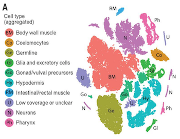
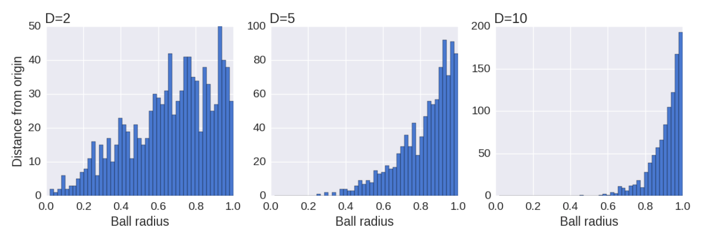
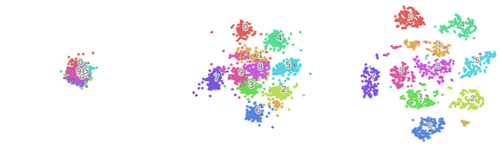
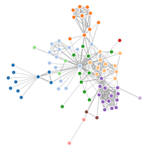
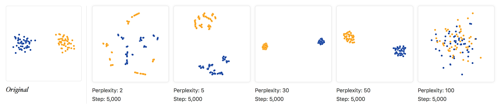
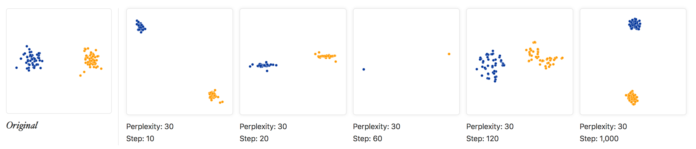
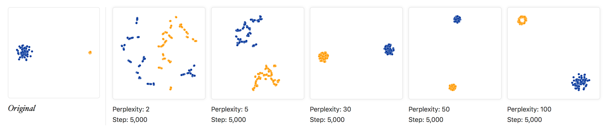
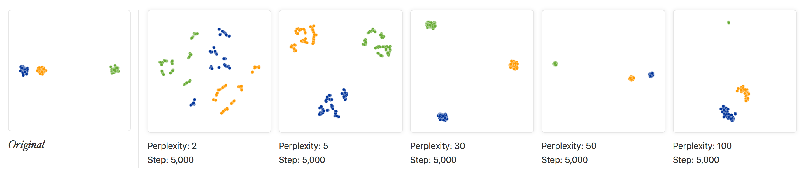
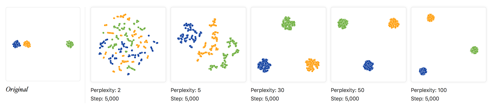

```{r setup, include=FALSE}
knitr::opts_chunk$set(echo = TRUE)
```


# t-distributed Stochastic Neighbor Embedding (t-SNE)

t-SNE is a **non-linear** method for visualizing structure in high-dimensional datasets that has been popularized by single-cell sequencing studies. In contrast to PCA, which is a linear method that seeks to preserve global structure, t-SNE aims to **preserve local structure**. t-SNE is often used in combination with PCA, and can be used to enhance the visualization of structure present in PC-PC plots. Here is an example from one of the papers we will study this semester (**Figure 1**).



The mathematics behind t-SNE are a bit complicated and are beyond the scope of this review. Here we seek to get a general feel for this method. Its primary goal is to map nearby points in the original high-dimensional data to nearby points in a two- or three-dimensional representation. 

The structure of many complex topological spaces, such as the famous "Swiss roll", can be reasonably represented using non-linear methods but not linear methods such as PCA. If the original features are related by complex polynomials, PCA will not work well.

## Some terminology

- Non-linear dimensional reduction is also called *manifold learning*. A non-linear topological space is called a *manifold* and has the property of resembling Euclidian space in the vicinity of each point.
- The low-dimensional space is called a *projection* or a *map* of the original manifold.
 
## An overview of the t-SNE algorithm

#### Distance in high-dimensional space
- Calculate pair-wise distances between data points $x_i$ and $x_j$ in the original dataset.
- Compute a pairwise *conditional probability* between data points, $p_{i|j}$, relative to each datapoint $x_i$.
- The values of $p_{i|j}$ are proportional to their probability density under a *Gaussian* (normal distribution) centered at $x_i$. This means that points nearby to $x_i$ will get assigned a high probability, and those far away will get a really low one.
- The *joint probability* $p_{ij}$ is the average of the reciprocal conditional probabilities. This is called *symmetrized* conditional similarity.

### Distance in low-dimensional space
- The lower-dimensional map aims to preserve the structure of the higher-dimensional space using a smooth transformation of these probabilities.
- Instead of using a Gaussian, the distances in the lower-dimensional space are modeled using a *Student's t-distribution with one degree of freedom* (a.k.a. a Cauchy Distribution).
- Since the t-distribution has heavier tails than a Gaussian, this serves to separate points from dense regions in the mapped space, preventing nearby points from collapsing together.

The O'Reilly tutorial listed below encourages the reader to think about the motivation for the t-distribution by visualizing a sphere in multiple dimensions. If random points are picked within the sphere, then most of them will be near the surface, as illustrated in **Figure 2**. The proportion of points near the surface increases with dimensionality, compressing most of the data toward it. The t-distribution compensates for this by stretching the distribution out more, which alleviates crowding.




### Optimization

- The algorithm seeks to preserve the local structure of the original data, that is to minimize the mismatch between $p_{i|j}$ and $q_{i|j}$
- It does this by *minimizing a cost function* that measures something called the *relative entropy*, or cross-entropy, between the two probability distributions. 
- An optimization procedure called *gradient descent* is used to minimize the cost function.
- Note that mapping nearby points so that they end up far apart is heavily penalized, whereas mapping distant points so that they end up close together carries a much smaller penalty.

The mapped space goes through several iterations as the optimization proceeds. Mapped points start out really close together, and then the graph relaxes as the distributions are recalculated. **Figure 3** shows the evolution of a set of data containing 10 natural clusters.




### Perplexity: optimizing the variance of each point

- Each point $x_i$ in the high-dimensional space has its own variance, $\sigma_i^2$.
- Points in dense areas get a smaller variance than those in sparse areas.
- The variance of each point induces a probability distribution $P_i$ across all other points whose *entropy* is proportional to the variance.
- The algorithm searches for a value of $\sigma_i^2$ that produces a $P_i$ with a fixed *perplexity*.
- van der Maaten says that perplexity can be interpreted as a smooth measure of the *effective number of neighbors*.
- Perplexity is a measure of entropy and is a parameter that is defined by the user. It is the same for all data points.


### Barnes-Hut approximation

The original algorithm is very costly in computational time that is proportional to the square of the number of data points. We say that it runs on an "order" of $n$ squared, which we write using "Big O" notation as: $\mathcal{O}(n^2)$. An implementation using the *Barnes-Hut* approximation greatly speeds up the processing time, allowing it to be run on very large real-world datasets. 

Barnes-Hut speeds up the calculations by dividing the space into small cells for nearby points (giving high resolution for short distances) and placing far away points by very large cells, allowing them to be treated as a single point centered on the cell's center of mass. Barnes-Hut runs in $\mathcal{O}(nlog(n))$.


## A physical analogy [^1]

You can think of the map as a dynamic graph composed of nodes connected by springs. If the mapped points get too close together, the springs push them apart. Similarly, points can't get too far from each other either, since the springs will pull them back. 
The *length* of the spring is propotional to the distance between points in the low-dimensional space. The *stiffness* of the spring is proportional to the mismatch in the conditional probabilities between the points. This image is from an animation you can find in the O'Reilly tutorial listed at the end of these notes.




## A word of caution, and some tips

- **Beware! Successive runs on the same data will not necessarily give similar results!**
- The *perplexity*, a measure of entropy that is used to find the right values of $\sigma_i^2$, is a tunable paramater that **can give wildly different results**.
- The perplexity must be optimized empirically; the original t-SNE paper gives a range of 5-50 as a good rule of thumb, but beware that you may need to experiment with the tuning to find a "good" visualization for your data (refer to "A cautionary tale" below).
- The perplexity should always be smaller than the total number of points.

- Because t-SNE uses and adaptive distance measure that depends on the local density of points, distances will be distorted. So you can't interpret the magnitude of distances that you see in a t-SNE plot as meaningful.
- This means that the apparent size of clusters in t-SNE, relative sizes, and distances between clusters, are not meaningful.
- Running enough iterations to reach a stable configuration is important.


## Examples

**Figures 5-9** show theoretical examples from one of the tutorials referenced below (see "A cautionary tale"), chosen to illustrate how results may vary depending on different properties of the original dataset and different settings used when running the algorithm.

- Effect of changing the perplexity parameter
- Effect of increasing number of iterations
- Effect of starting clusters with different sizes
- Effect of starting clusters separated by different distances
- Relationship between perplexity and number of data points













## Summary

Dimensional reduction methods are really useful for visualizing complex data in just two or three dimensions. Different methods have different strengths and drawbacks, and it will take you some time to get an intuitive understanding of their utility and their behavior. 

PCA is a well-established linear method that is great for finding significant variation within your data.

tSNE is a relatively new non-linear method that has become very popular because it is very flexible and can often find structure in data when other methods cannot.

It's always a good idea to play around with different methods and parameters before settling on a final visualization. You will get a better feel for them the more you experiment. You should also get in the habit of cross-checking your results with other techniques as a "sanity check".


# Suggested Reading

* A pretty good overview: https://www.oreilly.com/learning/an-illustrated-introduction-to-the-t-sne-algorithm

* Rahul Satija's Seurat website: http://satijalab.org/seurat/get_started.html
    + *There are a few guided tutorials here that walk you through identifying dynamic genes, normalization, scaling, linear dimensional reduction, determining statistically significant PCs, running tSNE, and finding cluster biomarkers.*

* Laurence van der Maaten: https://lvdmaaten.github.io/tsne/
    + Has a link to the original t-SNE paper (2008)
    + He is currently at Facebook with Yann LeCun (an NYU CS Prof)

* A cautionary tale:
https://distill.pub/2016/misread-tsne/


# Further notes on t-SNE

The conditional probability $p_{j|i}$ is given by a Gaussian, where the variance for each point, $\sigma_i^2$, is different for each and depends on its local density (these variances are called *Gaussian kernels*). The conditional probability is defined as:

$$ p_{j|i} = \frac{\exp(-|\mathbf{x_i} - \mathbf{x_j}|^2/2\sigma_i^2)}{\sum_{k\ne{i}}\exp(-\mathbf{|x_i} - \mathbf{x_k}|^2/2\sigma_i^2)} $$

The joint probability $p_{ij}$ is the average of $p_{i|j}$ and $p_{j|i}$ divided by the number of points, N:

$$ p_{ij} = \frac{p_{i|j} + p_{j|i}}{2N} $$

The distance $q_{ij}$ between two points in the mapped space is given by a Student's t-distribution and is defined as:

$$ q_{ij} = \frac{(1 + |\mathbf{x_i} - \mathbf{x_j}|^2)^{-1}}{\sum_{k\ne{i}}(1 + |\mathbf{x_i} - \mathbf{x_k}|^2)^{-1}} $$ 

The cost function $C$ is a function of the *Kullback-Leibler divergence*, or relative entropy between all data points in $P$ and $Q$. For symmetric SNE, it is defined on the joint probabilities $p_{ij}$ and $q_{ij}$ as:


$$ C = \sum_i{KL(P_i||Q_i)} = \sum_i{\sum_j{p_{ij}log{\frac{p_{ij}}{q_{ij}}}}} $$

The perplexity is defined as $Perp(P_i) = 2^{H(P_i)}$, where $H(P_i)$ is the Shannon entropy measured in bits:

$$ H(P_i) = -\sum_j{p_{j|i} log_2({p_{j|i})}} $$


[^1]: From https://www.oreilly.com/learning/an-illustrated-introduction-to-the-t-sne-algorithm

