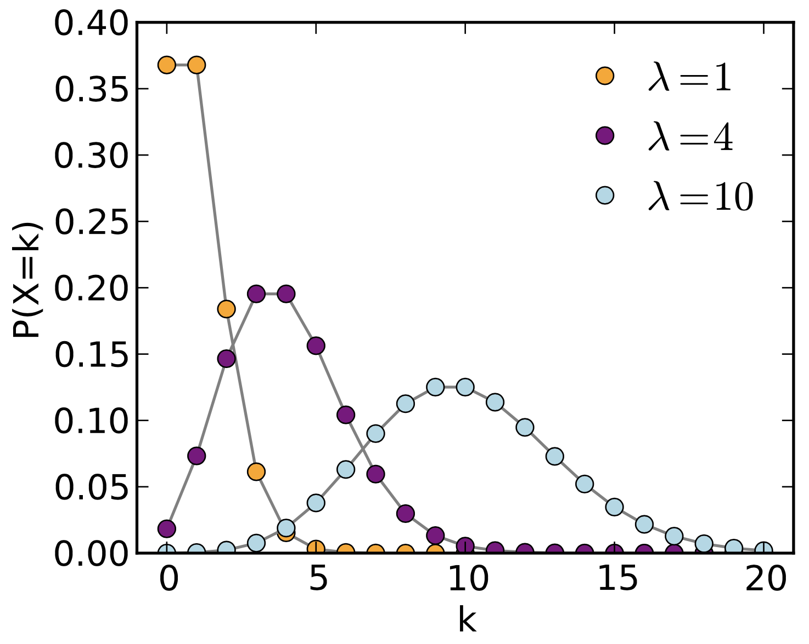

```{r setup, include=FALSE}
knitr::opts_chunk$set(echo = TRUE)
```

# Reading assignment

[**Aho - Chapter 3.3-3.6**](http://xdas.bio.nyu.edu/references/Aho_Ch3.3-3.6_PDFs_Part2.pdf)

**Introduction to dnorm, pnorm, qnorm, rnorm** [(PDF)](http://xdas.bio.nyu.edu/learning_r/Intro_R_dqpr_functions.pdf) [(RMD)](http://xdas.bio.nyu.edu/learning_r/Intro_R_dqpr_functions.Rmd)

# Review

- Bernoulli distribution
- Binomial distribution
- Normal distribution
- Standard normal distribution

[**Aho - Chapter 3.1-3.2**](Aho_Ch3.1-3.2_PDFs_Part1.pdf)

[**Tranchina - Elements of Calculus**](http://kriscgun.github.io/xdas-bio-2018/references/CalculusReview_2.0.pdf)


# Discrete distributions

## Poisson

A *Poisson process* describes occurrences that are randomly distributed in space or time, where the number of occurrences in non-overlapping intervals is statistically independent.

The Poisson distribution models *stochastic* processes, such as shot noise or scattered objects.

Examples in time:

- The number of gamma rays detected in a scintillation counter over time (the number of particles emitted over time due to exponential decay)
- The number of accidents in a given area per day
- The number of slices ordered per day at Pizza Mercato
- The number of 911 calls per day
- The number of mutations that accumulate per generation in a chemostat

Examples in space:

- Distribution of chocolate chips in cookie dough
- The number of typos per page in a book
- Distribution of bacterial colonies on an evenly spread agar plate, or of bacteriophage plaques plated at low multiplicity
- Distribution of gas molecules in a closed container
- The number of mutations per kilobase after treatment with a mutagen (e.g. EMS)

The Poisson PDF is:

$$ f(x) = P(X = x) = \frac{e^{-\lambda}\lambda^x}{x!} $$
where $X$ is a Poisson random variable and $\lambda$ is the rate at which events occur in a given interval of time (space), i.e. for $t=1$.

The Poisson makes the following assumptions:

+ The number of observed events $x \in \{0,1,2,...\}$ is independent in any interval
+ Events occur at a constant (random) rate over a set of intervals of time (or space)
+ The rate of events is $\lambda > 0$, the *rate constant* per unit interval 
+ The probability of observing two or more events in the same interval will approach 0 as intervals become smaller

If $X$ follows a Poisson distribution, we write $X$ ~ $POI(\lambda)$. The expected value AND the variation are: $E(x) = Var(X) =  \lambda$. 

Thus, the Poisson has only a _**single parameter**_ that determines both its _**location**_ and _**scale**_. Because of this, the PDF is commonly written as:

$$ P(X = x) = \frac{e^{-\mu}\mu^x}{x!} $$
In this formulation, $\mu = \lambda t$, and it represents the _**mean number of events in $t$ units of time (or space)**_. Because $t$ is some constant, it's just a scaling factor, so the formula still works out.

The figure and code below show how the shape of the curve varies with $\lambda$.

{width=60%}

```{r}

par(mfrow=c(2,2))

for (i in c(1,3,10,30)) {
  y = rpois(1000, i)
  xlimit=max(y) + 10
  title = paste("POIS(",i,") w/ normal approx",sep="")
  hist(y, prob=T, br=(-1:xlimit)+.5, col="skyblue2", xlab="x", main=title)
  lines(density(y,bw=1), col="blue", lwd=3)
  curve(dnorm(x, mean(y), sd(y)), col="red", lwd=2, add=T) 
}

```

#### Poisson approximation of the Binomial distribution

$\Rightarrow\ $ The Poisson is the *limiting* case of a Binomial distribution for rare events. That is, a Poisson with parameter  $\lambda = np$ approximates the Binomial when $n$ is large and $p$ is small.

In such as case, it can be easier to work with the Poisson since it has only one parameter instead of two. 

For example, let's consider hits on a website. This could be modeled as a Binomial distribution with a Bernoulli trial evry minute for an hour, with $p=1$ and $n=60$. This would be the same as a Poisson distribution with 6 events per hour, i.e. $\lambda=6$.

The Binomial formula may be written in terms of $\lambda$ thus:

$$P(x) = nCx (\frac{\lambda}{n}) (1-\frac{\lambda}{n})^{n-x}$$ 

It can be shown that the limit of $P(x)$ as $n$ goes to $0$ is the equation for the Poisson distribution given above.

$\Rightarrow\ $ Like the Binomial distribution for large $n$, the Poisson is well approximated by the normal distribution when $\lambda$ is large (and the sampling size is very large).


## Hypergeometric

The hypergeometric distribution is similar to the *binomial distribution*, except it defines the *probability of obtaining $x$ independent successes* when sampling _**without replacement**_. 

Examples:

- The number of fish caught as hunting season progresses.
- The number of aces in a hand of 5 cards.
- The number of pink Eppendorf tubes in a handful of tubes grabbed from a bag of mixed color tubes.
- The number of genes with a specific functional annotation (e.g. GO term) in the genome (often used for enrichment analysis in gene expression studies)

Since we are sampling without replacement, each trial affects the probability of the next outcome -- in other words, we need an equation to find the relative frequency of $x$ in a shrinking sample space. The PDF is defined as:

$$ f(x) = P(X = x) = {M \choose x}{N - M \choose n - x}\bigg/{N \choose n} $$

where:

- $x \in \{0,1,2,...,n\}$ the number of successful trials 
- $N \in \{1,2,...\}$ is the total number of selectable items 
- $M \in \{0,1,2,...,N\}$ is the total number of possible successful outcomes (i.e. th number of items in the group of interest)
- $n \in \{0,1,2,...,N\}$ is the number of items sampled

For example, consider the Eppendorf tube example with an increasing sample size:

```{r}
#rhyper(nn, m, n, k)
draw = c(5,10,20,50)     # k = number of items sampled
pink = 50                # M
total = 250              # N
non_pink = total - pink  # N - M
n_obs = 1000             # number of observations

par(mfrow=c(2,2))

for (i in draw) {
  y = rhyper(n_obs, pink, non_pink, i)
  xlimit=max(y)
  title = paste("HYP(",i,") w/ normal approx",sep="")
  hist(y, prob=T, br=(-1:xlimit)+.5, col="skyblue2", xlab="x", main=title)
  lines(density(y,bw=1), col="blue", lwd=3)
  curve(dnorm(x, mean(y), sd(y)), col="red", lwd=2, add=T) 
}

```


## Geometric

The geometric distribution is similar to the *binomial distribution*, except it gives the probability that $x$ independent Bernoulli **failures** occur **prior to the FIRST success**.

Example:

- The number of cards you would need to sample (with replacement, i.e. "catch and release") before finding an ace.
- The number of jelly beans you need to sample from a mixed bag before finding a watermelon flavored one (I really like the watermelon ones!)

The PDF is:
$$ f(x) = P(X = x) = p(1-p)^x$$

where:

- $p$ is the **unchanging** probability of success in a single Bernoulli trial, and
- $x \in \{0,1,2...,n\}$ is the _number of **unsuccessful**_ trials _**preceding**_ the first success. 

There is a single parameter $p$. If a random variable follows the geometric distribution, we write: $X$ ~ $GEO(p)$.

Since we are only concerned with a *single success* following $x$ failures, the above formula fully defines this probability as the intersection of $x$ failures and one success. We do not need to use any binomial coefficients because there is only one way to get this outcome (of course, that is if you stop when you get the first success; it's the same as the old adage, "You always find what you were looking for in the last place you look!")

```{r}
# rgeom(n,p)

par(mfrow=c(2,2))
prob = c(0.1,0.25,0.5,0.75)
for (i in prob) {
  y = rgeom(1000, i)
  xlimit = max(y) + 10
  title = paste("GEOM(p=",i,")",sep="")
  hist(y, prob=T, br=(-1:xlimit)+.5, col="skyblue2", xlab="x", main=title)
}

```


## Negative Binomial

The negative binomial is an extension of the geometric distribution to cases where we are interested in *more than one success* after a number of failures. In fact, the geometric distribution is a special case of the negative binomial in which the number of successful trials = 1.

Example:

- The probability that 5 of your experiments will fail before you will manage to get three experiments to work, given that your success rate is 20% on average (three is the magic number! ;-)
- In another formulation, the total number of experiments you will need to perform in order to achieve three successful experiments.

There are a number of different parameterizations of the NB distribution, depending on exactly which question you are asking. I found a very good discussion of these topics here: https://probabilityandstats.wordpress.com/tag/negative-binomial-distribution/

This blog also provides insight into the relationship between the negative binomial, the Poisson, the binomial, and the gamma distributions.

The PDF for the discrete NB distribution is:

$$ \begin{aligned}
f(x) = P(X_r = x) &= { x+r-1 \choose r-1}p^{r}(1-p)^x 
= { x+r-1 \choose x}p^{r}(1-p)^x \\
&= {n-1 \choose r-1} p^r(1-p)^x = {n-1 \choose x} p^r(1-p)^x 
\end{aligned}$$

where:

- trials are independent and only two outcomes are possible
- the probability of success $p$ in each trial is constant
- $x$ is the observed number of *failures* preceding $r$ successes in $n$ independent trials (note that $x + r = n$)
- the random variable $X_r$ represents the number of *unsuccessful trials*

Since the last ($n$th) Bernoulli trial is the $r$th success, the binomial coefficient gives the number of ways to obtain $x$ failures in the preceding $x + r - 1 = n - 1$ trials, which is equivalent to the number of ways to obtain $r-1$ successes preceding the $r$th success. The binomial coefficients above are equivalent, since

$${a \choose b} = {a \choose a-b}\ \ for\ \  0 \le b \le a.$$

If a random variable follows a negative binomial distribution, we write $X$ ~ $NB(r, p)$. There are two parameters: the number of successes, and the probability of success. It is important to remember that $X$, the random variable, represents the number of *failures* before achieving the desired number of successes. 

Now we can also write the geometric distribution as a special case of the NB, where $r=1$: $X$ ~ $GEO(p)$ is equivalent to $X$ ~ $NB(1,p)$

The mean and variance of the negative binomial distribution are: $E(X) = \frac{r}{p}$ and $Var(X) = \frac{r(1-p)}{p^2}$.

Below are density plots for the NB showing how its shape changes as the probability changes or the number of successes changes.

```{r}
library(ggplot2)

# The plot below shows varying the probability
nbinomdata = data.frame(x=1:100,
                        y=dnbinom(1:100,20,0.25),
                        z=dnbinom(1:100,20,0.5),
                        w=dnbinom(1:100,20,0.75))

ggplot(nbinomdata) + 
  geom_line(aes(x=x, y=y, col="0.25"))+
  geom_line(aes(x=x, y=z, col="0.5"))+
  geom_line(aes(x=x, y=w, col="0.75"))

# The plot below shows varying the number of successes
nbinomdata = data.frame(x=1:100,
                        y=dnbinom(1:100,10,0.5),
                        z=dnbinom(1:100,30,0.5),
                        w=dnbinom(1:100,70,0.5))

ggplot(nbinomdata) + 
  geom_line(aes(x=x, y=y, col="10"))+
  geom_line(aes(x=x, y=z, col="30"))+
  geom_line(aes(x=x, y=w, col="70"))

```

An alternative formulation, which gives the total number of trials that must be performed in order to achieve the $r$th success, is:

$$ f(n;r,p) = P(X = n) = { n-1 \choose r-1}p^{r}(1-p)^{n-r} $$

where $n = \{r, r+1, r+2, ...\}$

### Survival function

It is common to encounter the *survival function*, which is the complement of the CDF of a particular distribution. If the CDF is $F(X) = P(X \le x)$, then the *survivorship* is $P(X > x) = 1 - F(X)$

The CDF of the NB is:

$$ P(X_r \le x) = \sum_{j=0}^k{j+r-1 \choose j}p^r(1-p)^j \ \ \ for \ \ \ k = 0,1,2,... $$

And the survival function is:

$$ P(X_r > x) = \sum_{j=k+1}^{\infty}{j+r-1 \choose j}p^r(1-p)^j \ \ \ for \ \ \ k = 0,1,2,... $$


### Relationship between the NB and other distributions

_**Geometric distribution**_

When $r$ = 1, the NB becomes the geometric distribution, which is therefore a special case of the NB: $GEO(p) = NB(1, p)$. 

Therefore, the *negative binomial* is to the *geometric* distribution as the *binomial* is to the *Bernoulli* distribution.

_**Poisson distribution**_

The Poisson distribution is a special case of the NB when *the number of successes is very large*:

$$ POIS(\lambda) = lim_{r -> \infty} NB(r, r / (\lambda + r))) $$

_**Binomial distribution**_

The negative binomial distribution describes the *waiting time* before the $r$th success in $n$ independent Bernoulli trials, where as the binomial distribution describes the *success rate* in $n$ trials.

Consequently, *the survival function of the NB is the same as the CDF of the binomial distribution* with parameters $k + r = n$ and $p$, where $k$ is the number of failures and $r$ is the number of successes. 

Equivalently, *the CDF of the NB is the survival function of the binomial distribution*.


### Negative binomial in analysis of deep sequencing data

The negative binomial has become popular in recent years as a way to model the distribution of read counts in deep sequencing data. In brief, count data for technical replicates can be modeled by a Poisson distribution. Recall that the mean and the variance for a Poisson are given by the same parameter, $\lambda$. Thus, the variance is proportional to the mean.

When considering biological replicates, it turns out that the variation in the counts varies with the number of counts per feature (e.g. expression level); it is *overdispersed*. In such cases, the Poisson is no longer the best model for the data. 

Instead, the NB is used to model the uncertainty in the variance. In this case, the variation is proportional to the mean, with an added term to account for the dispersion: 

$$ \sigma^2 = \mu + \alpha\mu^2 $$
where $\alpha$ is the dispersion parameter. For $\alpha > 1$, the dispersion is greater than the mean; as $\alpha$ goes to 0, the NB converges on a Poisson distribution.


There are various explanations for modeling sequence count data with the NB distribution, and a relatively simple one may be found here: https://bioramble.wordpress.com/2016/01/30/why-sequencing-data-is-modeled-as-negative-binomial/

The authors of DESeq2 provide a more detailed discussion[^1].

Technically, the NB is a *Poisson-Gamma mixture distribution*: a mixture of Poisson distributions where the uncertainty in the various $\lambda$s follows a Gamma distribution. The details are beyond our pay grade for the purposes of this class, but you may want to file this for future reference.


# Continuous distributions

## Exponential

The exponential distribution is a continuous distribution that, like the Poisson distribution, also relates to a *Poisson process*.

In other words, the **Poisson** describes the *number of events* that occur in a given period of time, whereas the **exponential** describes *the length of time elapsed* between consecutive events.

Examples:

- Battery life
- Radioactive decay
- Type II survivorship (mortality rates are more or less the same at any age)

The exponential distribution combines properties the geometric and Poisson discrete distributions: it describes the *density* of waiting times (failures) before the next Poisson (random) outcome. The exponential PDF is:

$$ f(t) = \lambda e^{-t\lambda} $$
where $\lambda > 0$ and $t \ge 0$. We write $T$ ~ $EXP(\lambda)$. The mean and standard deviation are both $1/\lambda$: $E(T) = 1/\lambda$ and $S.D.(T) = 1/\lambda$. The variance is thus $Var(T) = (1/\lambda)^2$.

```{r}
interval.exp<-seq(0, 10, 0.05)
plot(interval.exp,dexp(interval.exp,rate=0.5))
lines(interval.exp,dexp(interval.exp,rate=1),col="red")
lines(interval.exp,dexp(interval.exp,rate=2),col="blue")
lines(interval.exp,dexp(interval.exp,rate=10),col="green")
```

The CDF has a closed form that does not require integration:

$$ F(t) = \int_0^\infty \lambda e^{-\lambda t}dt = 1 - e^{-t\lambda} $$.


### Relationship between the Poisson and exponential distributions

The Poisson is a discrete distribution describing the *number of events per unit time*, and the exponential is a continuous distribution describing the *length of time between events*. For a Poisson process, then, if events happen at a rate of $\lambda$ per unit time on average, an average of $\lambda t$ events will occur per $t$ unit of time.

So, for a Poisson distribution $P(X = x) = e^{- \lambda t}(\lambda t)^x / x!$, $P(X = 0) = e^{-\lambda t}$ is the probability of *no* occurrences within $t$ units of time.

This is equivalent to the exponential *survivorship* function, which describes situations where the probability of mortality is the same for all individuals in a population. In otherwords, the chance of dying is independent of age. This is not true for mammals, but it is true of some birds, rodents, lizards, and sea animals.

Survivorship can be thought of as the probability that the time $T$ to the *first occurrence* exceeds $t$:

$$ P(T > t) = P(X = 0 | \mu = \lambda t) = e^{-\lambda t} $$

You can see that this is just one minus the exponential CDF, which gives the total probability that an event *does* occur within an interval of time $t$:

$$ P(T \le t) = 1 - P(X = 0 | \mu = \lambda t) = 1 - e^{-\lambda t} $$


### Note: Poisson and Gamma distributions

We will not go over the Gamma distribution here, but it is commonly encountered in Bayesian probability applications, as a congugate prior distribution for a number of likelihood functions. 

Conceptually, you can think of the Gamma as the waiting time until the $n$th Poisson-distributed event, or the $n$th change in a Poisson process. So, *the exponential distribution is a special case of the Gamma distribution* [in which the "shape" parameter equals 1]. Similarly, the *survival function of a Gamma distribution is the CDF of a Poisson distribution*.


# Examples

## Hypergeometric

What is the probability of holding two aces in a hand of five cards?

$$\begin{aligned}
P(X = x) &= {M \choose x}{N - M \choose n - x}\bigg/{N \choose n} = {4 \choose 2}{52 - 4 \choose 5 - 2}\bigg/{52 \choose 5} \\
&= \frac{\frac{4!}{2!2!}\frac{48!}{45!3!}}{\frac{52!}{47!5!}} 
= \frac{6 * (48*47*46 / 6)}{(52*51*50*49*48)/120} = 0.04
\end{aligned}$$

## Negative Binomial

You are performing an exit poll at a polling station in a district where the proportion of independent voters is 20%. What is the likelihood that you will have to interview 15 people before finding 5 that voted independent?

Here $n = 15$, $r = 5$, $x = 15-5 = 10$, and $p = 0.2$:

$$ P(X = 10) = {x+r-1 \choose r-1}(p)^r(1-p)^x = {14 \choose 4}(0.2)^5(0.8)^{10} = 0.34$$

## Radioactive decay: Poisson and exponential

Radioactive isotopes decay with a constant half-life, and so is a Poisson process. The Poisson and exponential are complementary ways of describing this process.

+ The observed decay rate is a continuous distribution that follows an exponential curve (i.e. the distribution of time elapsed between decay events).
+ The probability of detecting a single decay event with a scintillation counter follows a discrete Poisson distribution (i.e. the distribution of the number of decays per unit time).  

The slower the decay rate, the larger the time interval between observed events (exponential), and the fewer events observed per unit time (Poisson).


## Poisson

Say the number of single-nucleotide variants (SNVs) between *C. elegans* strains from Bristol (N2) and Hawaii (CB) is 1.5 per 1000nt (1 kilobase). What is the probability of observing zero SNVs in a random selection of 1000 bases? 

Here we define 1kb as one unit of $t$ (i.e. the "unit" size here is 1kb; the important thing is that we are operating in units).
```{r}
# p(X=0) for X ~ POIS(1.5)  # the rate is given as 1.5 per unit t = 1kb
dpois(0,lambda=1.5)
```

What is the probability of observing 5 or fewer mutations in a random selection of 4000nt? Since we are given a multiple of $t$, let's use the formula with $\mu = \lambda t$ instead to get the number of typos per 4kb:

$$P(X \le 5) = \sum^{5}_{x=0}P(X=x) = \sum^{5}_{x=0}\frac{e^{-\mu}\mu^x}{x!}$$

```{r}
# now t = 4 times the original unit size of t (1kb)
# mu = lambda * t = 1.5 * 4 = 6
ppois(5,lambda=6) # now plug in mu instead of the original value of lambda
```


## Exponential

For some animals, like lizards, their mortality rate is independent of their age. Over an extended trip to Costa Rica, you studied a large population of lizards and found that their rate of mortality is $\lambda$ = 0.05 deaths per month.

- What is the expected lifespand of one of these lizards? $E(X) = SD(X) = 1/\lambda = 20$ months.
- What is the probability an animal will survive more than 20 months? This is given by the survivorship function: $P(X > 20) = e^{-0.05*20} = 0.3679$. 
- What is the probability an animal will survive between 20 months or less? This is given by the CDF: $P(X \le 20) = 1 - e^{-0.05*20} = 1 - 0.3679 = 0.6321$. 
- What is the probability an animal will survive between 10 and 15 months? $P(10 \le X \le 15) = (1 - e^{-0.05*15}) - (1 - e^{-0.05*10}) =  e^{-0.05*10} - e^{-0.05*15} = 0.1341$


[^1]: https://genomebiology.biomedcentral.com/articles/10.1186/gb-2010-11-10-r106
