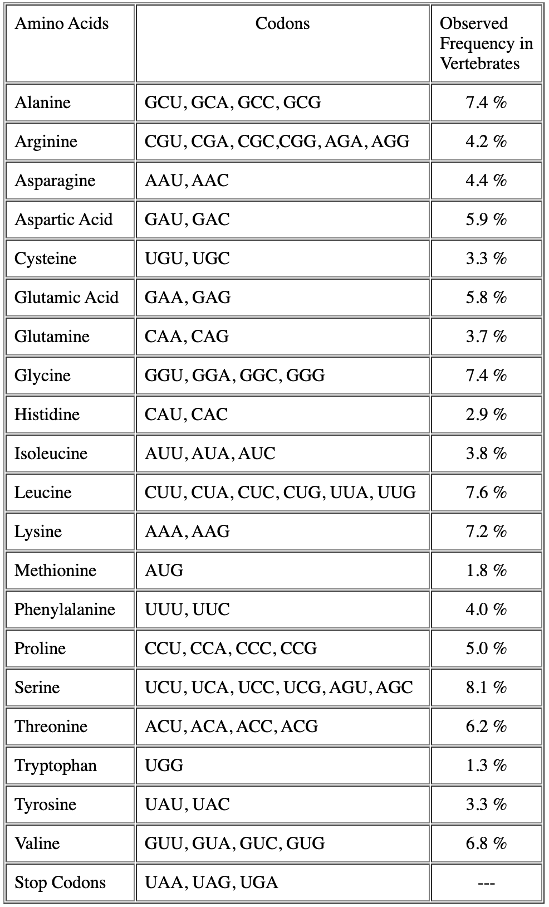
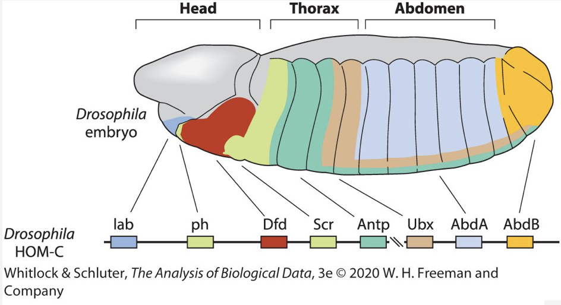

```{r setup, include=FALSE}
knitr::opts_chunk$set(echo = TRUE, error = TRUE)
# remove "error = TRUE" to make knitr halt on errors
# (do this when you are ready to check if your code will knit without errors)
```

**Note:** It is not necessary to load any extra packages to do this homework assignment, but if you choose to do so, don't forget to include a `library()` statement somewhere for the packages you plan to use.

## Q1. Codon and amino acid frequencies

The frequency table for amino acids in the human population and their associated codons is reproduced below and has been uploaded to the Ed Resource area under the heading "Random". 

<!-- Note: the figure is rendered in the HTML version of this file. It will not be found when you knit the .Rmd yourself since it is not in your file path. You could download it from Ed if you want, but it is not at all necessary. -->
{width=40%}

a. The frequencies of DNA bases in nature are 22.0% uracil, 30.3% adenine, 21.7% cytosine, and 26.1% guanine.

Assuming that codon frequencies reflect the natural abundance of DNA bases, the *expected frequency of a particular codon* can be calculated by multiplying the frequencies of each DNA base comprising the codon. 
The *expected frequency of an amino acid* can then be calculated by adding the frequencies of each codon that codes for that amino acid.

This approach also applies to the set of STOP codons. What is the total probability of obtaining a STOP codon?
```{r}
u = .22
a = .303
c = .217
g = .261

# Your answer here
```

b. Assuming you had a random protein sequence of infinite length (!), what is the probability of finding the sequence "EARTH" (Glu-Ala-Arg-Thr-His) at random? Use the table of observed a.a. frequencies (not the expected abundance of their codons based on nucleotide frequencies).
```{r}

```

c. What is the total probability that any random amino acid happens to be a polar uncharged amino acid (hint: there are 4 of these)?
```{r}

```


## Q2. Peptides

a. Let's say you are synthesizing random peptides of length 5 out of those 5 amino acids (EARTH), and each peptide has exactly one of each. 

How many possible different sequences of these amino acids are there?
```{r}

```

b. What is the probability of finding the sequence "EARTH" among your pool of peptides?
```{r}

```

c. Say you are synthesizing random peptides of length 20, and each peptide contains exactly one of each of the 20 common amino acids. How many distinct sequences of 3 amino acids will there be among these? Write out the answer in terms of the number of choices for each successive pick.
```{r}

```

d. Write out the formula for this using factorial notation (by hand) and then use it to cacculate the answer above using the R function for computing factorials.
```{r}

```

e. How many possible combinations of 3 amino acids are there? I.e. how many ways are there to pick 3 random amino acids out of 20? (Or, in other words, how many sets of 3 different amino acids are there in a set of 20?)
```{r}

```

f. What is the probability of observing any one of these combinations?
```{r}

```

g. Write a short function to compute the number of combinations for k out of n objects. Call it `ncomb`. It should take two parameters: n and k. Then call the function to find the number of possible combinations of 3 amino acids.
```{r}
ncomb = function( ) {
  
}
ncomb()
```


## Q3. Hox genes

The Hox genes are responsible for determining the anterior–posterior identity of body regions (segments) in the developing insect embryo. Different Hox genes are turned on (expressed) in different segments of the body, and in this way they determine which segments become head and which thorax, which develop legs and which antennas. One surprising thing about the Hox genes is that they usually occur in a row on the same chromosome and in the same order as the body regions that they control. For example, the fruit fly Drosophila melanogaster has eight Hox genes located on a chromosome in exactly the same order as the body regions in which they are expressed, from head to tail (see figure below; Lewis et al. 2003; Negre et al. 2005).

<!-- Note: the figure is rendered in the HTML version of this file. It will not be found when you knit the .Rmd yourself since it is not in your file path. You could download it from Ed if you want, but it is not at all necessary. -->
{width=50%}

a. If the eight genes were thrown randomly onto the same chromosome, how many orders could they potentially end up in?

```{r}

```

b. What is the probability that they would line up in the same order as the segments in which they are expressed?
```{r}

```

c. The flour beetle, *Tribolium castaneum*, has 10 chromosomes, roughly equal in size, and it also has eight Hox genes (Brown et al. 2002). If the eight Hox genes were randomly distributed throughout the genome of the beetle, what is the probability that all eight would land on the same chromosome? 
```{r}

```


## Q4. Binomial sampling

The *Drosophila* eye contains two kinds of ommatidia called "pale" and "yellow" that are randomly distributed across the retina in a 35:65 ratio, a phenomenon that has been studied in the Desplan lab at NYU. Ommatidia are arranged in neat rows. 

a. If you were to scan across one of these rows and sample 6 ommatidia, what would be the probability of sampling pale ("P") or yellow ("Y") cells in the following orders?

```{r}
P = 0.35 
Y = 0.65
  
# PPYYYY

# PYYYPY

```

a. What is the probability of finding at least one P cell? Of at least one Y cell?
```{r}
# At least one P cell

# At least one Y cell

```

How many ways are there to observe 4 Y cells out of 6? (This is the same as the number of ways there are to observe 2 P cells out of 6.) How would you compute this without enumarating all of the individual sequences by hand?
```{r}

```

What is the probability of finding exactly two P cells out of 6? (Hint: you need to multiply the number of ways this can happen by the probability of this combination.)
```{r}

```

What is the probability of finding no more than two P cells out of 6? (I.e. 0, 1, or 2)
```{r}

```


## Q5. Normal probability density

Consider a standard normal curve like the ones we have been looking at, in which the mean of the population is 0 and the standard deviation is 1.

a. Around what proportion of the data are between -2 SD and +2 SD of the mean?
```{r}

```

b. Around what proportion of the data are between 1 and 2 SD smaller than the mean?
```{r}

```

c. What is the probability of observing data data that are more than 2SD above the mean?
```{r}

```

d. If 60 people were to take random samples from a population and estimate 95% confidence intervals for the population mean, around how many of the confidence intervals would NOT contain the actual population mean?
```{r}

```


## Q6. Nucleotide probabilities

Some regions of the human genome are extremely G–C rich (i.e., a high proportion of the DNA nucleotides there are guanine and cytosine). Other regions are relatively A–T rich (i.e., a high proportion of the DNA nucleotides there are adenine and thymine). 

Imagine that you want to compare nucleotide sequences from two regions of the genome. Sixty percent of the nucleotides in **Region 1** are G–C (30% each of guanine and cytosine) and 40% are A–T (20% each of adenine and thymine). In **Region 2** there is no G-C bias.

a. If you choose an A from Region 1, what is the chance of also picking an A from Region 2?
```{r}

```

b. If you choose an A from Region 2, what is the chance of also picking an A from Region 1?
```{r}

```

c. If you choose a single nucleotide at random from one of these regions, what is the probability that you will pick the same nucleotide from the other region?
```{r}

```

d. Let's write a loop to empirically determine this answer.

First, let's create two vectors, **region1** and **region2** each with 100 nt. Make sure **region1** has 30 G, 30 C, 20 A, and 20 T. 

***Note***: there is more than one way to do this. Pick whatever way makes most sense to you. Just make sure you create two vectors of length 100 each.
```{r}

```

Now, randomly pick a single nt from each region and test whether they are the same. Use the `sample()` function to perform the random selection.
```{r}

```

To determine the how often the two nucleotides will match by chance, repeat this trial 1000 times and count the number of times you got a match. Then calculate the probability based on the frequency of occurrence and print the result.

```{r}
num_trials = 1000
equalcount = 0
for (i in 1:num_trials) {
    ...
    if () {
  }
}
print()
```

d. Assume that nucleotides over a single strand of DNA occur independently within regions, and that you randomly sample a three-nucleotide sequence from each of the two regions. What is the chance that these two triplets are the same?

```{r}

```

e. Now let's write a loop to empirically determine this answer.

Now instead of picking one nt at a time, our test is to randomly select three nucleotides from first region and another three from the second region, and then compare them to see if they are the same.

First, sample a single pair of 3nt from each region and compare them. Make sure that once you pick a nt from each list of 100, you do not pick it again.
```{r}

```

Now let's do this 1000 times, see how many times we get the same three selected, and then compute the probability. As we did above for a single nt, here we are generating a sample of 1000 "random trials".
```{r}

```


f. Above you performed 1000 **random trials** comparing 3nt at a time from the two regions. If you repeat the sampling above, you will get slightly different results each time.

Let's create a function that can do this random sampling any number of times. The function should take three arguments:

+ A vector for region 1
+ A vector for region 2
+ The number of trials

The return value of the function should be the proportion of times that you got a match. 

Note: If you use the `==` comparator on two vectors, it will return a logical vector of the same length indicating whether each element of both vectors is a match. In order to evaluate whether every element of the two vectors is a match, wrap your comparison inside the `all()` function.

+ Test out how this works by comparing two sample vectors of length three, e.g. `t1 = c(1:3)`, `t2=c(1:3)`, and then look at the output of `t1 == t2` and `all(t1==t2)`.

```{r}
# add a comment here about what this function does.
run_sample = function(region1, region2, num_trials) {

  # insert same code as the chunk above.
  
  return() # return the frequency (total counts / # of trials)
}

```

g. Use the above function to take 100 random samples of size 1000 (i.e. repeat your set of 1000 random trials 100 times). Use a `for` loop to do this.

Store the result (the probability of "successes") for each of the sample runs in a vector. Each element of the vector will contain the proportion of times you got a match in each of the runs (so, your vector will contain 100 elements). Don't forget that you will need to initialize an empty vector before running the loop.

```{r eval=T}

allsampleruns =
for() {
  
}

```

h. What is the mean proportion of matches from all the runs? How does this number compare the to the probability we calculated earlier? Print out both the actual probability and the observed mean of all the sample runs.

```{r}

```

i. Visualize the variation in the sample means using a histogram, and add vertical lines showing the theoretical mean (blue dashed line) and the mean of the sample means (red solid line).

```{r}

```