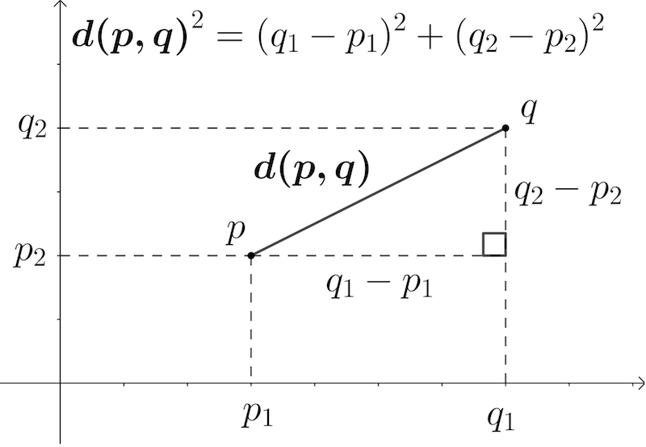
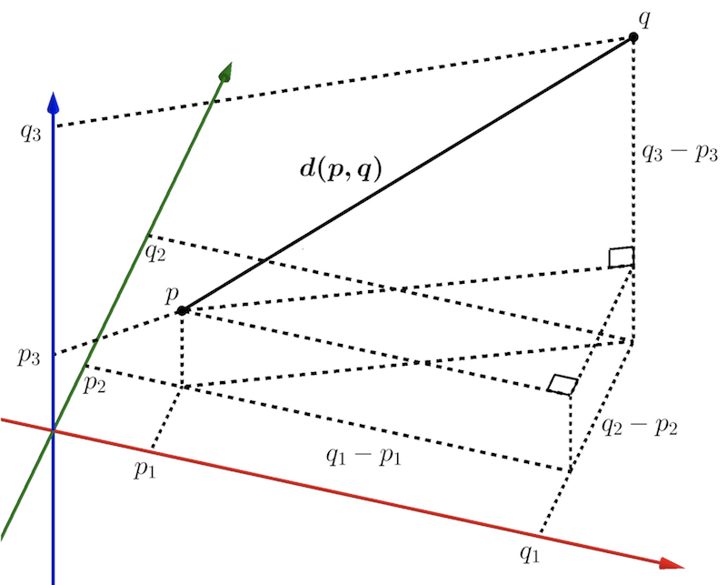
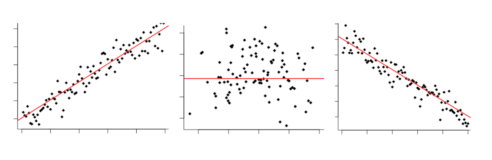
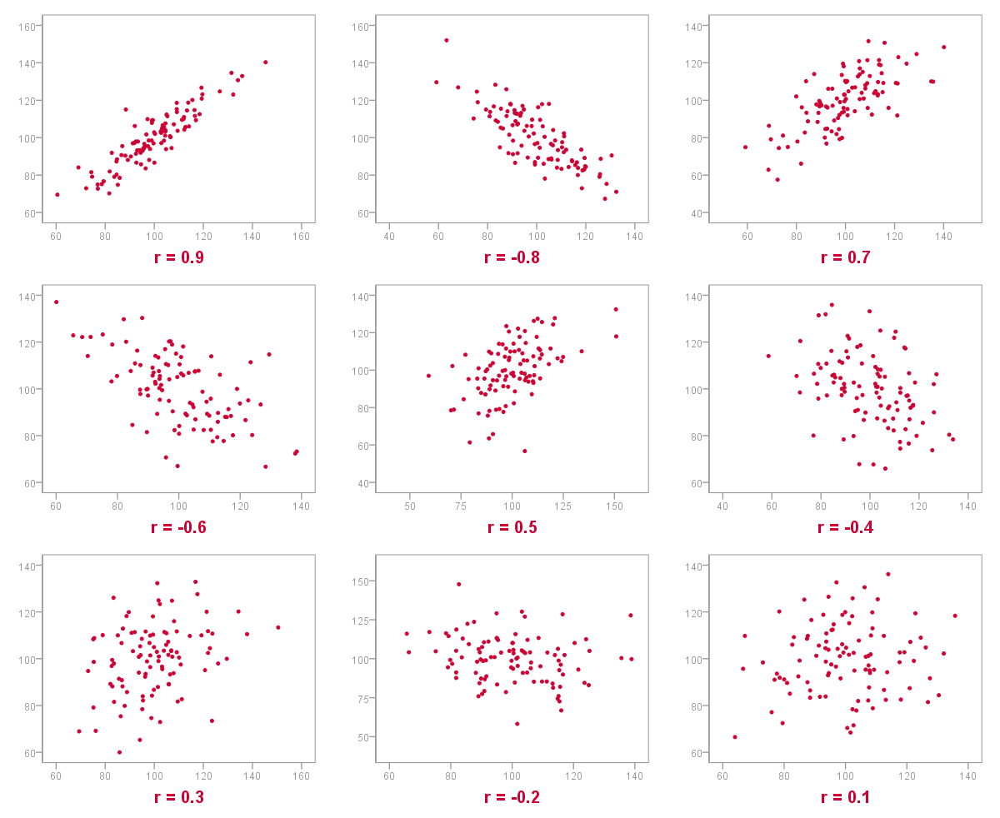
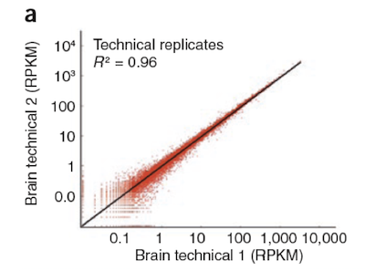

```{r setup, include=FALSE}
knitr::opts_chunk$set(echo = TRUE)
```

# Finding patterns in data: Common analysis tasks and questions
We are often interested in identifying large-scale patterns in our data as a first step to develop more specific questions. For gene expression analysis, common applications include:

* Time course: 
  + During development
  + After exposure to some environmental stimulus (chemical, light/dark, etc.)
* Comparison between different cell types or tissues
  + Different developmental lineages
  + Normal vs. diseased tissue

We usually want to ask different types of questions of the same dataset:

* Identify up- and down-regulated genes.
    + *Example:* Genes that change in expression in diseased vs. normal cells, or in response to an experimental treatment.

* Find groups of genes with similar expression profiles.
    + *Example:* How many genes respond to circadian rhythms? (~6% in *Arabidopsis*)
    + *Example:* Group yeast genes based on their response to a heat shock, to look for regulatory elements shared by genes with similar response patterns

* Find groups of experiments / conditions with similar expression profiles.
    + *Example:* Group cancer patients based on their gene expression profiles, to refine diagnosis and/or treatment choices.

* Find genes that explain observed differences among conditions (feature selection).
    + *Example:* Identify sentinel genes for different cell types.

To begin analyzing our data, we need some way to **group** genes and conditions based on **similarities** in gene expression profiles. The first step is to find a way to **measure distances** between genes and groups.


# Distance measures

There are many ways to measure distance. Two of the most common are **Euclidean**, which measures absolute Cartesian distance, and **Correlation**, which measures relative distance with respect to total variation.

## Metrics versus measures

We are all familiar with Euclidean distance, i.e. the shortest path between two points. It's probably a good time to note that Euclidean distance qualifies as a bona fide distance *metric*. A **metric** satisfies four conditions:

1. **Non-negativity** -- It is always equal to or greater than zero: $d(p,q) \ge 0$.
2. **Identity** -- If $d(p,q) = 0$, then $p$ and $q$ are identical: $d(p,q) = 0 \Leftrightarrow p = q$
3. **Symmetry** -- It is symmetric, i.e. the distance from $p$ to $q$ always equals the distance from $q$ to $p$: $d(p,q) = d(q,p)$.
3. **Triangle inequality** -- For three points, $d(x,z) \le d(x,y) + d(y,z)$. 

Not all distance measures satisfy these criteria. Such measures may be called *semi-metric* or *quasi-metric*, or simply *measures*. You should keep this in mind for future reference.

## Euclidean distance
* The most common and familiar distance metric; it gives the *root mean squared error* (RMSE)

### Euclidean distance in two dimensions

Euclidean distance is simply the geometric distance between the two points in Cartesian space. Recall the basic Pythagorean formula:
$$a^2 + b^2 = c^2$$

where $a$ and $b$ are sides of a right triangle and $c$ is the hypotenuse. Specifically, $a^2$ is the difference between the two points in the first dimension squared, and $b^2$ is the difference in the second dimension squared. To get the Euclidean distance $c$ we take the $\sqrt{c^2}$, or simply $\sqrt{a^2 + b^2}$.

More generally, let's call our data points $\mathbf{p}$ and $\mathbf{q}$, and let's say we have two measurements for each of them, in dimensions $D_1$ and $D_2$ (for example, weight and height, which gives body mass index). Then, $\mathbf{p} = (p_1,p_2)$ and $\mathbf{q} = (q_x,q_y)$, and we can write the distance between them, $d_{pq}$, as:

$$d_{pq} = d_{qp} = \sqrt{ (q_1 - p_1) ^2 + (q_2 - p_2) ^2 } = \sqrt{ (p_1 - q_1) ^2 + (p_2 - q_2) ^2 }$$

Simple, right? To make this statement more general, we can write $\mathbf{p} = (p_1, p_2)$ and $\mathbf{q} = (q_1, q_2)$, and express the Euclidean distance as follows:

$$ d_{pq} = \sqrt{\sum\limits_{i=1}^{n}{(q_i - p_i)} ^2} $$
where $n = 2$, so $i = (1,2)$. 

Figure 1 shows an illustration of Euclidian distance in two dimensions.

{width=45%}


### Euclidean distance in multiple dimensions

The Euclidean distance is easily generalized to multiple dimensions using the above formula. Now $i$ takes on values $1$ to $n$, where $n$ is the number of dimensions: $i = (1 ... n)$. For three dimensions, $n = 3$ (Figure 2).

{width=60%}

Random variables are more commonly denoted using letters toward the end of the alphabet (letters in the middle tend to be used for things like the number of rows or columns in a matrix). So, instead of $\mathbf{p}$ and $\mathbf{q}$, let us denote our two data points as $\mathbf{x} = (x_1, ... , x_n)$ and $\mathbf{y} = (y_1, ... , y_n)$. Now we can write:

$$ d(x,y) = \sqrt{\sum\limits_{i=1}^{n}{(y_i - x_i)} ^2} $$

Most of the time we will omit writing out the limits of the summation explicitly, and instead just write $\sum$.

It will eventually become natural for you to think of these as *vectors* in $n$ dimensions, or *n-dimensional vectors*. Vector and matrix algebra are the workhorses of *linear algebra*, which is foundational for *big data* analytics. This has become so popular a field of study that it now has its own name: *data science*.


## Manhattan distance

* a.k.a. *taxicab metric*, *grid distance*, and *rectilinear distance*
* Gives the *mean absolute error* (MAE)

The Manhattan distance gets its name because it uses a "city block" approach to measuring distance. It is calculated using absolute distances in orthogonal dimensions (rather than squared distances):

$$d(x,y) = \sum\limits_{i=1}^{n}|x_i - y_i|$$


## Minkowski distance

The above two distance measures belong to the Minkowski family of distance measures. The Minkowski distance is defined, for vectors $\mathbf{a}$ and $\mathbf{b}$ of length $p$ in vector space $R^p$, as:

$$d_{Minkowski}(\mathbf{a},\mathbf{b}) = \Bigg[ \sum_{i=1}^{p}{ |a_i - b_i| ^r } \Bigg] ^{1/r}$$
The Euclidean distance corresponds to the special case of $r = 2$ and the Manhattan distance to $r = 1$.

#### Euclidean or Manhattan?

Most of the time you will want to use Euclidean distance. It turns out that Manhattan distance is preferable when *dimensions are not comparable*, particularly for high-dimensional data. It is also less sensitive to *outliers* because distances are measured in absolute magnitude rather than squared magnitude. In fact, reducing the exponent to $r < 1$ can even be an improvement over Manhattan distance when working in high dimensions. However if data are distributed approximately normally, so that extreme values are uncommon, then Euclidean distance usually works well.

_**A short digression (you can safely ignore this section, but read on if you are interested):**_

If you continue in data science you will probably hear more about *L-norms* (based on Lebesgue spaces). In linear algebra, a *norm* is a function that assigns a positive length or size to any non-zero vector.

* For *L2* statistics (based on Euclidian distance), the *mean* is the value that minimizes the *mean squared error* across the dataset.
* For *L1* statistics (based on Manhattan distance), the *median* is the value that minimizes the sum of *absolute deviations* across the dataset.
* A family of *regularization* techniques for multivariate regression problems is often applied to large datasets to simplify computational solutions by applying penalties to a solution's parameter values (don't worry if this sounds like a lot of gobbledy-gook for now; you may find it useful later). *L1 regularization* (like the LASSO method) encourage solutions with a lot of zero values, whereas *L2 regularization* (used in ridge regression) encourage solutions where many values are very small. *Elastic net regularization* uses a combination of L1 and L2 norms.


## Covariance and Correlation

For some applications, in order to make comparisons between datasets, it's helpful to get them all on the same scale. We can do this by standardizing, or normalizing, the data.

### Covariance

In order to look at how much two variables change in tandem, we can calculate the **covariance**. Just as the *variance* of a single variable represents its dispersion, the *covariance* measures how much two values vary *together*:

 $$cov_{x,y} = \frac{\sum\limits_{i=1}^{n}{(x_i-\overline{x})(y_i-\overline{y})} }{n-1}$$

Note that instead of taking the square of a single variable to measure its deviation from the mean, we now multiply the difference between two variables and their respective means.

We  divide by $n-1$ because for $n$ observations, we  have $n-1$ *independent* observations, or degrees of freedom (and not, for example, $(n-1)^2$). *It may help you to think of the degrees of freedom as belonging to the dimensions of the system, not as belonging to each variable within it.*


### Linear correlation[^1]

The linear correlation coefficient measures the strength and the direction of a linear relationship between two variables. This is sometimes referred to as the *Pearson product moment correlation coefficient*, or more simply the **Pearson correlation coefficient**, in honor of its developer Karl Pearson.

Recall that for a series of observations in one dimension that are normally distributed, the data can be *normalized* by subtracting the mean from each data point and dividing by the standard deviation of the population. The $Z-score$ is thus defined as:

$$Z = \frac{\sum{x_i - \mu_x}}{\sigma_x},\ \  where\ \ Z \sim \mathcal{N}(0,1)$$

Similarly, the correlation of a population in two dimensions is defined as the *covariance* of two variables divided by the product of their *standard deviations*:

$$\rho = \frac{Cov(X,Y)}{\sigma_{x}\sigma_{y}}$$

Thus, the correlation coefficient is just the covariance, normalized using the variance of the individual variables. For $n$ observations, $r$ becomes:

$$r = \frac{\sum(x_i - \bar{x})(y_i - \bar{y})} {n-1\sqrt{Var(X)Var(Y)}}
    = \frac{\sum(x_i - \bar{x})(y_i - \bar{y})} {(n-1){s_Xs_Y}}
    = \frac{\sum(x_i - \bar{x})(y_i - \bar{y})}
           {\sqrt{\sum(x_i - \bar{x}) ^2} \sqrt{\sum(y_i - \bar{y}) ^2}} $$

#### Properties of $r$

The value of r is such that $-1 < r < +1$.  The + and – signs signify positive and negative linear correlations, respectively. The figure below illustrate data with a strong positive correlation (left), uncorrelated data (middle), and data with a strong negative correlation (right).




* **Positive correlation:** If x and y have a strong positive linear correlation, r is close to +1.  An r value of exactly +1 indicates a perfect positive fit.   Positive values indicate a relationship between x and y variables such that as x increases, y also increases. 

* **Negative correlation:** If x and y have a strong negative linear correlation, r is close to -1. An r value of exactly -1 indicates a perfect negative fit. Negative values indicate a relationship between x and y such that as values for x increase, values for y decrease. 

* **No correlation:**  If there is no linear correlation or a weak linear correlation, r is close to 0.  A value near zero means that there no relationship between the two variables.

* Note that r is a dimensionless quantity; that is, it does not depend on the units employed.

* A perfect correlation of ± 1 occurs only when the data points all lie exactly on a straight line.  If r = +1, the slope of this line is positive.  If r = -1, the slope of this line is negative.

* A correlation greater than 0.8 is generally described as strong, whereas a correlation less than 0.5 is generally described as weak.These values can vary based upon the "type" of data being examined. A study utilizing scientific data may require a stronger correlation than a study using social science data.

The following diagram illustrates data showing a range of correlation coefficients:


#### Interactive visualizations

+ Whitlock & Schluter have an [**interactive exercise**](https://shiney.zoology.ubc.ca/whitlock/Guessing_correlation/) online that can help you get a feel for correlation coefficients for point clouds with different shapes. 
+ Another one may be found [**here**](https://www.stat.berkeley.edu/~stark/Java/Html/Correlation.htm).


## Coefficient of determination[^2]

The coefficient of determination is denoted as $R^2$. For the special case of two variables, $R^2$ is equivalent to $r^2$ -- the square of the linear correlation coefficient (we will come back to this shortly when we discuss linear regression). 

The coefficient of determination is useful because it gives the proportion of the variance (fluctuation) of one variable that is predictable from the other variable. It is a measure that allows us to determine how certain one can be in making predictions using a particular model.

Notice that the following graph, showing the RPKM for two replicate samples, gives their $R^2$ value. This is a measure of the reproducibility of the data.



#### Properties of $r^2$

* $r^2$ is the ratio of the explained variation to the total variation.

* $r^2$ is such that **0 < $r^2$ < 1**,  and denotes the strength of the linear association between $\mathbf{x}$ and $\mathbf{y}$.

* $r^2$ represents the percent of the data that is explained by the line of best fit.  For example, if $r$ = 0.922, then $r^2$ = 0.850, which means that  85% of the total variation in y can be explained by the linear relationship between $\mathbf{x}$ and $\mathbf{y}$ (as described by the regression equation, which we will discuss later). The other 15% of the total variation in $\mathbf{y}$ remains unexplained.

* $r^2$ is a measure of how well the regression line represents the data. If the regression line passes exactly through every point on the scatter plot, it would be able to explain all of the variation. The further the line is away from the points, the less it is able to explain.

[^1]: Based in part on https://mathbits.com/MathBits/TISection/Statistics2/correlation.htm
[^2]: From https://mathbits.com/MathBits/TISection/Statistics2/correlation.htm


## Exercises

Resources from Whitlock & Schluter:

+ R code for the Chapter 16 [**examples**](https://whitlockschluter3e.zoology.ubc.ca/RExamples/Rcode_Chapter_16.html)
+ [**Lab 11**](https://whitlockschluter3e.zoology.ubc.ca/RLabs/R_tutorial_Correlation_Regression.html): Correlation and regression
+ [**Interactive demo**](https://shiney.zoology.ubc.ca/whitlock/Guessing_correlation/) for correlation

R contains several functions for covariance and correlation. We will use the example from **Figure 16.4-1** to illustrate these. This example shows a negative linear correlation between log-transformed data on the population density of different invertebrates in streams and their body mass (Schmid et al., 2000).

```{r}
streamInvert <- read.csv(url("https://whitlockschluter3e.zoology.ubc.ca/Data/chapter16/chap16f4_1StreamInvertebrates.csv"), stringsAsFactors = FALSE)
head(streamInvert)
```

