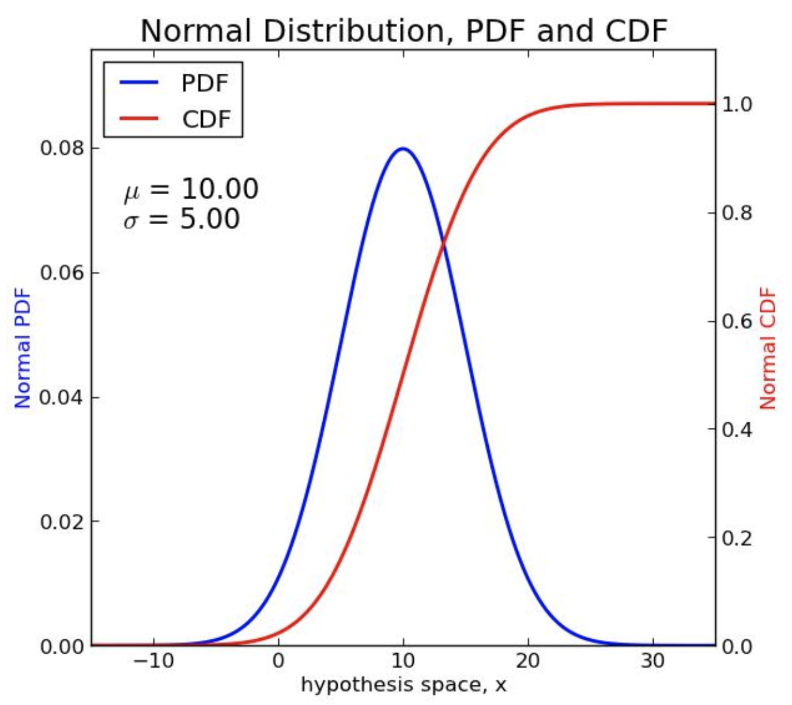
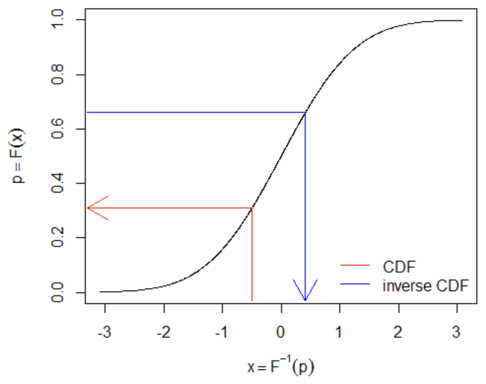

## Overview


R has a family of built-in functions for a large number of common probability distributions. You can find a list of these functions by typing `help(Distributions)` at the R console.

There are four types of functions for working with distributions:

+ Taking random samples from a pre-defined distribution (e.g. binomial, normal, exponential, Poisson, etc.)
+ Probability density functions (PDF)
+ Cumulative density functions (CDF)
+ Inverse CDF

The four types of functions start with **d, q, p,** and **r**:

+ **r: random sample**
  + Take a ***random sample*** from a distribution
+ **d: density**
  + Find the ***height*** of the **PDF** (probability density function) at one or more values of $x$
  + The PDF is written as $f(x)$
+ **p: probability**
  + Find the ***total probability*** for a certain interval of $x$ values
  + This is the **CDF**, $F(x)$, and it ranges from 0-1
  + The CDF represents the **area under the PDF** across a range of values
+ **q: quantile**
  + Find the value of $x$ corresponding to the $p$th ***quantile*** (percentile) of the total probability
  + $p$ ranges from 0-1
  + This is the **inverse CDF**, $F^{-1}(p)$


## Relationships between distribution functions

The height of the **PDF** gives the value of a function at different values of a random variable $x$. The **CDF** gives the total area under the curve from $X = - \infty$ to $x$, which corresponds to the total probability that the random variable $X$ takes on a value less than or equal to $x$: $Pr[X \le x]$. For a normal distribution, this can be illustrated as follows:

{width=45%}

The **quantile** function is the inverse of the **CDF**: whereas the CDF gives the total probability $Pr[X \le x]$, the inverse CDF gives the value of $x$ corresponding to a particular total probability -- that is, the value of $x$ below which some fraction (quantile) of all the data fall:

{width=45%}


## Example: the normal distribution

To illustrate how these functions work, let's work through examples using the normal distribution. We will call these the *norm* family of functions.

---

### `dnorm`

The probability density function for the normal distribution is:

$$
f(x\ |\ \mu,\sigma) = \frac{1}{\sigma\sqrt{2\pi}}e^{-\frac{(x-\mu)^2}{2\sigma^2}}
$$

The important thing here is not the specific form of the function, but the **parameters** that define its **location** (central tendency) and its **spread** (variation). Here, those parameters are $\mu$ and $\sigma$, and with these two parameters you can define a normal probability density function with any mean and variance.

The function `dnorm` returns the height of the PDF for the normal distribution, given parameters for $x$, $\mu$, and $\sigma$. Some examples of using `dnorm` are below:

```{r}
# The dnorm function takes three main arguments, as do all of the *norm functions in R.
# The following computes the PDF of the standard normal with x = 0, mu = 0 and sigma = 0.
dnorm(x = 0, mean = 0, sd = 1)

# Since mean = 0 and sd = 1 are the default arguments, the following is equivalent:
dnorm(0)

# Another exmaple of dnorm where parameters have been changed.
dnorm(2, mean = 5, sd = 3)

# Where not explicitly specified, arguments are expected in the same order (careful!)
dnorm(2,5,3)

# You can also get the height of a normal PDF across a range of values as a vector:
dnorm(seq(3, 5, by=0.1), 5, 1)
```

When considering the PDF for a standard normal distribution (with mean = 0 and sd = 1), the independent variable $x$ can also be thought of as a $Z$-score. This can be seen by getting a vector of $x$ values for the standard normal using `dnorm` and then plotting it:

```{r}
# Vector of Z-scores across -3 to +3 SD away from the mean
z_scores = seq(-3, 3, by = .1)
z_scores

# Let's make a vector of the values the function takes given those Z-scores.
# Remember for dnorm the default value for mean is 0 and for sd is 1.
dvalues = dnorm(z_scores)
dvalues

# Now let's plot these values
plot(z_scores, # if omitted, the vector indices for dvalues are used instead
     dvalues,
     xlab= "Z-score",
     ylab="Density",
#     xaxt = "n", # Don't label the x-axis tick marks
     type = "l", # Make it a line plot
     main = "PDF of the Standard Normal")

# If you want to add your own labels, you can uncomment these and the 'xaxt' line above
# These commands label the x-axis:
#axis(1, at=which(dvalues == dnorm(0)), labels=c(0))
#axis(1, at=which(dvalues == dnorm(1)), labels=c(-1, 1))
#axis(1, at=which(dvalues == dnorm(2)), labels=c(-2, 2))
```

As you can see, `dnorm` will give us the height of the PDF of the standard normal
distribution at whatever Z-score we provide as an argument to `dnorm`.

---

### `pnorm`

The function `pnorm` returns the integral from $-\infty$ to $q$ of the PDF of a normal distribution. `pnorm` has the same default `mean` and `sd` arguments as `dnorm`, so for a standard normal distribution $q$ is the same as a Z-score. Try to guess the value of `pnorm(0)`.

```{r}
# Arguments: q = 0, mean = 0, sd = 1
pnorm(0)  # same as pnorm(q=0, mean=0, sd=1)
```

The `pnorm` function also takes the argument `lower.tail`. If `lower.tail` is
set equal to `FALSE` then `pnorm` returns the integral from $q$ to $\infty$ of
the PDF of the normal distribution. Note that `pnorm(q)` is the same as
`1-pnorm(q, lower.tail = FALSE)`

```{r}
pnorm(2)                    # lower tail for the standard normal at Z-score=2
pnorm(2, mean = 5, sd = 3)  # lt for a broader distribution with mean shifted to 5

# These are equivalent expressions for the probability that P(X > x)
# The upper-tail p value 1-pnorm(x) = rejection area
pnorm(2, mean = 5, sd = 3, lower.tail = FALSE)     # the upper tail
1 - pnorm(2,5,3)                                   # also the upper tail

#  The non-rejection region where P(X <= x)
1 - pnorm(2, mean = 5, sd = 3, lower.tail = FALSE) # back to the lower tail!
```

`pnorm` is the function that replaces the table of probabilites and Z-scores at
the back of the statistics textbook qnd can be used to get p-values.

Let's take our vector of Z-scores from before (`z_scores`) and compute a new vector using `pnorm`. A plot of these shows the cumulative distribution function of the standard normal distribution.

```{r}
z_scores = seq(-3, 3, by = .1)
p_values = pnorm(z_scores)

# Now we'll make two different plots ... notice the different labels on the x-axis.
par(mfrow=c(1,2))

# This plot shows the **Z-scores** vs. the cumulative density
plot(z_scores, p_values,
     type = "l", # Make it a line plot
     main = "CDF of the Standard Normal",
     xlab= "Z-score",
     ylab="Cumulative Density")  

# This plot shows the **quantiles** vs. the cumulative density
plot(p_values,     # x is omitted, so y = values and x = vector indexes
     xaxt = "n",  # Don't label ticks on the x-axis
     type = "l",  # Make it a line plot
     main = "CDF of the Standard Normal",
     xlab= "Quantile",
     ylab="Cumulative Density")

# These commands label the x-axis for the second graph
axis(1, at=which(p_values == pnorm(-2)), labels=round(pnorm(-2), 2))
axis(1, at=which(p_values == pnorm(-1)), labels=round(pnorm(-1), 2))
axis(1, at=which(p_values == pnorm(0)), labels=c(.5))
axis(1, at=which(p_values == pnorm(1)), labels=round(pnorm(1), 2))
axis(1, at=which(p_values == pnorm(2)), labels=round(pnorm(2), 2))
```

---

### `qnorm`

The `qnorm` function is simply the inverse of the CDF, i.e. it is the inverse of `pnorm`. You can use `qnorm` to determine the answer to the question: What is the Z-score of the $p$th quantile of the normal distribution?

```{r}
# What is the Z-score of the 50th quantile of the standard normal distribution?
qnorm(.5)
# What is the Z-score of the 96th quantile of the normal distribution?
qnorm(.96)
# What is the Z-score of the 99th quantile of the normal distribution?
qnorm(.99)
# Around 2/3 (68%) of the density falls between -1 and +1 sd of the mean
pnorm(1) - pnorm(-1)
# Around 95% of the density falls between -2 and +2 sd of the mean
pnorm(2) - pnorm(-2)
# The central 95% quantile range spans roughly 4 sd (-2 to +2)
qnorm(0.975) - qnorm(0.025)
```

Let's plot `qnorm` and `pnorm` next to each other to further illustrate the fact
they they are inverses.

```{r, warning=FALSE}
# Make a vector of Z-scores: from -3 to 3 by 0.1 # get the CDF for the standard normal
z_scores <- seq(-3, 3, by = .1)
pvalues <- pnorm(z_scores)

# Make a vector of quantiles: from 0 to 1 by increments of .05
# distribution is infinite so don't try to hit limits of probability
quantiles <- seq(0.001, 0.999, by = .01)
quantiles

# Now find the Z-score at each quantile
qvalues <- qnorm(quantiles)
qvalues

# This is for getting two graphs next to each other
par(mfrow=c(1,2))

# Same pnorm plot from before
plot(z_scores, pvalues, type = "l",
     main = "CDF of the Std Normal",
     xlab= "Z scores",
     ylab="Probability Density")
# Plot the quantiles
plot(quantiles, qvalues, ylim = c(-3,3),
     type = "l",
     main = "Inverse CDF of the Std Normal",
     xlab="Probability Density",
     ylab="Z-scores")
```

These plots show that `qnorm` (inverse CDF) really is the inverse function of `pnorm` (CDF). This can also be appreciated by applying the functions sequentially:
```{r}
 # They're truly inverses!
pnorm(qnorm(0))
qnorm(pnorm(0))
```

---

### `rnorm`

If you want to generate a vector of normally distributed random numbers, `rnorm`
is the function you should use. The first argument `n` is the number of numbers
you want to generate, followed by the standard `mean` and `sd` arguments.

You can plot a histogram of the samples along with the empirical density of the sample along with the theoretical curve:

```{r}
par(mfrow=c(1,1), mar=c(5.1,4.1,4.1,2.1)) # making the plot window to default size

# generate a sequence of z-scores
xseq = seq(-4,4,.01)

# take the same number of random samples from the standard normal distribution
y = rnorm(length(xseq))
sample_density = density(y) # empirical probability density values for the samples

# make a histogram
hist(y, prob=TRUE, breaks=40,col="lightgray")
lines(sample_density, col="red") # the empirical density (smoothened line)

# add a curve showing the theoretical PDF using the mean and SD of y as the parameters:
curve(dnorm(x, mean(y), sd(y)), add=TRUE, col="darkblue", lwd=2)
```

### Weak law of large numbers

The _**weak law of large numbers**_, or _Bernoulli’s theorem_, states that the sampling distribution of the mean converges on the true mean as the number of samples goes to infinity. Let’s illustrate this using `rnorm`.

```{r, warning=FALSE}
# The set.seed function takes a number as an argument and sets a seed from which random
# numbers are generated. It's important to set a seed so that your code is reproduceable.
# Some people like to set seeds to the "date", which is just the arithmetic equation
# "month minus day minus year". The following evaluates to -2028:
set.seed(9-18-2019)  # it's my birthday!
rnorm(5)
# Using the same seed again, I'll generate the same vector of numbers.
set.seed(9-18-2019)
rnorm(5)
# Setting it to something else gives a different random sample
set.seed(Sys.time())  # this date in the current time zone is coerced into an integer
rnorm(5)
# The seed only sticks once!
rnorm(5)

# Now onto using rnorm. Let's generate three different vectors of random numbers
# from a normal distribution.
n10 <- rnorm(10, mean = 70, sd = 5)
n100 <- rnorm(100, mean = 70, sd = 5)
n10000 <-  rnorm(10000, mean = 70, sd = 5)
# Let's just look at one of the vectors
n10
```

Which histogram do you think will be most centered around the true mean of 70?

```{r, warning=FALSE}

# what are the means?
mean(n10) # not so close
mean(n100) # somewhat closer
mean(n10000) # pretty close

# This is for getting two graphs next to each other
oldpar = par()
par(mfrow=c(1,3))

# The breaks argument specifies how many bars are in the histogram
hist(n10, breaks = 10)
hist(n100, breaks = 50)
hist(n10000, breaks = 50)
```

---

## QQ plots

You can compare a sample from a distribution to a theoretical distribution using a **quantile-quantile (QQ)** plot.

```{r}
y <- rnorm(100)
qqnorm(y) # plot quantiles for theoretical vs. sampled values
qqline(y) # add a theoretical normal-normal line for the samples passing through Q1,Q3
```

If a sample doesn’t match the QQ line, then it’s not very representative of the theoretical distribution. Even for a sample taken from the theoretical population, as above, the samples will usually deviate more from the line at the tails due to low sampling coverage.

---

## Comparing the different functions

Now we can put all of these together:

```{r}
set.seed(9-18-2019)
xseq<-seq(-4,4,.01)

random.samples<-rnorm(1000,0,1)
densities<-dnorm(xseq, 0,1)
cumulative<-pnorm(xseq, 0, 1)

par(mfrow=c(1,3), mar=c(3,4,4,2))
hist(random.samples, main="Random draws from Std Normal",
     cex.axis=.8, xlim=c(-4,4))
plot(xseq, densities, main="PDF of Standard Normal",
     col="blue", xlab="", ylab="Density",
     type="l", lwd=2, cex=2, cex.axis=.8)
plot(xseq, cumulative, main="CDF of Standard Normal",
     col="orange", xlab="", ylab="Cumulative Probability",
     type="l", lwd=2, cex=2, cex.axis=.8)
```

---

## Sampling from distributions vs. using the sample function

When we use functions like `rnorm`, we sample much more often from regions where the distribution is more dense. For the normal distribution, this means that we get many more samples that are close to the mean than those that are far away from it.

In contrast, when we take a random sample from a set of numbers using the `sample` function, we are taking values from a **uniform** distribution across the range of values. So these two procedures produce very different results.


## Other distributions

These concepts generally hold true for all the distribution functions built into R. You can learn more about all of the distribution functions by typing `help(Distributions)` into the R console. Examples for taking random samples from different distributions are:

+ **Uniform**: `runif()`
+ **Binomial**: `rbinom()`
+ **Chi-squared**: `rchisq()`
+ **Poisson**: `rpois()`
+ **Exponential**: `rexp()`
+ **Student's *t* **: `rt()`
+ **Log normal**: `rlnorm()`
+ **Negative binomial**: `rnbinom()`

---

### Credits

This tutorial was adapted from documents by Sean Kross and Savita Kulkarni and was edited and augmented by Kris Gunsalus. Material from Sean Kross is licensed [CC0](https://creativecommons.org/publicdomain/zero/1.0/). The original version may be found [here](seankross.github.io/notes/dpqr/index.Rmd).
